## 第五章 函数 ##

### 5.0.0 教学目的 ###

函数是编程中最重要的概念，他们让编程分解成更小的子程序 然而，函数有另一个重要的目的，允许程序员设置代码进行运行、控制。

学生不可能体会到第一次创建子程序的价值，因为他们的价值很小。因此，我们建议开始对函数当成代码来运行。

命名函数，函数调用和函数参数，可以介绍一下作为推广的理念。最终学生要学会运用“DRY”的原则，用函数来创建自己的命令，通过创建自己的命令来抽象普通代码序列。

### 5.0.1 主题大纲 ###

#### 5.0  绪论 ####
* 5.0.1 教学目的
* 5.0.2 主题概述
* 5.0.3 关键术语
* 5.0.4 关键概念
####5.1  教案####
* 5.1.1 关键的时间表
* 5.1.2 CSTA标准
* 5.1.3 教学笔记
* 5.1.4 用按钮调用函数的经验教训
* 5.1.5 上课计划用按钮创建功能
* 5.1.6 课程计划将重新使用功能代码
* 5.1.7 在函数中传递参数的课程计划

###5.0.2 关键术语 ###
<table>
	<tr>
		<td>参数</td> 
		<td>变量</td>
	</tr>
	<tr>
		<td>抽象</td>
		<td>执行程序</td>
	<tr>
		<td>模块化</td>
		<td>对象</td>
	</tr>
	<tr>
		<td>可重用性</td>
		<td>实践处理函数</td>
	</tr>
<tr>
		<td>DRY;不要重复自己</td>
		<td>回调</td>
	</tr>
</table>

###5.0.3关键概念 ###
函数是什么
一个函数在程序中可以被执行。 函数允许程序员划分代码，就像作者使用段落划分文章，数学家也使用函数将公式划分为计算值的简单规则。然而，在计算机科学中，函数不仅仅将程序分为公式 ：

1.函数允许代码重用。一旦定义了一个函数，它的代码可以在一个程序中多个地方使用，而不必再写一遍代码 。

2.函数控制何时以及如何运行。放在函数里的代码仅当函数被调用时才开始运行的。这意味着，通过函数的多次调用避免重复书写相同的代码。

如何编写函数

在CoffeeScript，函数调用是通过把参数写在函数名后实现，有两种方式：

<table>
	<tr>
		<td>Fd 100</td> 
		<td>利用空间，函数名FD来称呼它，参数100</td>
	</tr>
	<tr>
		<td>Fd（100）</td>
		<td>使用括号和没有空间FD称之为带参数</td>
	</tr>
	
</table>

调用一个函数可以没有参数，但要有定义，如hide()。与我们以前使用的许多调用内置函数一样，将FD和参数隐藏，函数的自定义和程序员定义是完全相同的方式。

在一个函数定义CoffeeScript，开始用箭->（分为两个字，负角度）瞄准参数函数的函数体。可以把函数的函数体上箭头和线是经过一系列的行缩进。

<table>
	<tr>
		<td>（x）->x * x</td> 
		<td>一个未命名的函数，需要任何值和返回x*x</td>
	</tr>
	<tr>
		<td>Sq=(x)->return x*x</td>
		<td>相同的功能，这一次命名为“平方”，并表达不同的使用缩进和“return”</td>
	<tr>
		<td>Exclaim=->
     Write“hey！”
     Write“yo！</td>
		<td>函数名为“exclaim”，没有参数写两信息</td>
	</tr>

</table>

函数如何计算问题的答案 ？

函数由函数定义与调用函数结合使用。函数可以计算在CoffeeScript中回答这样的问题：

<table>
	<tr>
		<td>1、sq=（x）->x*x </td> 
		
	</tr>
    <tr>
	<td>2、Write“My favorite square numbers”</td>
    </tr>
    <tr>
	<td>3、Write sq（8）</td>
    </tr>
<tr>
	<td>4、Write sq（3）</td>
    </tr>
</table>

平方函数计算平方数，并在这个程序中使用了两次

第一行有一个函数定义，定义为函数（×）->x*x。 该函数有一个输入参数，在箭头后面（×）中列出，在箭头之后，该函数的主体计算x * x。函数的主体是一段代码，该代码是不正确的！它是有意义的，它不运行，因为该程序还不知道使用什么值。参数x是一种变量：它的值是有不同的情况的，我们将在不知道用什么X值这个问题时，有一个函数调用。

在第三行，平方（8）是函数调用。数字8是函数参数。这是指定的参数（x）的特定值。当运行第三行时，该程序立即以第一行的函数为平方，立即执行该项函数，临时设置为8，然后计算x*x，就是64。 当这样做时，它将返回64到第三行，写上数字64。
程序然后执行第四行，称为平方，X是分到3，和X *X返回9 。
这类运算的流程看似简单，但函数是如此的重要，它对深入理解函数调用和返回的顺序很重要。
注意，每次平方值，可以有不同的x值，为函数的每次调用都有不同的意义。这个变量被称为局部变量-它没有任何意义被外函数调用。
当代码运行时，如何才能控制函数？
一个函数是一个可以随时调用的对象（在需要时）：
<table>
	<tr>
		<td>Myfunc=->write“ouch！” </td> 
		
	</tr>
    <tr>
	<td>Butter=“click me”，myfunc</td>
    </tr>
  
</table>
函数MyFunc不立即运行，但只有当按下按钮

这里myfunc是函数->写“ouch！”这就不需要任何参数，并且每次调用时都要写一个消息。注意，像往常一样，函数不跑的时候，它规定：“ouch！”是写在屏幕上的程序。但当我们点击按钮，调用函数时，我们看到，“ouch！”，是第一次运行时。 

在这个例子中，我们没有编写函数调用！取而代之的是，内置的功能按钮设置它自己的函数调用来完成每当按钮被点击。一个函数，用于调用回调函数，称为回调函数，因为当一个事件发生时，我们的回调叫做事件处理程序 。

在CoffeeScript，我们可以没有命名它--一个匿名函数：
<table>
	<tr>
		<td>Button“click me”，->write “ouch ”</td> 
		
	</tr>
    <tr>
	<td>Write“ready？”</td>
    </tr>
  
</table>

包含代码运行的函数可以创建，甚至不给它们命名。
 
在这里，再次，Function->“ouch！”作为按钮函数的第二个参数传递。然而，不同于以往的例子中，我们没有给出名字的函数->写“ouch！”。 我们只是定义它内联，我们需要通过它的按钮。虽然匿名函数听起来很神秘，但它们通常用于创建事件处理程序 。

当匿名事件处理程序的缩进时，如回调直接传递，代码清晰表明该函数体的代码运行时，表示一个特定的事件发生 
<table border="1" cellspacing="0">
<tr>
<td><pre><code>
Button“go forward”，->
   Fd 100
   Dot red
Button“go backw”，->
   Bk 100
   Bot blue
</code></pre></td>
</table>
事件处理程序（从3章）是函数

值得思考的是为什么逗号都需要在上面的代码中： 每一个逗号的形式匿名函数作为参数传递的第二按钮后，两缩进代码行的箭头。 虽然这个代码很简单，但它包含几个非常重要的概念，我们建议学生实验用不同的方式编写事件处理程序的代码，使用命名函数和匿名函数。

程序员何时定义一个函数？

每当我们有代码要用函数时，我们要在程序中的几个地方重用或（同样的想法看的另一种方式）每当我们有代码，我们要尊重一些未来的执行调用。

我们使用函数的指导原则，在这种情况下，叫DYR：“不要重复自己”。如果你发现在你的程序中，你是写类似的代码，你应该定义一个函数，它的身体包含的代码只能有一次；然后使用函数调用在不同的地方，相同的函数复用。 
为了帮助DRY，程序员通常调用其他函数的功能，他们通常定义的函数与几个参数，以允许他们的函数来定制，以适应不同的情况。高级程序员常常自定义函数调用其他函数作为参数传递，就是回调了。 如果做得仔细，函数甚至可以被内部称为递归。（10章）

因为函数使得在简单和复杂的情况下组织和安排一个程序的代码是可能的，函数是编程中最强大和最基本的概念 

###5.1.1建议的时间白表：55分钟的课时 ###
<table>
	<tr>
		<td>教学时间</td> 
		<td>标题</td>
	</tr>
	<tr>
		<td>多天</td>
		<td>第一、二课：使用按钮来解释功能的目的。</td>
	<tr>
		<td>1天</td>
		<td>第三课：教函数帮助代码的重用性。</td>
	</tr>
	<tr>
		<td>1天</td>
		<td>第四课：教授参数传递函数。</td>
	</tr>
</table>

### 5.1.2 CSTA标准 ###

<table>
	<tr>
		<td>CSTA标准</td> 
		<td>CSTA 链</td>
        <td>CSTA学习目标</td>
	</tr>
	<tr>
		<td>3级A
           （等级9-12</td> 
		<td>计算思维能力（CT）</td>
        <td>使用预定义的函数和参数，类和方法将一个复杂的问题转化为简单的部分</td>
	<tr>
	<td>3级A
           （等级9-12</td> 
		<td>计算实践与编程（CPP)</td>
        <td>应用分析设计，解决问题的实现技术。</td>
	</tr>
	<tr>
		<td>3级A
           （等级9-12</td> 
		<td>CPP</td>
        <td>使用应用程序接口（接口）和库以方便编程解决方案 </td>
	</tr>
    <tr>
		<td>3级B
           （等级9-12</td> 
		<td>CT</td>
        <td>通过定义新的函数和类来分解问题  </td>
	</tr>
    <tr>
		<td>3级B
           （等级9-12</td> 
		<td>CPP</td>
        <td>使用抽象工具来分解一个大的计算问题（例如，程序抽象，面向对象的设计，功能设计)。</td>
	</tr>
<tr>
		<td>3级B
           （等级9-12</td> 
		<td>CT</td>
        <td>讨论抽象管理问题复杂度的价值</td>
	</tr>
	</tr>
</table>
### 5.1.3教学笔记 ###

这是第一个课题，开始编程的学生，将带来编程挑战。在许多语言中，当一个学生试图闯入可重用的代码，模块的参数传递里，会遇到编译错误的结果中回归正确的值与适当的数据类型和模块调用。 学生将会抵制模块化，以避免编译错误的铅笔代码，在区块模式中将有助于避免一些错误。

### 5.1.4教案 1 ###
在这个案例中，函数必须被调用来执行 。
<table>
	<tr>
		<td>详细内容</td> 
		<td>教学建议</td>
        <td>时间</td>
	</tr>
     <tr>
		<td>Code
      
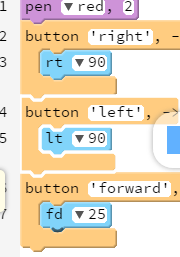

      
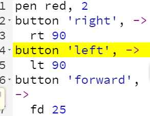
</td> 
     
		<td>在这一课中，按钮调用函数。每一个按钮都是一个被调用的函数。

      向学生展示一个按钮的功能。显示每一个按钮的代码。

     提供这个链接： http://teachersguide.pencilcode.net/edit/functions/remotecontrol为发挥按钮的功能，让学生能够创造更多模式 。  输出：
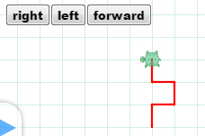

       </td>
        <td>示范：15分钟
             学生
             实践：
             20分钟</td>
	</tr>

</table>

### 5.1.5教案 2 ###
<table>
	<tr>
		<td>详细内容</td> 
		<td>教学建议</td>
        <td>时间</td>
	</tr>
     <tr>
		<td>Code for the circle button
         
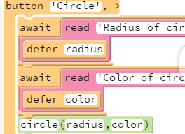

          
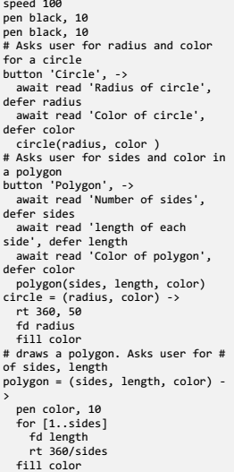
</td> 

		<td>提供这个链接：http:/teachersguide.pencilcode.net/edit/functions/ShapeBot

         添加到程序附加代码，以绘制形状和按钮 

      下一步，向学生展示代码。解释说，在圆按钮的代码，绘制圆形的规格，也显示了主要的程序，从该圆和多边形的功能被称为。（左柱截图是圆的）

      鼓励学生通过增加自己的形状（三角形、星星等）来改善这个程序。 

      教学提示：现在不注重参数的传递
       只是要求学生接受它。我们将在以后的课程中解决这个问题。

      输出圆形按钮:
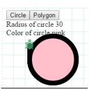

       </td>
        <td>演示：20分钟

      学生
      实践：
      直到课结束</td>
	</tr>

</table>

### 5.1.6教案 3 ###
这节课介绍了各种案例和控制块的使用来创建可重用的代码片段。
<table>
	<tr>
		<td>详细内容</td> 
		<td>教学建议</td>
        <td>时间</td>
	</tr>
     <tr>
		<td>Code：
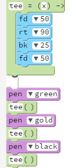
         

       
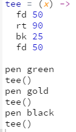</td> 
		<td>介绍一个函数可以被称为几次来创建一个独特的或解决一个问题的想法。
     键入代码并显示一个函数可以被称为重复。

     注：发球的程序代码，可以发现在book.pencilcode.net 
        
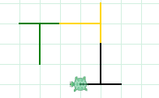
       </td>
        <td>演示：20分钟</td>
	</tr>
     <tr>
		<td>Code：Step 1
        
</td> 
		<td>介绍一个小函数可以写的思想和另一个可以写的程序。 

     第一步：编写程序绘制背景：background()
       
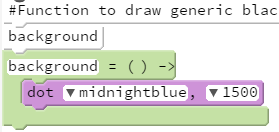 
       </td>
        <td>演示
       时间：
       30分钟
     （包括所有的步骤 ）</td>
	</tr>
  <tr>
		<td>Code：Step 2
          
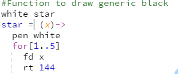</td> 
		<td>第二步编写程序绘制的明星：star() 
         

       </td>
        <td></td>
	</tr>
<tr>
		<td>Code：Step 3
         
</td> 
		<td>第三步：编写一个主程序调用这两个程序：main() 
         
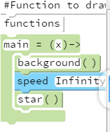 
       </td>
        <td></td>
	</tr>
<tr>
		<td>Code：Step 4 Black，Sky，1，Stars
          

           
</td> 
		<td>第四步：链接主函数
      向学生解释main()不知道明星是新的程序代码可以在这里找到：
      http://teachersguide.pencilcode.net./edit/chapter5/starslnTheSky 
         
 
       </td>
        <td></td>
	</tr>
<tr>
		<td>Black，Sky，25，Stars 
         

             
</td> 
		<td>解释和展示给学生，star()可以用在不同的程序 
     代码程序，告诉学生如何star()和background()功能复用 
      
 
        

       </td>
        <td>演示
        时间：
        15分钟</td>
	</tr>
</table>

<table>
	<tr>
		<td>详细内容</td> 
		<td>教学建议</td>
        <td>时间</td>
	</tr>
     <tr>
		<td>Code
         

           
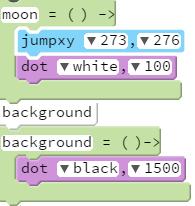
             
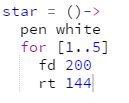 
                 

                     
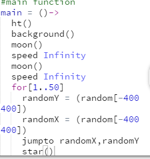
                        
</td> 
		<td>演示，现在很容易为程序添加新的功能（例如增加一个月亮） 

      复制左栏显示模块化的代码 

     解释说，如果恒星或月球没有显示，更容易找到该程序中的错误，因为函数（行为）是孤立的函数
     证明这一点通过修改月亮的位置（jumpxy值）
 
     或者，修改FD -星功能价值。改变它的东西非常小，如6（代码和输出显示） 
     

     注：主要main（）功能保持不变（未显示）
      
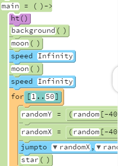
       </td>
        <td>演示
        时间：
       15分钟
        学生
        实践
        时间：
         45分钟</td>
	</tr>

</table>

### 5.1.7教案 4 ###
本课探究参数的功能。程序员设计的函数与更多的变量，使他们的程序可重用的各种应用。变量的值是从用户获得的，在作为参数传递给函数。 
如圆（半径，颜色）半径
<table>
	<tr>
		<td>详细内容</td> 
		<td>教学建议</td>
        <td>时间</td>
	</tr>
     <tr>
		<td>Code
        
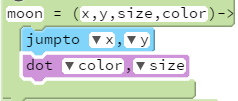 
           
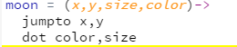
              
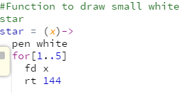
                 
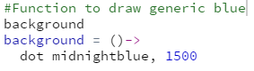
                   
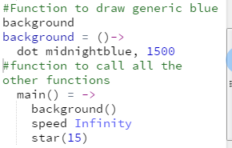</td> 
		<td>以月亮为例子。问学生们如何改变月球的大小。月球计划（见代码）现在可以采取的大小和位置参数。并且根据不同的值月亮的位置和大小在天空会不同。解释说，在月球（230 230…），×将采取价值230，y并将采取价值230。 
       教学建议。请同学们拉上星程序并添加参数（代码）。您还可以与学生和在屏幕上一起写代码。
        

          

            

               

                  

                    

                       
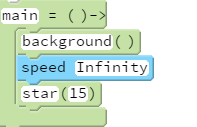
       </td>
        <td>演示
         时间：
         30分钟</td>
	</tr>
 

</table>
 <table>
    <tr>
		<td>迭代开发周期：
            学生需要大量的练习和用函数编写程序。培养他们写一小段代码和测试它，然后再加入小的变化和测试，重复这个过程，直到程序反馈。学生练习：120分钟</td> 
		
	</tr>
 </table>
