#第一章PencilCode环境介绍
本节内容主要向大家介绍PencilCode的编辑环境。PencilCode是由谷歌工程师DavidBau和他的儿子AnthonyBau一起开发的应用于多种领域的开源技术，只需要登陆PencilCode.net网站就可以免费使用该工具。
##两种视窗模式
PencilCode提供两种视窗界面。电脑用户通过输出设备就可以进行观看。项目的运行离不开源代码，在PencilCode中，屏幕被分成了两部分，左边的一部分用于显示项目的源码，而右边的一部分则输出代码的运行结果。用户可以通过点击屏幕中间的"play"键来运行已经编辑好的源代码。如图1 所示。
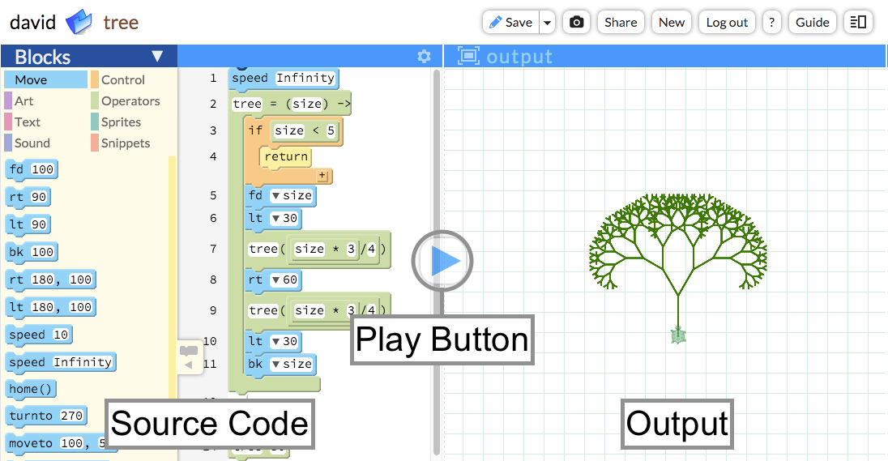

##PencilCode提供的语言和函数库
PencilCode在块和文本编辑过程中支持主流的web编辑语言，常用的函数库包括：
*HTML,web标准语言
*JavaScrip，web浏览器标准的项目语言
*CSS，
*jQuery
*CoffeeScript
*jQuery-turtle
借助PencilCode，学员可以使用这些工具创建各种web应用，并且在探索过程中形成基本的计算思维概念。
我们将在本书后续章节中介绍这些语言和函数库的使用。
##网页制作
每一个网页都具有源代码和输出显示两部分。
当用户点击链接打开网页的时候，网页源代码就被发送到了用户主机。页面可以是不同语言构成，例如HTML和JavaScrip。但是显示结果都是由浏览器编译过的界面。例如图2和图3所示。
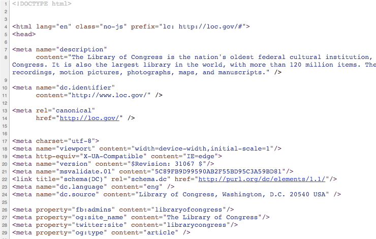

鼓励学生可以去www.ebay.com，www.flicker.com，www.mozilla.org之类的网站，借助Ctrl-U查阅源码。通过查阅不同网站的页面代码获取网站的隐藏信息。
##基于网页的PencilCode
PencilCode的项目编辑都是基于网页进行的。顶端编辑菜单仅提供几个用于控制页面共享的编辑按钮。右上角的按钮用于项目的保存、共享页面管理以及帮助文档。左上角显示项目名称。项目重命名通过点击褐色名称进行编辑。如图4所示。
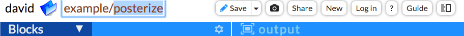

项目名称用于设置项目网络链接地址（URL web address），如下表所示：

|用户名 |项目名称 |网站链接|
|-------|---------|--------|
| Coolsite |     First       | http：//coolsite.pencilcode.net/home/first         |
| David  | Example/posterize | http://david.pencilcode.net/home/ example/posterize |
鼠标悬停在蓝色区域右边的"output"按钮上会激活"open window"链接，打开一个新的页面用于显示已经完成的项目成果。这个页面不会显示任何代码，（这个链接仅对已经记录和保存的项目有效。）这个操作用于全屏运行编辑的项目结果，使用Ctrl-U打开"view source"查阅页面代码。

在PencilCode，全屏输出的URL地址含有"/home/"字段，因此这个地址可以被链接、邮件发送、植入到任何地方。将URL地址中的"/home/"字段改为"/edit/"， 则进入UI编辑，显示PencilCode项目源码。
##程序设计语言介绍
PencilCode支持用户使用"模块化"语言，通过对编辑模块的拖拽来进行程序的设计。通过这些已编辑的模块可以直接调用文本语言诸如CoffeeScript、JavaScrip及HTML。尽管这些模块由不同的文本代码构成，但是都可以进行可视化的程序编辑。
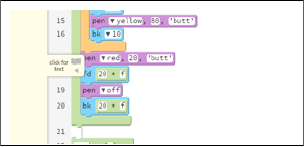
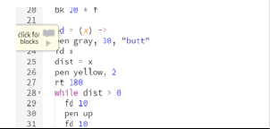

程序设计语言与其他语言一样，既能支持硬件设备也能被程序员理解。英文"一遍又一遍的调试"在英特尔奔腾芯片中被解释为"1110101111111110"。英文单词对于计算机而言太模糊，而机器代码对于程序员又太过于晦涩。程序设计语言使用可读单词，具有精确的语法编写规则，使得计算机能够精确地读写。
当阅读CoffeeScript或者JavaScrip的可视化模块时，编程语法以块的拼接结构形式表现出来。例如相同的词语在不同命令中，以不同的模块显示。对于一个控制语句中的命令，可以通过以命令模块的嵌套来显示。
##模块和文本的转换
在PencilCode中，块模式和文本模式的优势都被完美的展示出来。通过块模式可以借助以可视化界面对CoffeeScript、JavaScrip或者HTML语言的逻辑结构进行阅读，学生可以自由的对两种编辑模式进行切换。
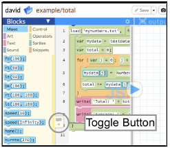

编辑区域左下角黄色标签上的开关按钮用于进行项目编辑过程中块模式和文本模式的切换。鼠标滑过标签时可以看到标签扩展按钮上显示"click for blocks"或者"click for text"（"点击进入块编辑"或者"点击进入文本编辑"）
##块编辑的使用
何时使用块和文本？
当学生学习了新的函数或者命令，可以使用块编辑模式进行练习。所有的块都被组织排放在右侧的列表中，使用时根据正确的语法和适当的缺口对接就能实现预定的功能。因此通过对块进行适当的组织就能够轻松的实现每一个新的想法和创意。
当学生熟练掌握了函数和命令后，为帮助他们理解和记忆，可以使用文本编辑模式。当学生通过编辑和完成项目，部分掌握了程序设计语言后，会发觉文本模式下命令和函数的录入似乎比块模式下进行块的拖动更加快速和流畅。
在PencilCode中，每一个构成块的代码都包含了程序设计语言中所使用基本的数学关系。例如，当使用CoffeeScript语言时，使乌龟向前移动100像素可以使用"fd 100"的模块，同时，与之相关的代码被写入文本模式中。当学生使用文本编辑模式修改或者添加代码时，他们可以切换到块模式下查阅代码带来的块的变化。
学生可以通过点击按钮在两种模式下自由切换工作界面。最初我们建议学生更多的使用块编辑，而当学生逐渐掌握程序设计语言后，他们会更多的使用文本编辑来录入代码，只有当他们需要尝试一些新的想法或者他们需要了解某段代码的工作过程的时候才会切换到块编辑模式。在学习程序设计语言的过程中，大多数的学生都会经历从块编辑到文本编辑的过程。

##CoffeeScript
PencilCode同时支持CoffeeScript和JavaScript，但是默认的语言是CoffeeScript，因此我们推荐学生学习CoffeeScript。
CoffeeScript应用于在很多的技术中心，包括Github和Dropbox。它的运行速度和功能与JavaScript相同。而且CoffeeScript的语法更简单，使用空格代替的其他语言中出现的各种符号。简单的语法和少量的代码可以帮助学生在文本编辑界面很容易的做出第一个程序。同时也想学生阐明了程序设计语言中的一些基本概念，诸如函数、循环、嵌套、录入和数组。
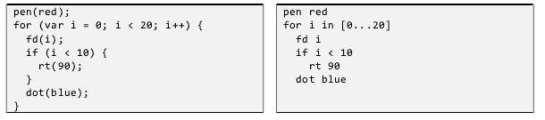

本书将在介绍完JavaScrip之后，第7章介绍CoffeeScrip的使用。
##命令
命令标记：在块编辑的源码中创建命令。首先创建一个空的模块，点击"Enter"键确认，接着在块的头部录入#号。块命令如下图所示：
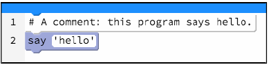

##语言选择：
在CoffeeScript和JavaScript中进行选择，点击蓝色标题中的"gear cion"。从中选择语言和添加的函数库，窗格语言可以选择CSS或者HTML。也可以选择是否让页面中的小乌龟出现在所编辑的项目中。
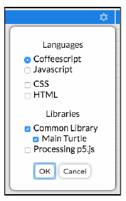

该选项可延续到下一个应用项目中。可以通过"gear cion"重新进行选择设置。
##测试区域
测试命令的一种方式就是运行。位于页面右下方的测试栏可以帮助核对CoffeeScript和JavaScript的语法。例如，录入"dot red，100"点击运行，可以看到命令的执行状况和功能。

在测试区域录入不带参数的命令，会获得该命令参数使用方法的提示。(如下图所示，关于"label"的帮助信息)如果帮助信息显示不下，深灰色的区域会延长用于显示帮助文档。
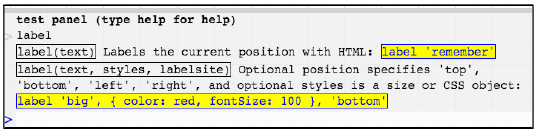

###测试框调试
可以通过测试框调试项目变量。例如，运行左侧区域的指令"x=42"，
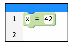

录入在测试框中看到的"x"的值，并点击回车键。如果测试框显示"x is not defined"，意味着程序还没有开始运行，需要点击"play"按钮，之后会看到程序的运行结果"x"的值是42。
"debug"命令很特殊，可以直接在主页面上输出。尝试创建项目，设置"debug 'hello'"，单词"hello"被显示出来。
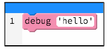

运行的时候，测试框会显示"hello"。
##PencilCode的库
PencilCode提供哪些可用的函数库？大约100个函数存在于PencilCode的块列表中，同时PencilCode还提供一个大型开放式的函数库远超出列表中提供的函数数量。基本上所有的页面都可以用。
在教师手册中只对其中的一小部分函数进行了讨论说明，而剩余的库可以通过互联网上的例子和教程进行学习使用。PencilCode可用库包括：
1.网络文档对象模型（DOM）。互联网标准委员会制定，该模型函数可以被互联网上所有页面识别。
2.jQuery.最受欢迎的互联网页面库，应用于大多数网站。我们将在第11章介绍jQuery库的使用方法。
3. jQuery-turtle。PencilCode提供的乌龟库拓展了jQuery库。提供了本手册第一部分介绍的简单易用的功能。大多数函数都可以通过乌龟库进行块编辑。
4.socket io.实时通信库可以实现与浏览器的即时通信。
###乌龟库之外的巨大功能库讲解
尽管网页编辑有不同的功能，所有的标准类都可以被测试窗口解析。例如，录入"location"到DOM界面的"location"对象，并且通过点击鼠标使其扩大。测试窗口显示"location"包含许多函数和大量的数据，"href"：一个项目使用location.href变量。
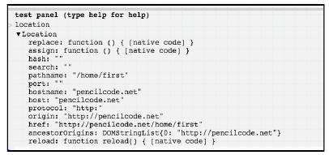

##如何使用本书
###向导
这本教师手册用于帮助学生学习基本的项目设计知识。好像有教师在课程中做项目介绍一般。这本手册告诉学生如何分阶段的使用PencilCode环境，以及开始编写简单的程序。每章围绕着基本的程序结构，从基本的概念到深入的应用。手册也告诉学生如何讲块代码编译为代码文本：开始编程可能会让学生望而生畏，最初使用块编辑可以克服恐惧的心理。同时关注学习程序设计方法，以及程序所要解决的问题。
 教师手册基于CSTAK-12标准编写。每章都按照教案的标准框架建立。各章节的基础项目由David和Deepa完成，更多有效应用参阅网站向导。
###如何阅读这本书
这本手册适用于借助提供一些PencilCode教授程序设计的教师。每章提供的截图用于帮助教师完成每个主题。关键片段可以给老师一个相关技术主题的概述。每章都会提供一个关键词，同时教师的课程设计向导覆盖每个程序。教师可以根据手册中提供的课程内容的案例组织和教授学生。一些有经验的教师会利用教程中的案例和课程计划介绍更多的概念给学生。每一个案例的教授都包含如何实现操作和如何构建应用。鼓励教师使用该手册，并开发出适宜自己学生的教学课程。
每章都提供授课课时建议。这个既是教师手册中授课的建议也是生学习过程的学时建议。
###本书适用的学生对象
本手册主要针对高中学生介绍程序设计课程。

