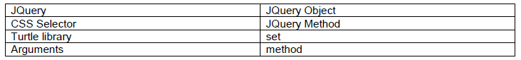
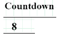
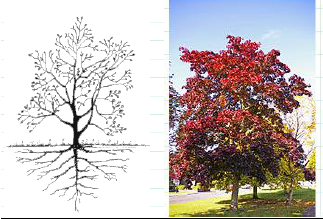

#第十二章 使用 jQuery遍历数据
##12.0.1 学习目标
本章节介绍了jquery的基础知识。当今许多开发者使用jquery来创建具有交互式功能的网页，让学生熟悉、了解互联网上大量的jquery编程资源。学生将学习jquery的”选择”概念，并使用jquery的方法和事件来创建一个简单的交互程序。
##12.0.2 主题大纲
###12.0 章节介绍
* 12.0.1 目标
* 12.0.2 主题大纲
* 12.0.3 关键术语
* 12.0.4 关键概念

###12.1 课程计划
* 12.1.1 建议的时间表
* 12.1.2 CSTA标准
* 12.1.3 课程计划I——使用定时器Timer()程序
* 12.1.4 课程计划II——遍历数组

##12.0.3 关键术语

##12.0.4 关键概念

介绍jQuery
因为jQuery以一种方便简单的方法来检查和改变视觉元素，所以jQuery在网页的创建中最受欢迎的库。下面是一个使用jquery的例子。

`$(‘div’).hide();`

在使用jquery时需要以下三个步骤：
1.CSS选择器是用来查找页面上的一组元素。
2.创建一个jquery对象用来表示集合元素。
3.调用jquery方法来对集合元素做一些相应的操作。
在这个例子中，’div’是CSS选择器，$(‘div’)是jquery对象，.hide()是jquery方法。
这行jquery代码的意思是：“查找页面上所有的`
`元素并将其隐藏”。
查询数据库包括查找、收集和操作三个步骤。Jquery将这个数据库技术应用于一个HTML页面的界面元素，将单个页面作为数据库。

使用$创建jquery对象
在jquery库中最重要的函数是创建jquery的对象函数。因为它使用频繁，Jquery库为这个函数提供了一个简短而不寻常的名字：$。尽管它可能看起来很奇怪，$恰好可以使用一个符号作为一个普通的函数名。
一个jquery对象拥有一组元素：在网页上可能包含零个，一个或者多个元素。
下面是一些使用$的例子：

|jquery构造器    |创建一个包含这个集合的jquery对象|
| ------------- |:-------------:     |
|$('P')         | 文档中所有的`
`元素 |
|$('.special')  | 文档中所有class='special'的元素|
|$('#buy')      |文档中id='buy'的元素|
| $(`''`)|没有插入文档中的一个新的``元素的src|
|$(`'
Hello
'`)      |还未插入文档中的一种给定文本内容的新`
`元素|

用于查找元素的$ CSS选择器语言和CSS语言相同，因此你了解的CSS选择器也同样可以应用到jquery中。如果没有元素匹配选择器，函数将返回为空集。
$函数也可以使用HTML语法创建元素（如上面的最后两个例子）。在这种情况下，它返回一组尚未放置在可视文档中新创建的元素。jquery对象有一个设置其大小的.length的长度属性。例如，可以使用表达式$(‘P’).length来计算文档中`
`元素的数量。
使用jquery对象
有若干可用于任何jquery对象的操作方法。例子如下：

|$('p').fadeOut();    |平滑的淡出元素，然后隐藏它们|
| ------------- |:-------------:     |
| $('p').css({ background: red });         | 改变所有选定元素的CSS样式 |
| $('p').html('Read <b>this</b>');   | 替换所有选定元素的HTML内容|
| var t = $('p').text();        |读取第一个选定的`
`元素的文本内容|
|   $('input').val(10); |设置所有选定的`<input>`框内的值|
|var v = $('input').val();     |读取第一个选定的`<input>`元素的值|
|$('img).attr({src: '/img/cat'});|改变每个``元素的src属性为"/img/cat"|
|$(`''`).appendTo('body');|创建一个dog图像并将它添加到<body>中|
|$('#warn').remove();|删除id="warn"的元素|
|$('img').bk(100);|使用"bk"函数移除``元素|

使用过Pencil Code的每个学生都会对Jquery有所熟悉，因为每个Pencil Code语言都是一个jquery对象。这个Pencil Code语言库为jquery方法增加了像”pen”，”fd”，”rt”，和”moveto”等语言方法，是jquery的一个延伸语言。程序员可以使用这些方法在屏幕上移动任何视觉元素。
主要的语言可以使用jquery方法$(‘#turtle’)调用，所以他们的CoffeeScript程序”fd 100”与本书第一部分的JavaScript和jQuery程序$(‘#turtle’).fd(100)是一样的。

尝试使用jQuery
这样有利于学生对个别jQuery方法进行测试。下面的HTML就是应用”gear”菜单来创建的Pencil Code项目。

`<html> `
`<body> `
  　　 `<h1>My favorite things</h1> `
  　　 `
Pizza: 
`
   　　`
Watermelon: 
`
`</body> `
`</html> `
该文档中有足够的元素可以用上面所介绍的jQuery实例进行测试。学生可以进入Pencil Code右窗格“测试面板”中的jQuery代码，或者也进入运行在左边的JavaScript和CoffeeScript代码中。
这里的jQuery有两点需要注意：
1.当您运行该代码时，通常都会更改，虽然有些更改可以随着时间的推移而改变。
2.尽管你所做的更改会影响可视文档，但是它们不改变程序本身的HTML。
程序中的HTML是“初始状态”的HTML页面。一旦一个程序添加、删除或者改变元素，它可以结束寻找程序员最初写的HTML页面，但是如果程序运行时，它将从最初的HTML开始。

使用jQuery提供动态输出
jQuery是用于创建随时间而改变的动态输出屏幕的用户界面。例如，你可以利用jQuery控制一个定时器每一秒更新多次。下面这个JavaScript程序可以做到这一点。

`$('<h1>Countdown</h1>').appendTo('body'); `
`$('h1').css({textAlign: 'center'}); `
`var count = 10; `
`forever(1, function() { `
  　　　`  $('h1').html(count); `
   　　　 `count -=1; `
  　　　 ` if (count < 0) {`
  　　　   ` $('h1').html('blast off!'); `
   　　　  ` stop();`
`} `
`}); `

本程序使用“forever”来设置一个每秒被调用一次直到stop()方法被调用的函数。以下是程序中每一个jQuery调用的解释：

| $(`'<h1>Countdown</h1>'`).appendTo('body');|创建一个`<h1>`元素，并将其添加到`<body>`中|
| ------------- |:-------------:     |
| $('h1').css({textAlign: 'center'});| 设置元素`<h1>`中的“text-align”属性为中心样式 |
| $('h1').html(count);  | 将元素`<h1>`中的HTML内容更改为可变的|
| $('h1').html('blast off!');|将元素`<h1>`中的HTML的内容变为“blast off！”|
jQuery允许程序通过更新任何视觉元素的内容，以提供屏幕上的实时信息。

使用jQuery事件收集用户的输入
在本书的前面几个章节中，输入是通过界面中的点击按钮来进行收集。jQuery在每个元素上设置“.on”方法来简化收集用户输入事件。下面是一个实例。
`$('h1').on('click', function(e) {`
 　　　 `	log('You clicked on an h1');`
`}`

第一个参数的“on”方法是事件名称，第二个参数是事件处理函数。这些事件处理程序与第三章所用的事件处理程序是一样的。主要区别在于，它很容易将同一事件处理程序连接到整组元素中。它也容易处理事件以外的“点击”事件。下面是可以用这种方式处理事件的部分列表。

|$('h1').on('click', function(e)...)|e.pageX和e.pageY代表点击的页面坐标|
| ------------- |:-------------:     |
|$('h1').on('dblclick', function(e)...)|e.pageX和e.pageY是双击的坐标|
| $('h1').on('mousemove', function(e)...)|e.pageX和e.pageY是鼠标移动的坐标|
|$('h1').on('keydown', function(e)...)|e.which是按键被按下的数字代码|
|$('h1').on('keydown', function(e)...)|e.which是被释放的一个关键数字代码|

其它很多事件都可以被获取到，它们的命名和描述都可以在网络资源上找到。
使用jQuery将输入与输出结合
学生可以通过jQuery将输入与输出相结合并创建有用的交互性用户界面。例如，下面的程序将on(‘click’)事件处理程序与.rt和.attr方法相结合实现当点击图片时，图片旋转并进行切换。

`var trees = [ `
`'/img/elm-tree', `
`'/img/maple-tree', `
`'/img/pine-tree', `
`'/img/cypress-tree', `
`'/img/oak-tree' `
`]; `
`$('').appendTo('body'); `
`$('img').on('click', function() { `
`$('img').rt(360); `
`$('img').attr('src', random(trees)); `
`}); `
###12.1.1  建议事件表：55分钟的课时
|教学天数|教学主题|
| ------------- |:-------------:     |
|2天|课程计划I|
|2天|课程计划II|
###12.1.2 教学标准
|CSTA标准|CSTA链|CSTA覆盖的学习目标|
| ------------- |:-------------:| -----:|
|等级3B（9-12年级）|合作（CL|使用项目协作工具，版本控制系统和集成开发环境，在一个协作软件中开发项目|
|等级3A（9-12年级）|计算编程实践（CPP)|使用先进的工具创建数字作品(例如，网页设计，动画，视频，多媒体)|
|等级3A（9-12年级）|计算编程实践（CPP）|通过使用各种网络编程工具来创建和组织网页|
###12.1.3 课程计划I
本课程计划的重点是集中在使用jQuery命令和定时器程序设计程序。

|详细内容|教学建议|时间|
| ------------- |:-------------:| -----:|
|代码：`$('<h1>Countdown</h1>').appendTo('body'); 　``$('h1').css({textAlign:'center'});　　　　　``var count = 10;　　　　　　　　　　　``forever(1, function() {　 $('h1').html(count);` `count -=1;``if (count < 0) { ` `$('h1').html('blast off!');` `stop();  ` `}` ` });　　　　　　　　　　　　　　　　　　　　　　　　　　　　　　　　　　　　　　　　　　　　　　　　　`输出: |第一步：演示计时器程序。   第二步：指出解释各种jQuery命令的关键概念。            第三步：向学生解释$符号怎样调用函数。                第四步：使用Alt-Tab解释程序输出和实际程序之间的命令。   第五步：鼓励学生尝试修改代码  |　　　　　　　　示范：15分钟               　学生实践：30分钟|

###12.1.4 课程计划II
本课程计划演示jQuery遍历存储在数组的数据的能力。它解决了在一维数组中遍历和显示数据。

|详细内容|教学建议|时间|
| ------------- |:-------------:| -----:|
|代码：                   `var trees = ['/img/elm-tree','/img/maple-tree', '/img/pine-tree', '/img/cypress-tree','/img/oak-tree' ]; $('').appendTo('body'); $('img').on('click', function() {$('img').rt(360); $('img').attr('src', random(trees)); }); `　输出: |第一步：展示神奇的树程序。第二步：向学生展示鼠标如何响应点击函数。             第三步：指出树的数组命名。 第四步：appendTo指向的jQuery命令。                    第五步：鼓励学生修改数组的内容并让学生注意各种图像的显示.第六步：鼓励学生尝试其他的jQuery代码并查看结果。|　　　　　　　示范：15分钟学生实践：30分钟|

