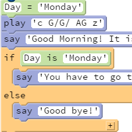
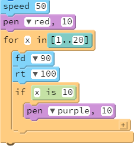
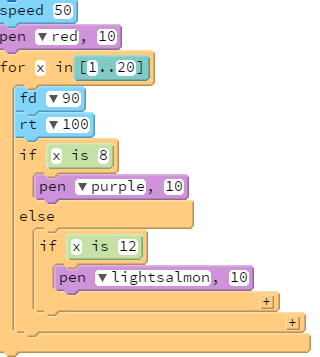
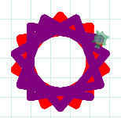
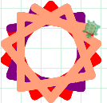
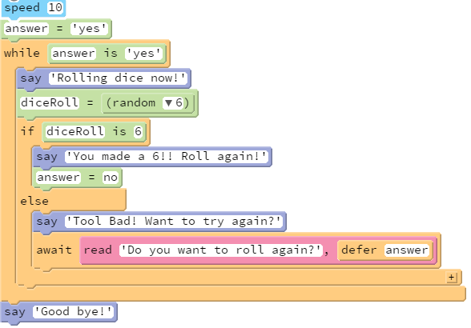
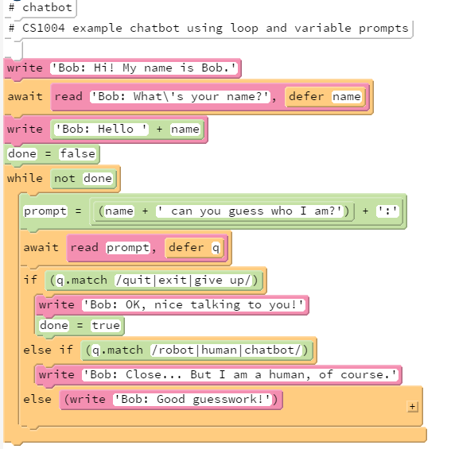
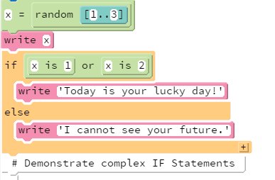

# 章节六：条件语句

## 6.0.1 教学目标

学生一般认为条件语句（也称为选择语句或决定语句）相比于其他的结构更容易理解。关于条件语句的主要困惑发生在学生开始用布尔组合时，例如：英语中随便用的单词“and”与布尔逻辑中的形式词“`and`”有一些不同。在这个单元的最后，学生应该能运用条件语句，创建具有比较的布尔表达式，他们也应该能正确的推出布尔操作符“`and`”、“`or`”和“`not``”的用法。

## 6.0.2 主题大纲

> 6.0   章节介绍  
  >> 6.0.1   教学目标  
  >> 6.0.2   主题大纲  
  >> 6.0.3   关键术语  
  >> 6.0.4   关键概念  

> 6.1     课程计划  
>> 6.1.1   建议的时间表  
>> 6.1.2   CSTA标准  
>> 6.1.3   课程计划一 使用控制块-`If`,`If...Else`  
>> 6.1.4   课程计划二 修改问答机器人的循环赋值
>> 6.1.5   课程计划三 使用布尔表达式  
>> 6.1.6   课程计划四 设计一个猜大小游戏和赛车游戏

> 6.2   资源  
>> 6.2.1   附加练习

## 6.0.3 关键术语

<table border="1" cellpadding="2" cellspacing="0" width="100%">
<tr>
<td>布尔值：<code>true</code>/<code>false</code></td>
<td><code>If then else</code>，<code>If then else if else</code></td>
</tr>
<tr>
<td>简单与复杂的表达式</td>
<td>匹配功能</td>
<tr>
<td><code>AND</code>/<code>OR</code>-操作符</td>
<td></td>
</tr>
<tr>
<td><code>is</code>（比较）,<code>isnt<code>,<code>&lt;</code>,<code>&gt</code>;,</td>
<td></td>
</tr>
<tr>
<td>数值比较</td>
<td></td>
</tr>
<tr>
<td>字符串比较</td>
<td></td>
</tr>
</table>

## 6.0.4 关键概念

### 使用条件控制代码

单词`if`能够用来使一块代码在一个条件的控制下，这块代码仅仅在条件为真时运行。

下面是一个用`if`通过检测键盘按下来控制乌龟的运动。

缩进的代码`fd 2`只在条件`pressed('W')`为真，也就是，当使用者正在按`W`键的时候运行。相似的，另外两行代码`rt 2; dot blue, 5`只在使用者按下`D`键时运行。

如果这两个键都没被按下，这两块缩进的代码都不会运行。如果这两个键都被按下，这两块代码都会运行。

<table align="center" border="1" cellpadding="4" cellspacing="0">
<tr bgcolor=#CCCCCC><td>
<pre><code>forever ->
  if pressed('W')
    fd 2
  if pressed('D')
    rt 2
    dot blue, 5</code></pre>
</td></tr>
</table>

<i>用<code>if</code>检测键盘按下</i>

### 对于两种选择中另一种使用“else”

当“`if`”没有发生的时候，关键词“`else`”允许你编写要使用的第二种行动。第二块代码将会在条件为假的时候发生。

<table align="center" border="1" cellpadding="4" cellspacing="0">
<tr bgcolor=#CCCCCC><td>
<pre><code>forever ->
  if pressed('W')
    fd 2
  else
    rt 2</code></pre>
</td></tr>
</table>

<i>用<code>if/else</code>提供两种选择</i>

这个程序在`W`被按下的的时候将乌龟向前移动。当`W`没有按下的时候，旋转乌龟自身。

### 对于多种选择使用“else if”链接

当存在三种甚至更多的行动时，`if`和`else`将被链接起来。

<table align="center" border="1" cellpadding="4" cellspacing="0">
<tr bgcolor=#CCCCCC><td>
<pre><code>forever ->
  if pressed('W')
    fd 2
  else if pressed('S')
    bk 2
  else
    rt 2;</code></pre>
</td></tr>
</table>

<i>对于三种选择，链接<code>if</code>，<code>else if</cdoe>和<cdoe>else</code></i>

这个代码中，当`W`被按下时乌龟向前移动，当`S`被按下时乌龟向后移动。如果什么都没有按下，乌龟将向右自旋。链接的`if/else`只会选择为真的第一个条件，因此，当`W`与`S`都同时被按着时，程序将只执行“`fd 2`”，乌龟并不会向后移动。

### 用“and”，“or”和“not”组成布尔表达式

词`and`，`or`和`not`是可以被用来组合条件的**布尔操作符**。例如，下面的程序用了“`and`”和“`not`”。程序绘制了一个蓝色的环，然后只有在`W`被按下并且乌龟没有接触到蓝色的环的时候向前移动乌龟。

<table align="center" border="1"cellpadding="4" cellspacing="0">
<tr bgcolor=#CCCCCC><td>
<pre><code>dot blue, 500
dot white, 400
forever ->
  if pressed('W') and not touches('blue')
    fd 2
  else
    rt 2</code></pre>
</td></tr>
</table>

<i>用<code>and</code>和<code>or</code>的组合测试</i>

尽管布尔操作符通常与在英语单词中读到它们有同样的意思，但是理解它们作为数学操作符究竟如何发挥作用很重要。因为很容易产生意外的影响。

### 搞混“and”和“or”

考虑一个程序，`up`键和`W`键需要起同样的作用，用同样的方法向前移动乌龟。我们可能会想着用`and`组合来用一个“`if`”来同时捕获这两种情况，就像这样：

<table align="center" border="1" cellpadding="4" cellspacing="0">
<tr bgcolor=#CCCCCC><td>
<pre><code>WRONG:

forever ->
  if pressed('up') and press('W')
    fd 2</code></pre>
</td></tr>
</table>

<i>错误的使用<code>and</code>组合两种情况</i>

可是，这段代码不会产生想要的结果！为了理解原因，我们需要理解`and`和`or`是如何操作真值的。

### 布尔值和布尔表

词`and`，`or`和`not`是组合“`true`”和“`false`”的布尔操作符（与你使用“`+`”，“`×`”组合常规数字的算术规则相似）。就像我们能够通过建立加法表和乘法表学习加法和乘法一样，我们可以通过写下**真值表**理解`and`和`or`。这里有两个关于上面的程序的真值表：

<table align="center" border="1" cellpadding="2" cellspacing="0">
<tr>
<td align="center">pressed('up') <b>and</b> pressed('W')</td>
<td align="center">pressed 'up' = false</td>
<td align="center">pressed 'up' = true</td>
</tr>
<tr>
<td align="center">pressed 'W' = false</td>
<td align="center" bgcolor=#FFB6C1>false</td>
<td align="center" bgcolor=#FFB6C1>false</td>
</tr>
<tr>
<td align="center">pressed 'W' = true</td>
<td align="center" bgcolor=#FFB6C1>false</td>
<td align="center" bgcolor=#B0C4DE>true</td>
</tr>
</table>

 

<table align="center" border="1" cellpadding="2" cellspacing="0">
<tr>
<td align="center">pressed('up') <b>or</b> pressed('W')</td>
<td align="center">pressed 'up' = false</td>
<td align="center">pressed 'up' = true</td>
</tr>
<tr>
<td align="center">pressed 'W' = false</td>
<td align="center" bgcolor=#FFB6C1>false</td>
<td align="center" bgcolor=#B0C4DE>true</td>
</tr>
<tr>
<td align="center">pressed 'W' = true</td>
<td align="center" bgcolor=#B0C4DE>true</td>
<td align="center" bgcolor=#B0C4DE>true</td>
</tr>
</table>

逻辑与`and`组合两个布尔值，只有在两个值都为`true`的时候“`true`”。例如，`pressed('up')` __and__ `pressed('W')`，只有在`up`键和`W`键同时都被按下时为`true`。

逻辑或`or`组合两个布尔值，只要两个值之一为`true`就产生`true`。例如，`pressed('up')` __or__ `pressed('W')`，在只有`W`被按下，或者只有`up`被按下，或者两者都被按下时为“`true`”。这是我们想在程序里实现的结果。

把`and`改成`or`以修复程序。

### 用比较操作符测试数字

布尔表达式能够用来检测数字的属性。你在数学课堂上见到的大多数比较操作符能够在一个编程语言中使用，但是它们可能被写做稍微不同的符号。例如，“`小于或等于`”被写做`<=`。这里有一个一些常见的数字布尔测试的总结：

<table border="1" cellpadding="2" cellspacing="0" width="100%">
<tr>
<td align="center">表达式</td>
<td>描述</td>
<td align="center">x = 0时的值</td>
<td align="center">x = 3时的值</td>
<td align="center">x = 6时的值</td>
</tr>
<tr>
<td align="center"><code>x is 3</code></td>
<td>x等于3</td>
<td align="center" bgcolor=#FFB6C1>false</td>
<td align="center" bgcolor=#B0C4DE>true</td>
<td align="center" bgcolor=#FFB6C1>false</td>
</tr>
<tr>
<td align="center"><code>x isnt 3</code></td>
<td>x不等于3</td>
<td align="center" bgcolor=#B0C4DE>true</td>
<td align="center" bgcolor=#FFB6C1>false</td>
<td align="center" bgcolor=#B0C4DE>true</td>
</tr>
<tr>
<td align="center"><code>x < 3</code></td>
<td>x小于3</td>
<td align="center" bgcolor=#B0C4DE>true</td>
<td align="center" bgcolor=#FFB6C1>false</td>
<td align="center" bgcolor=#FFB6C1>false</td>
</tr>
<tr>
<td align="center"><code>x &lt;= 3</code></td>
<td>x小于或等于3</td>
<td align="center" bgcolor=#B0C4DE>true</td>
<td align="center" bgcolor=#B0C4DE>true</td>
<td align="center" bgcolor=#FFB6C1>false</td>
</tr>
<tr>
<td align="center"><code>x > 3</code></td>
<td>x大于3</td>
<td align="center" bgcolor=#FFB6C1>false</td>
<td align="center" bgcolor=#FFB6C1>false</td>
<td align="center" bgcolor=#B0C4DE>true</td>
</tr>
<tr>
<td align="center"><code>x &gt;= 3</code></td>
<td>x大于或等于3</td>
<td align="center" bgcolor=#FFB6C1>false</td>
<td align="center" bgcolor=#B0C4DE>true</td>
<td align="center" bgcolor=#B0C4DE>true</td>
</tr>
<tr>
<td align="center"><code>0 < x &lt;= 6</code></td>
<td>x大于0且小于或等于6</td>
<td align="center" bgcolor=#FFB6C1>false</td>
<td align="center" bgcolor=#B0C4DE>true</td>
<td align="center" bgcolor=#B0C4DE>true</td>
</tr>
<tr>
<td align="center"><code>x % 2 is 1</code></td>
<td>x为奇数（因为x除以2的余数为1）</td>
<td align="center" bgcolor=#FFB6C1>false</td>
<td align="center" bgcolor=#B0C4DE>true</td>
<td align="center" bgcolor=#FFB6C1>false</td>
</tr>
<tr>
<td align="center"><code>x % 3 is 0</code></td>
<td>x被3整除</td>
<td align="center" bgcolor=#FFB6C1>false</td>
<td align="center" bgcolor=#B0C4DE>true</td>
<td align="center" bgcolor=#B0C4DE>true</td>
</tr>
</table>

### 搞混“or”和比较

数值比较能够用布尔操作符组合。例如，`(x > 6 and x isnt 9)`意味着x是一个大于6且不等于9的数，`(x is 5 or x is 11)`意味着x或者是5或者是11。重要的是，记住词`or`是操作真值而非操作数字的。因此左边版本的程序不会产生需要的结果。

<table align="center" border="1" cellpadding="4" cellspacing="0" width="100%">
<tr bgcolor="#CCCCCC">
<td>
<pre><cdoe>WRONG:

await readnum 'How many items?', defer n
if n is 1 or 2
  write 'Come to the speedy checkout.'</code></pre>
</td>
<td>
<pre><code>RIGHT:

await readnum 'How many items?', defer n
if n is 1 or n is 2
  write 'Come to the speedy checkout.'</code></pre>
</td>
</tr>
</table>

左边的程序无论你输入什么都会错误的导致快速检验行。为了理解原因，记得`or`操作的是真值，因此，当你说“`or 2`”，它将判断“`2`是`true`还是`false`？”这个问题。按照惯例，任意非零数字都当作“`true'`”，因此“`or 2`”使得不管num的值为多少这个表达式总是真。另一方面，右边的程序将产生需要的结果：只有number是2的时候使表达式“`or n is 2`”为真。

要考虑的另一个区别是操作符的优先级。词`or`比`is`的优先级低，因此左边的表达式这样读：`((n is 1) or 2)`，右边的表达式这样读：`((n is 1) or (n is 2))`。

### 使用模式匹配测试字符串

测试文本字符串也能用来创建布尔值字符串的方法有准确地比较它们（查看它们的长度）或者用“`match`”方法检测字符串是否匹配一个模式。模式匹配可以用来确定一个字符串里面是否包含一个特定的字母模式。

下面的表格展示了一些例子。
<table border="1" cellpadding="2" cellspacing="0" width="100%">
<tr>
<td align="center">Expression</td>
<td>Description</td>
<td align="center">"appear"</td>
<td align="center">"pear"</td>
<td align="center">"peachy"</td>
</tr>
<tr>
<td align="center"><code>x is "pear"</code></td>
<td>x就是等于字符串"pear"</td>
<td align="center" bgcolor=#FFB6C1>false</td>
<td align="center" bgcolor=#B0C4DE>true</td>
<td align="center" bgcolor=#FFB6C1>false</td>
</tr>
<tr>
<td align="center"><code>x.length is 6</code></td>
<td>x刚好有6个字符</td>
<td align="center" bgcolor=#B0C4DE>true</td>
<td align="center" bgcolor=#FFB6C1>false</td>
<td align="center" bgcolor=#B0C4DE>true</td>
</tr>
<tr>
<td align="center"><code>x.match(/pp/)</code></td>
<td>x包含子字符串"pp"</td>
<td align="center" bgcolor=#B0C4DE>true</td>
<td align="center" bgcolor=#FFB6C1>false</td>
<td align="center" bgcolor=#FFB6C1>false</td>
</tr>
<tr>
<td align="center"><code>x.match(/pea/)</code></td>
<td>x包含子字符串"pea"</td>
<td align="center" bgcolor=#B0C4DE>true</td>
<td align="center" bgcolor=#B0C4DE>true</td>
<td align="center" bgcolor=#B0C4DE>true</td>
</tr>
<tr>
<td align="center"><code>x.match(/PEA/)</code></td>
<td>x包含子字符串"PEA"</td>
<td align="center" bgcolor=#FFB6C1>false</td>
<td align="center" bgcolor=#FFB6C1>false</td>
<td align="center" bgcolor=#FFB6C1>false</td>
</tr>
<tr>
<td align="center"><code>x.match(/Pea/i)</code></td>
<td>x包含子字符串"Pea"，忽略大小写</td>
<td align="center" bgcolor=#B0C4DE>true</td>
<td align="center" bgcolor=#B0C4DE>true</td>
<td align="center" bgcolor=#B0C4DE>true</td>
</tr>
<tr>
<td align="center"><code>x.match(/^pea/)</code></td>
<td>x以"pea"为字符串开头</td>
<td align="center" bgcolor=#FFB6C1>false</td>
<td align="center" bgcolor=#B0C4DE>true</td>
<td align="center" bgcolor=#B0C4DE>true</td>
</tr>
<tr>
<td align="center"><code>x.match(/ear$/)</code></td>
<td>x以"ear"为字符串结尾</td>
<td align="center" bgcolor=#B0C4DE>true</td>
<td align="center" bgcolor=#B0C4DE>true</td>
<td align="center" bgcolor=#FFB6C1>false</td>
</tr>
<tr>
<td align="center"><code>x.match(/a(p|ch)/)</code></td>
<td>x包含"a"且"a"后跟"p"或"ch"</td>
<td align="center" bgcolor=#B0C4DE>true</td>
<td align="center" bgcolor=#FFB6C1>false</td>
<td align="center" bgcolor=#B0C4DE>true</td>
</tr>
<tr>
<td align="center"><code>x.match(/ap*e)/)</code></td>
<td>x包含"a"，后跟0个或更多"p"，后跟"e"</td>
<td align="center" bgcolor=#B0C4DE>true</td>
<td align="center" bgcolor=#FFB6C1>false</td>
<td align="center" bgcolor=#FFB6C1>false</td>
</tr>
</table>

在两个符号"/"中间用 的模式被叫做**正则表达式**。

一个正则表达式能够用来检测一个字符串是否包含一个固定的模式，例如字符串是否包含字母"pp"。一般地，正则表达式是是区分大小写的，所以"PEA"不能匹配"pea"，但是在正则表达式后面加一个"`i`"能使其不区分大小写。

正则表达式模式有一些强大的功能。例如，在一个正则表达式中，"`^`"匹配字符串的开头，"`$`"匹配字符串的结尾，"`(one|other)`"用来匹配备选项，"`*`"允许一个子样式重复0次或更多次。

尽管上面展示的样式类型对于大多数情况已经足够，正则表达式还有更多功能。如果你搜索“regular expression lessons”，会发现互联网上还有很多关于正则表达式的优秀的资源。当你探索时，你应该知道正则表达式中的符号是标准化的，在`JavaScript`，`CoffeeScript`，`Python`，`Perl`，`Java`，`C#`与其他语言中使用的是同一种样式。

## 6.1.1 建议的时间表

<table border="1" cellpadding="2" cellspacing="0" width="100%">
<tr bgcolor=#CCCCCC>
<th>教学日</th>
<th>主题</th>
</tr>
<tr>
<td>2天</td>
<td>课程计划一：<code>If</code>,<code>If Then Else</code>语句使用有趣的可视化元素</td>
</tr>
<tr>
<td>1天</td>
<td>课程计划二：问答机器人 与 课程计划三：复杂`If`语句</td>
</tr>
<tr>
<td>1天</td>
<td>课程计划四：结对编程猜大小游戏</td>
</tr>
<tr>
<td>1天</td>
<td>课程计划五：赛车游戏</td>
</tr>
</table>

## 6.1.2 标准

<table border="1" cellpadding="2" cellspacing="0" width="100%">
<tr bgcolor=#CCCCCC>
<th>CSTA标准</th>
<th>CSTA链</th>
<th>CSTA学习目标覆盖</th>
</tr>
<tr>
<td>Level 3 A (Grades 9 - 12)</td>
<td>计算思维(CT)</td>
<td>解释如何通过排序，选择，迭代和递归构成算法块</td>
</tr>
<tr>
<td>Level 3 A (Grades 9 - 12)</td>
<td>CT</td>
<td>解释程序执行进程</td>
</tr>
<tr>
<td>Level 3 A (Grades 9 - 12)</td>
<td>CT</td>
<td>描述计算中如何使用数学与统计功能，集合和逻辑</td>
</tr>
</table>

## 6.1.3 课程计划一

这节课程聚焦于控制块，`If`语句和`If Else`语句。这节课程应当花费一个课时的30到40分钟，剩余的时间让学生仿照这个程序编写一个相似的程序。

<table border="1" cellpadding="4" cellspacing="0" width="100%">
<tr bgcolor=#CCCCCC>
<th>详细内容</th>
<th>教学建议</th>
<th>时间</th>
</tr>
<tr>
<td>
Code
<table border="1" cellpadding="4" cellspacing="0" width="100%">
<tr bgcolor=#CCCCCC><td>
<pre><code>Day = 'Monday'
play 'c G/G/ AG z'
say 'Good Morning! It is time to wake up'
if Day is 'Monday'
  say 'You have to go to school today'
else
  say 'Good bye!'</code></pre>
</td></tr>
</table>  

</td>
<td>
解释布尔表达式计算的关键概念。
  
展示控制块和‘IF’语句
  
输入左一列的<a href="http://teachersguide.pencilcode.net./edit/chapter6/WakeUp">代码</a>（注意：对于这个程序，你可能需要一个扬声器。你可以使用<code>write</code>块取代<code>say</cdoe>块）
  
教学提示：你可以通过在整段代码外添加一个循环使其以一个固定周期多次（如：5次）播放这个曲调来扩展这个课程。解释这个程序给出一个基于变量“Day”被设定的值的输出。
</td>
<td>
示范：20分钟
</td>
</tr>
<tr>
<td>
Code
<table border="1" cellpadding="4" cellspacing="0" width="100%">
<tr bgcolor=#CCCCCC><td>
<pre><code>speed 50
pen red, 10
for x in[1..20]
  fd 90
  rt 100
  if x is 8
    pen purple, 10
  else
    if x is 12
      pen lightsalmon, 10</code></pre>
</td></tr>
</table>  
  

</td>
<td>
使用绘图给出另一个例子。示范条件语句如何影响绘图案的颜色。
  
教学提示：改变条件里的值来观察图案是如何变化的。
  
增加另一个<code>if</code>语句来显示另一种颜色。（指出一个嵌套的<code>if</code>语句的使用。）
  
添加一个‘<code>if</code>’语句来改变速度。<a href="http://teachersguide.pencilcode.net./edit/chapter6/pattern">这里</a>有这个程序的拷贝。
 

  
现在学生能够开始写它们自己的程序了。学要求生写出示范的两个程序。学生应该在下课前（课程时间中的15分钟）完成这两个程序。
 

</td>
<td>
示范：20分钟 
学生练习：15分钟
</td>
</tr>
<tr>
<td>
Code
<table border="1" cellpadding="4" cellspacing="0" width="100%">
<tr bgcolor=#CCCCCC><td>
<pre><code>speed 10
answer = 'yes'
hide()
while answer is 'yes'
  diceRoll = (random 6)
  label
String.fromCharCode(9856 +
diceRoll), 100
  say 'Rolling dice now!'
  if diceRoll is 6
    say 'You made a 6!! Roll
again!'
    answer = no
  else
    write diceRoll
    say 'Tool Bad! Want to
try again?'
    await read 'Roll
again?', defer answer
say 'Good bye!'</code></pre>
</td></tr>
</table>
</td>
<td>
添加一些有趣的元素到程序里，以展示如何使用一个循环语句和一个条件语句增加程序的能力。
  
模拟掷骰子的<a href="http://teachersguide.pencilcode.net./edit/chapter6/DiceRoll">代码</a>。(这是一个快艇骰子游戏的初级程序。附加练习部分提供了快艇骰子游戏的规范。）
  
演示并遍历学生的代码。指出随机数的使用，如何设计一个退出条件使得在最后退出循环和<code>If...Else</code>块。
  

</td>
<td>
示范：55分钟
</td>
</tr>
</table>

## 6.1.4 课程计划二

这节课程修改在第3,4，5章节介绍的问答机器人的循环赋值。学生将会用他们之前学到的所有概念加上条件语句来扩展这个程序。

<table border="1" cellpadding="4" cellspacing="0" width="100%">
<tr bgcolor=#CCCCCC>
<th>详细内容</th>
<th>教学建议</th>
<th>时间</th>
</tr>
<tr>
<td>
Code
<table border="1" cellpadding="4" cellspacing="0" width="100%">
<tr bgcolor=#CCCCCC><td>
<pre><code># chatbot
# CS1004 example chatbot using
loop and variable prompts

write 'Bob: Hi! My name is Bob.'
await read 'Bob: What\'s your
name?', defer name
write 'Bob: Hello ' + name
done = false
while not done
  prompt = name + ' can you
guess who I am?' + ':'
  await read prompt, defer q
  if (q.match /quit|give up/)
    write 'Bob: OK, nice talking
to you!'
    done = true
  else if (q.match /bot/)
    write 'Bob: Close... But I
am a human, of course.'
  else
    write 'Bob: Good guesswork!'</code></pre>
</td></tr>
</table>
</td>
<td>
改进问答机器人（循环版本）程序。询问学生如何扩展它的功能。
  
尽管这个程序问了四个人的名字，它没有“记住”他们。
  
通过问学生一个好的问题来使课堂更加有趣。遍历代码并强调条件语句的能力。
  这个<a href="http://teachersguide.pencilcode.net./edit/chapter6/questionbot">例子</a>同时介绍了操作<code>x.match()</code>功能。在block-模式，它看起来是这样的：
  

</td>
<td>
示范：20分钟
</td>
</tr>
</table>

## 6.1.5 课程计划三

这节课程计划示范复杂`if`语句的使用，特别是，组合多个布尔表达式。

<table border="1" cellpadding="4" cellspacing="0" width="100%">
<tr bgcolor=#CCCCCC>
<th>详细内容</th>
<th>教学建议</th>
<th>时间</th>
</tr>
<tr>
<td>
Code
<table border="1" cellpadding="4" cellspacing="0" width="100%">
<tr bgcolor=#CCCCCC><td>
<pre><code>x = random [1..3]
write x
if x is 1 or x is 2
  write 'Today is your lucky day!'
else
  write 'I cannot see your
future.'
 # Demonstrate complex IF
Statements</code></pre>
</td></tr>
</table>  

</td>
<td>
解释评测多布尔表达式的关键概念。解释<code>AND</code>/<code>OR</code>操作符组合两个表达式并评测它们。
  
这里提供的例子一个简单程序程序，扮演一个“精灵”并预测基于产生的随机数的一日气运。
  
教学提示：解释<code>OR</code>操作符如何起作用。用这个只要表达式中的一个为真‘<code>if</code>’语句就会被执行的例子来解释。
  
让学生拷贝提供的<a href="http://teachersguide.pencilcode.net./edit/chapter6/genie">代码</a>并测试这个程序。
</td>
<td>
示范：20分钟
</td>
</tr>
<tr>
<td>
Code
<table border="1" cellpadding="4" cellspacing="0" width="100%">
<tr bgcolor=#CCCCCC><td>
<pre><code>x = random [1..3]
write x
if x is 1 or x is 2
  write 'Today is your lucky
day!'
else
  if `` is ``
    write 'Stay low. Let
everything happen tomorrow'
  else
    write 'I cannot see your
future.'
 # Demonstrate complex IF
Statements</code></pre>
</td></tr>
</table>
</td>
<td>
现在用左侧展示的已修改的程序来深入解释。
  
教学提示：解释如何<code>AND</code>操作符如何起作用。用这个*当且仅当*两个表达式都为真时‘<code>if</code>’语句才会执行的程序来解释。
  
让学生拷贝提供的<a href="http://teachersguide.pencilcode.net./edit/chapter6/genieComplete">代码</a>并测试这个程序。
  
给学生10分钟的时间来试验<code>if</code>语句并修改代码。让他们测试其他程序员的代码并看看精灵对他们这天有什么预测！
</td>
<td>
示范：20分钟
  
学生练习：10分钟
</td>
</tr>
</table>

## 6.1.6 课程计划四

现在学生将开始与一个合作者一起设计一个猜大小游戏。附加练习部分给出了问题描述。开始练习前，学生将会看到一个结对编程方面的短视频。下面的课程计划聚焦于如何与合作者一起设计一个程序。学生将会花费半节课的时间来设计这个程序。剩余的半节课以及另外的一节课或者作业来完成这个安排。（注意：作业可能导致不是真的合作工作，因为这增加了在网络上或从队伍以外的人处寻找答案的诱惑。）

<table border="1" cellpadding="4" cellspacing="0" width="100%">
<tr bgcolor=#CCCCCC>
<th>详细内容</th>
<th>教学建议</th>
<th>时间</th>
</tr>
<tr>
<td>
<a href="https://www.youtube.com/watch?v=vgkahOzFH2Q">https://www.youtube.com/watch?v=vgkahOzFH2Q</a>
</td>
<td>
让学生观看这个关于结对编程的视频。
</td>
<td>
学生练习：5分钟
</td>
</tr>
<tr>
<td colspan="3">
把学生分组。参考部分提供了建立合作小组的资源。
  
使用“Rally Robin”合作的学习®结构，让学生写出猜大小游戏的伪代码。他们的伪代码应当指明：
<pre><code>&#9;i.&#9;使用的变量
&#9;ii.&#9;需要的控制结构
&#9;iii.&#9;输入/输出语句</cdoe></pre>
学生练习：20分钟
</td>
</tr>
<tr>
<td colspan="3">
Rally Robin 说明： 
在一张纸上，轮流写下如何设计这个猜大小游戏的设计说明。
  
每一个说明应当有一个数字标记（如：1，2,...） 
学生1写下第一个说明。 
学生2写下第二个说明。 
 
重复这个过程直到所有的说明都被记录下来。 
下一步，退回去轮流修正这些说明，直到连个合作者都满意。 
 
将你的工作提交给你的老师以得到分数。 
这里是一个<a href="http://teachersguide.pencilcode.net./edit/chapter6/hiLo">猜大小</a>程序的样例。 
学生练习：20分钟
</td>
</tr>
<tr>
<td colspan="3">
在你的电脑上，用结对编程视频上的结对编程的方法与你的合作者一起输入程序。 
学生练习：40分钟
</td>
</tr>
</table>

## 6.1.7 课程计划五

这节互动式的课程包括学生设计一个赛车游戏。我们建议学生用CoffeeScript输入这些文本。鼓励学生在text-模式和block-模式之间切换以使他们走出舒适区并增加他们的自信。按照这个活动表里提供的乌龟赛跑轨道活动来做。

<table border="1" cellpadding="4" cellspacing="0" width="100%">
<tr bgcolor=#CCCCCC>
<th>详细内容</th>
<th>教学建议</th>
<th>时间</th>
</tr>
<tr>
<td>
<a href="http://activity.pencilcode.net/home/worksheet/race.html">http://activity.pencilcode.net/home/worksheet/race.html</a>
</td>
<td>
教学建议： 
让班里所有学生同时开始这个工作表。打印出这个工作表并把它给学生。这将消除复制-粘贴代码的诱惑。按照这个链接完成步骤1和2. 
指导学生输入文本并保持使用text-模式。 
</td>
<td>
学生练习：10分钟
</td>
</tr>
<tr>
<td>
<a href="http://activity.pencilcode.net/home/worksheet/race.html">http://activity.pencilcode.net/home/worksheet/race.html</a>
</td>
<td>
让学生在教室里口头回答问题1和2。 
</td>
<td>
学生练习：15分钟
</td>
</tr>
<tr>
<td>
<a href="http://activity.pencilcode.net/home/worksheet/race.html">http://activity.pencilcode.net/home/worksheet/race.html</a>
</td>
<td>
现在让学生走出他们自己的步子作为他们回应挑战1至4。学生可以保持使用text-模式或者切换回block-模式。如果他们切换回block-模式，鼓励他们切换到文本查看他们的代码是什么样子的。 
 
解决代码用CoffeeScript给出。 
教学提示：如果学生输入文本，鼓励他们缩进他们的代码来表达内容。学生应该遵循所有好的编程习惯（在Appendix A中提到）。
</td>
<td>
学生练习：20分钟
</td>
</tr>
<tr>
<td colspan="3">
赛车游戏活动能被学生完成。

1. <a href="http://activity.pencilcode.net/home/worksheet/race.html">http://activity.pencilcode.net/home/worksheet/race.html</a> - 基础的游戏 
2. <a href="http://activity.pencilcode.net/home/worksheet/race-car.html">http://activity.pencilcode.net/home/worksheet/race-car.html</a> - 使小车看起来像一个真正的车，这里强调了对象”的思想，这个对象的行为受你控制 
3. <a href="http://activity.pencilcode.net/home/worksheet/race-two.html">http://activity.pencilcode.net/home/worksheet/race-two.html</a> - 这里介绍了“第二个对象”——两个实例——现在你可以分开控制它们 
4. <a href="http://activity.pencilcode.net/home/worksheet/race-track.html">http://activity.pencilcode.net/home/worksheet/race-track.html</a> - 这是一个绘图的回顾，但是用于一种非常不同的目的——创建一个轨道形状 
5. <a href="http://activity.pencilcode.net/home/worksheet/race-speed.html">http://activity.pencilcode.net/home/worksheet/race-speed.html</a> - 这是一个变量的说明，用来记录每一辆车跑得多快 
6. <a href="http://activity.pencilcode.net/home/worksheet/race-time.html">http://activity.pencilcode.net/home/worksheet/race-time.html</a> - 这里用了另一个变量，这个变量用来记录过去了多少时间 
	7. <a href="http://activity.pencilcode.net/home/worksheet/race-menu.html">http://activity.pencilcode.net/home/worksheet/race-menu.html</a> - 这是一个用函数来分离你打程序为子程序的例子 

</td>
</tr>
</table>

# 6.2 资源

## 附加练习

**快艇骰子游戏**

设计一个被满意的修改版本的快艇骰子游戏，这个游戏中你掷三个骰子并基于下面的类别来计算分数。这个游戏在每一个用户三次机会之后结束。在三次机会结束以后得到最高的分数的用户是获胜者。三个类别如下：

> i.    3个相同 —— 5分  
> ii.   两个相同 —— 10分  
> iii.  快艇 —— 你赢了！游戏结束！

**猜大小游戏**

设计一个简单的游戏，你的电脑产生一个随机数，用户必须猜测这个数字。电脑通过给出像“大了或者小了”的回应来给用户帮助。一旦正确的数字被给出，游戏显示电脑产生的数字并说“游戏结束”。如果你能添加一个新特性到这个游戏，你可以额外得到五分——创造力分。
