#第八章：一维数组介绍#
###8.0.1教学目标
一维数组（也称为向量）是一个程序存储许多线性结构数据元素的数据结构基础。在这个单元中，学生们将学会创建和遍历数组，以及如何在一个数组中增加、删除、插入和查找元素。通过使用 Pencil Code，学生们将探索如何使用来自网络的数据创建数组以及怎样使用数组中的数据创造可视化的效果。
###8.0.2主题大纲
8.0		章节介绍

- 8.0.1教学目标
- 8.0.2主题大纲
- 8.0.3关键术语
- 8.0.4核心概念

8.1课堂计划

- 8.1.1建议时间安排
- 8.1.2 CSTA标准
- 8.1.3教学建议
- 8.1.4教学计划   I：在数组中使用    “for…each”循环
- 8.1.5教学计划   II：遍历数组——文本模式
- 8.1.6教学计划   III：数组行为演示
- 8.1.7教学计划   IV：使用数组创建以一个数组中的元素为内容的条形图
- 8.1.8教学计划   V：使用数组创建以一个数组中的元素为内容的饼图
- 8.1.9教学计划   VI：使用数组查询数组中的数据元素
###8.0.3关键术语
<table>
	<tr>
		<td>线性数据结构</td> 
		<td>从0开始的索引</td>
	</tr>
	<tr>
		<td>条形图</td>
		<td>数据语法的规模</td>
	<tr>
		<td>范围错误</td>
		
	</tr>
	<tr>
		<td>索引</td>
		
	</tr>
	<tr>
		<td>数据容量</td>
	</tr>
</table>
###8.0.4核心概念
CoffeeScript和JavaScript在遍历数组的支持上有所不同，所以数组的描述也会不同，这取决于所使用的语言。这章的核心概念由这两种方式提供：可以CoffeeScript和JavaScript交替使用。老师可以决定用哪种语言来描述本章的概念。

####理解 CoffeeScript中的数组
数据结构是一个电脑程序用来在某一时刻组织多条信息的对象。下面是一个带有 for循环的数据结构。（要注意的是要创建这个程序需要在文本模式下完成。尝试转到文本模式并编辑如下的 for语句）

	for x in [red, orange, yellow]
	dot x, 100
	fd 50
方括号中的对象（[red,orange,yellow]）是一个叫做数组的数据结构。For循环遍历数组，在给X依次赋数组中的每一个值的过程中重复缩进的语句。
这段代码的微妙之处在于数组是它本身。数组可以用它自己的变量表示，也可以用一个名称代替。例如，这个程序和上面的程序是等价的。

	mycolors = [red, orange, yellow]
	for x in mycolors
	dot x, 100
	fd 50
在这个代码中，用到的mycolors代表包含了三种颜色的数组。数组可以用于重复一个循环，但是同一个数组也可以用其他方法使用。

####基础使用：数组索引和数组长度
一个数组可以称为容器，因为他是一个包含了其他对象的对象。每一个数组都包含很多定义
了明确顺序的元素，并且每一个数组都有一个长度（Length），它表示数组中的元素数量。
元素之间互不相关，数组长度可以从中得到。（他们可以在文本模式中输入若干数组片段之
后随时转换为块模式）（原文有错误）
<table>
	<tr>
		<td>Write mycolors.length</td> 
		<td>这里将输出”3”，因为有三个元素在数组中</td>
	</tr>
	<tr>
		<td>Write mycolors[0]</td>
		<td>这里将输出”red”，因为第一个元素是[删去空格]red</td>
	<tr>
		<td>Write mycolors[1]</td>
		<td>这里将输出”orange”</td>
		
	</tr>
	<tr>
		<td>Write mycolors[2]</td>
		<td>这里将输出”yellow”</td>
		
	</tr>
</table>
数组数字后的方括号的使用叫做  indexing，方括号中的数字是一个数组中特定元素的index。Indexing也可以用于改变数组元素。例如，下面的代码可以改变数组中的第一个颜色。

	mycolors[0] = blue
改变数组中的一个元素对其它元素不产生影响。

####零底数索引

CoffeeScript和[删除空格]JavaScript以及其它大多数的现代编程语言中的数组都是以零作为底数的。以零作为底数，即数组的的第一个元素底数是从0开始的（而不是1）。这也意味着一个数组的最后一个元素的底数是数组的长度减1。

自从人们逐渐习惯于从 1开始计数，将 0作为底数一开始让人们觉得违反常理。从 0开始计数是语言设计的一个选择，像Fortran这样的更老的程序语言确实在用从1开始索引的形式。许多程序员在体验了从零开始索引和从 1开始索引之后认为从0开始索引稍微清晰一些，因为这种方式允许程序员用某元素到数组开始处元素的距离来表示它的底数。因为第一个元素就在数组的开始处，它的到数组开始处的距离，它的底数，肯定就是0。（另外，更多的关于从 0开始索引的数学争议可以在网上通过搜索"Edger Dijkstra’sdiscussion of zero-indexing"来找到。）

####空数组和从0开始索引的循环语句

为了在CoffeeScript中实现使用从零开始索引方式的循环语句，我们将使用“three-dot”范围形式[0...N]，就如下面程序的第二行所显示的：

	mycolors = [red, orange, yellow]
	for j in [0...mycolors.length]
	write element #' + j + ' is ' + mycolors[j]
“three-dot”形式表示的数据范围被称为一个半闭范围，它从第一个数字开始计数但是明确忽略了最后一个数字，所以[0...3]表示[0,1,2],这也正是从零开始索引形式所需要的。

“three-dot”形式范围还有相对于“two-dot”形式的另外一个优点：它在数组长度为 0时也能正常工作！当计数到0时，并不是[1..0]这样倒置了两个数，而是用[0...0]这样从0开始到0结束，正因为它用了”three-dot”形式。这样做的结果是获得一个空序列，这意味着循环语句无法进入：这正是我们所需要的空数组。

一个空数组是一个极好且有用的数组！我们可以通过写这样的语句创建一个空数组：

	favoritecolors = []
	write 'the length is ' + favoritecolors.length
空数组的长度当然是0。

####用数组做一个图表

数组可以包含任何类型的元素，如数字或字符串。 ”Visualization”是一个在数组中用数字创建一个图表的有用的编程类型。这是一个例子。

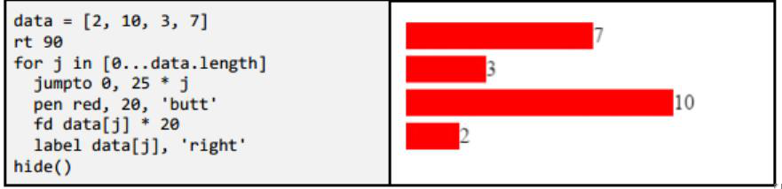 

这个程序使用[0...data.length]来从0到3遍历数据元素底数，然后它使用data[j]在某个时刻将一个数据元素从数组中读取出来。这些数字使用”turtle”函数来画一个图。

这个程序使用了一些”pen”和”label”等另外的参数函数来做更精确的设计。”pen”在”butt”选项中，它是一个用来做一个直方形线条而不是一个圆形线条的绘图工具。”label”在”right”选项中，用来在turtle的右方放置一个标签而不是直接在turtle上。

####从字符串和文件中创建数组

数组非常强大因为一个一维数组对象可以包含数千计或者数百万计的元素。然而，实际应用中，数组需要从程序外的数据文件中加载进来。

为了进行下次实验，我们在 Pencil code中创建一个文件并更名为”mydata.txt”。一旦你给它的命名用”.txt”结尾，Pencil Code将会知道这不是一个普通的程序，然后它会期待一个无格式的 txt数据文件。在文件中保存一系列的数字不使用空格，仅仅是用逗号隔开，就像这样：

96,73,93,95,85,89,85,99,79,75,89,82,90,85,84,85,88,95,78,96,91,93

所有的数字都可以被使用；也许这是一串考试成绩。

这是一个将文件中的数据加载到数组并进行基础的统计学计算的示例程序。

	await load 'mydata.txt', defer textdata
	mydata = textdata.split(',')
	total = 0
	for j in [0...mydata.length]
	mydata[j] = Number(mydata[j])
	total += mydata[j]
	write 'Total: ' + total
	write 'Average: ' + total / mydata.length
####将文件加载到数组的三个步骤

正如上述程序中的例子所示，将一个文件加载到数组中需要两三个步骤：

1. 将一个文件加载为一个一维大字符串的文本数据：(await load'mydata.txt', defer textdata)
2. 将文件划分成由多个小字符串组成的数组，每个元素一个数组：(mydata = textdata.split(','))
3. （如果数据是数字）把字符串转换成数字：(mydata[j] = Number(mydata[j]))

“load”函数能够从网上加载一个文件 URL并调用一个”callback”函数获得一维字符串类型的文件目录。这里的程序加载一个短的文件名”mydata.txt”，文件名能够在程序正在运行的 Pencil Code的文件夹里查找到。通过使用一个以”http://”开头的全名的URL，Pencil Code可以从网上加载数据文件。注意加载是输入的一部分（来自于网络而不是用户），它的运行就像是I/O模块中的读取函数。我们在这里结合load和await在程序等待回复时暂停程序。

“split”函数将一个 txt字符串通过用定界符拆分的方式划分成一个由多个字符串组成的数组。定界符可以是任意的字母或符号。例如，用每行的”entry”单词拆分文件，用”\n”拆分文件（反斜杠 n是一个出现在一个txt文件每行末尾的用于进入新行的符号）。

“Number”函数是将一个字符串转化为一个数字。为了避免”96”+”73”会获得”9673”这样的结果，被加载的字符串必须在进行运算之前转换成数字。

####探索：将一个文档划分成数组，再将它连接起来

这是另一个在文件中查找字符的示例程序。它利用”split”函数通过一个特殊的符号将文件的所有单词都分割开而后使用”join”函数将数组组合回来成为一个大字符串并输出。

为了给这个程序准备数据，保存一个命名为”document.txt”的文件，里面包含大量的文本，
例如一片来自Wikipedia的论文或一本公共领域的书。

	await load 'document.txt', defer textdata
	words = textdata.split(/\b/)
	await read 'A word to search for?', defer q
	for j in [0...words.length]
	if words[j] is q
	words[j] = '<mark>' + q + '</mark>'
	write words.join('')
这个程序用数组做了四件事：

1. 它用分隔符(/\b/)创建数组。特殊符号/\b/将字符串分割成一个个的单词。
2. 它用测试“words[j]is q ”来检验所有单词，来尝试找到一个相符的单词。
3. 对于相符的字符，它用一个HTML的tag.words[j]='<mark>' + q + '</mark>'来增加一个格式化代码。
4. 其中的 words.join(‘’)用于把所有的数组中的元素连接起来生成一个一维的字符串
用于输出。

程序运行的结果如下所示：

	A word to search for? who
	There once lived, in a sequestered part of the county of Devonshire, one 
	Mr. Godfrey Nickleby: a worthy gentleman, who, taking it into his head 
	rather late in life that he must get married, and not being young enough or
	rich enough to aspire to the hand of a lady of fortune, had wedded an old 
	flame out of mere attachment, who in her turn had taken him for the same
	 reason. Thus two people who cannot afford to play cards for money,
	 sometimes sit down to a quiet game for love.

数组让输出程序能够使用诸如大容量数字或文本的大数据成为可能。

（中间重复第一部分内容）
###8.1.1 推荐时间安排：1（55 分钟课堂周期） ###
<table>
<tr>
	<td>CSTA 教学天数</td>
		<td>CSTA 主题</td>
</tr>

<tr>
	<td>CSTA 2天（复数days）</td>
		<td>CSTA 课堂计划 I </td>
</tr>

<tr>
	<td>CSTA 1天</td>
		<td>CSTA 课堂计划 II </td>
</tr>

<tr>
	<td>CSTA 1天</td>
		<td>CSTA 课堂计划 III </td>
</tr>

<tr>
	<td>CSTA 1天</td>
		<td>CSTA 课堂计划 IV & V  </td>
</tr>

<tr>
	<td>CSTA 1天</td>
		<td>CSTA 课堂计划 VI </td>
</tr>

</table>

###8.1.2 标准 ###
<table>
	
<tr>
		
		<td>CSTA 标准</td> 
		
			<td>CSTA 部分 </td>

				<td>CSTA 涵盖的学习目标 </td>
	
	</tr>
<tr>
		
		<td>CSTA 水平 3A （9-12 年级）</td> 
		
			<td>计算思维 </td>

				<td>CSTA 解释顺序、选择、迭代和循 环如何建立块算法。</td>
	
	</tr>

<tr>
		
		<td>水平 3A （9-12 年级） </td> 
		
			<td>计算思维 </td>

				<td>比较海量数据收集分析的技术</td>
	
	</tr>

<tr>
		
		<td>水平 3A （9-12 年级） </td> 
		
			<td>协作 </td>

				<td>描述查找和收集小大规模的数据集的技术 </td>
	
	</tr>

<tr>
		
		<td>水平 3A （9-12 年级） </td> 
		
			<td>协作 </td>

				<td>部署关于不同问题的不同数 据收集技术 </td>
	
	</tr>
<tr>
		
		<td>水平 3A （9-12 年级） </td> 
		
			<td>计算思维 </td>

				<td>比较和对比简单的数据类型 和它们的使用 </td>
	
	</tr>

<tr>
		
		<td>水平 3A （9-12 年级） </td> 
		
			<td>电脑和通信设备 </td>

				<td>讨论对应用程序功能进行修 改的影响 </td>
	
	</tr>

	

</table>

###8.1.3 教学建议 ###
鼓励学生在文本模式和块模式直接转换来不断扩充他们自己以致超越他们原有的水平。教学 计划建议在不同模式间进行转换。学生们最好在他们理解整体的逻辑流程时使用块模 式。在其它情况下，用文本输入各种关键词更加方便，因为块模式也许不能包含所有需要的块。 这很重要，因为用文本键入使连接到 JavaScript更加丰富的可用库变得可行。
 
###8.1.4 教学计划I ###
这节课介绍 CoffeeCript 的数组。
 
<table>
	
		<tr>
		
				<td>目录摘要	</td> 
		
				<td>教学建议</td>
        
				<td>时间</td>
	
		</tr>
     
	<tr>
		
			<td>        

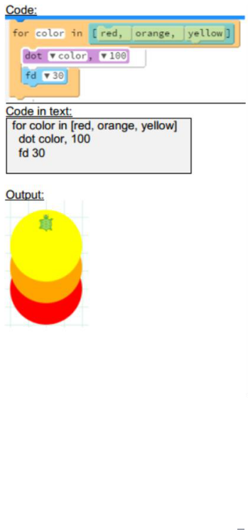 
                 
 
		</td> 
		<td>导出程序”rainbox Colors”并演示运行 程序。 指出这在第四章的 教学计划 III 中使用 过。 解释 color 是一个由 一个数组中的红， 橙，黄三种颜色转换 而来的变量。 在[]括号之间的是存 储在数组数据结构 里的各种颜色。命 令’dot’在数组中起 作用并且画了相对 应颜色的小点。 鼓励学生玩各种颜 色。 变量：程序可以获取 一个包含点大小的 数组而不是颜色本 身改变自己的值。 For 循环类似于这 样： 
for x in [10,20,30,40] 
dot red,x fd 30  
      
 </td>
        
	<td>示范：15分钟       
		学生实践：20分钟
</td>
	</tr>
 

</table>
 

###8.1.5 教学计划II ###
这里对数组的第一次介绍是给学生们展示如何遍历由一列已知的元素组成简单的数组。程序 绘制的元素的大小保存在数组中。敲下所示的代码（用块模式和文本模式）或者导出代码而 后通过代码引导学生，解释概念给学生。

<table>
	
		<tr>
		
				<td>目录摘要	</td> 
		
				<td>教学建议</td>
        
				<td>时间</td>
	
		</tr>
     
	<tr>
		
			<td>        

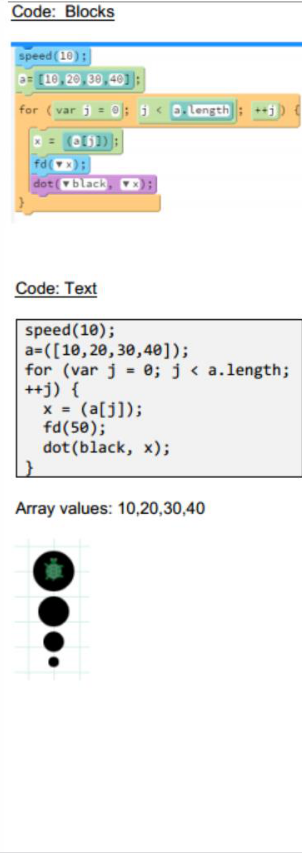 

                 
 
		</td> 
		<td>敲下代码（或导出到工 程中）而后通过代码引 导学生 展示数组是如何声明 的。 解释长度如何给出数组 的大小。 解释数组为什么从 0 开 始以及 for 循环如何遍 历整个数组。 解释 x 代表数组的某一 位置的值，所以有 j=0， x=10，j=3，x=40。 Turtle 移动依靠 x 的每 个值而且点的大小的绘 制也依靠 x 的值。 教学技巧：一个功能的练习是要让学生们改变 数组的值以使得他们不 墨守成规。这能够让学 生们看到圆点大小的改 变依赖于数组中索引的 位置。让他们使用一些 如 10,50,15 和 30 这样 的大数字来观察圆点变 大或变小。 数组值：10,50,15,39 
 

     
 </td>
        
	<td>示范：30分钟       
</td>
	</tr>
 

</table>
  

###8.1.6 教学计划III ###
这节课计划将展示如何使用后入先出的栈的概念从一个数组中增加或删除一个元素。这个示 例程序可以用于给学生展示数组中的元素是如何被加入或删除的。使用弹栈的特点来演示即使元素被移除，数组为那个元素创建的空间也只会变成无主之物。将程序分发给学生，让他 们用程序体验并理解数组行为和栈的特性。
 
<table>
	
		<tr>
		
				<td>目录摘要	</td> 
		
				<td>教学建议</td>
        
				<td>时间</td>
	
		</tr>
     
	<tr>
		
			<td>        

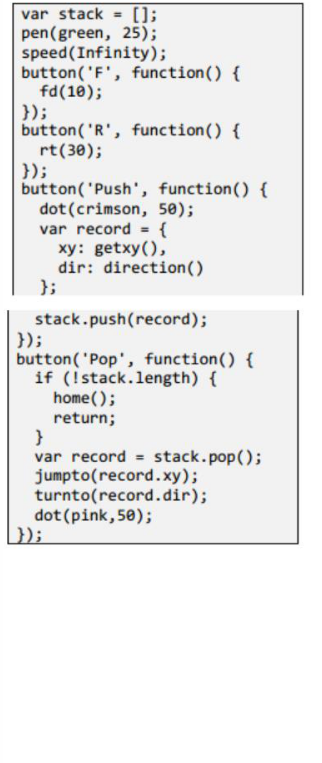 

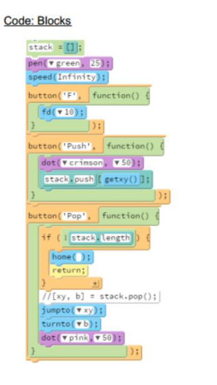 

                         
 
		</td> 
		<td>使用这个程序来示范 基础的数组功能。 使用 F 按钮来使乌龟向 前移动。 使用 Push 来在屏幕上 创建一个红色的圆点， 代表一个添加到数组 中的元素。 使用 Pop 创建粉红色的 圆点。这个点比红点更 亮。这个例子可以用于 表示一个元素被移出 数组。 使用’F’按钮和’Push’按 钮的组合来示范一个 元素可以被替换到数 组结构中的任意位置， 只要那里有用于支持 此元素一个整形的索 引位置。 输出：
	
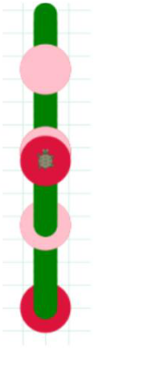
          
 </td>
        
	<td>示范：20分钟    
		学生实践：55分钟   
</td>
	
</tr>

 

</table>
 

<table>
	
    
	<tr>
		
	      
	<td>拓展活动：让学生们创建他们自己版本的两个程序。复制给他们两个实例程序，让他们能 够思考他们自己的程序。鼓励学生创建第一个程序用他们自己的版本（你可以选择把程序 1 当 做他们的实验活动，让他们自己设计）第二个程序只用于示例目的。你也可以让学生思 考它（思考拼写错误）并帮助他们更好地理解程序的运行。（55 分钟）   
</td>
	
</tr>

 

</table>
  
 

###8.1.7 教学计划 IV  ###
这节课计划示范数组关于保存数据的使用。学生们将学会遍历数组并用数组中的数据生成数 据图。这节课将展示一个条状图如何用程序中的两个数组画出来。这节课将充分地显示出 Penci Code 能够在执行过程中实时生成可视化反应的特点。 

<table>
	
		<tr>
		
				<td>目录摘要	</td> 
		
				<td>教学计划</td>
        
				<td>时间</td>
	
		</tr>
     
	<tr>
		
			<td>        

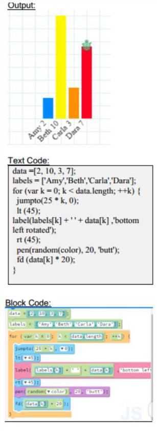 

                         
 
		</td> 
		<td>通过程序代码引导学生。 步骤 1：运行程序并演示输出。 步骤 2：用 1-D 数组中的数据标 记数组。 步骤 3：Labels 构成 x 轴数据。 Data 构成 y 轴数据并确定条形图 的长度。 步骤 4：随机彩色生成器决定图 表中的颜色。 步骤 5：展示程序中的循环语句。 教给学生循环语句如何遍历数 组。（data.length） 步骤 6：展示给学生乌龟在 y 轴 上向一个常量（数据数组中的值） 移动。
	
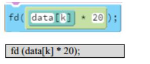
 
 
步骤 7：展示给学生乌龟在 x 轴 上向一个常量（数据数组中的值） 移动          
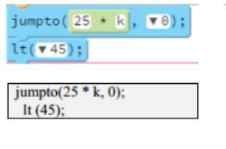
 

 
 </td>
        
	<td>示范：30分钟    
		学生实践：25分钟   
</td>
	
</tr>

 

</table>
 

<table>
	
    
	<tr>
		
	      
	<td>拓展活动：让学生用不同类型的数据值创建不同的数组并用提供的代码创建条状图。 （55 分钟）  
</td>
	
</tr>

 

</table>
   

###8.1.8 教学计划 V  ###
在这节课中，学生们将用存储在一维数组中的简单数据创建一个饼图。这节课类似于条形图 那节课。但是对于同一个数组表的绘制是不同的。

<table>
	
		<tr>
		
				<td>目录摘要	</td> 
		
				<td>教学建议</td>
        
				<td>时间</td>
	
		</tr>
     
	<tr>
		
			<td>        

 
          

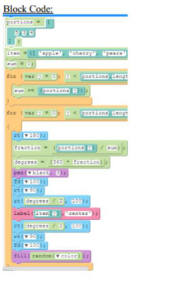
    
                        
 
		</td> 
		<td>步骤 1：运行程序来示范饼图的创建。 步骤 2：改变数组中的值来展示它是如何 影响结果图的。 步骤 3:单步调试代码来展示饼状图是如 何计算的。 步骤 4：计算分数的公式 
	
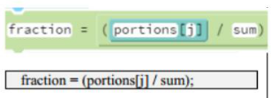
 

 
步骤 5：计算读出的公式。        
  
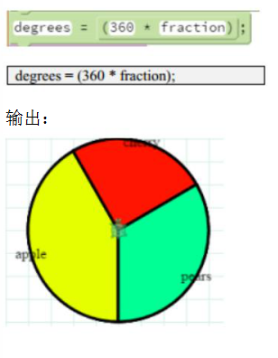
 

输出： 
	
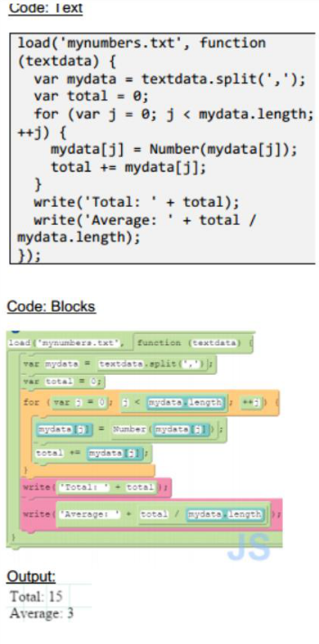

 </td>
        
	<td>示范：30分钟    
		学生实践：一课时   
</td>
	
</tr>

 

</table>
 

<table>
	
    
	<tr>
		
	      
	<td>拓展活动：（Ask 拼写错误）让学生用不同类型的数据值创建不同的数组并用所给的代码 创建各种描绘不同类型数据的饼图。 （55 分钟）   
</td>
	
</tr>

 

</table>
  

###8.1.9 教学计划 VI   ###
这节课计划阐释如何在一个文本文件中查找一个元素。课程计划有两部分。第一部分包括给 学生展示如何加载（打开）一个文件并读取它。第二部分有一个遍历代码用于查找文件
中的一个元素。  

<table>
	
		<tr>
		
				<td>目录摘要	</td> 
		
				<td>教学建议</td>
        
				<td>时间</td>
	
		</tr>
     
	<tr>
		
			<td>        

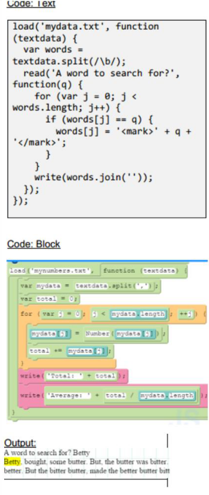 

   
                        
 
		</td> 
		<td>步骤 1 ： 导 出 所 有”SearchingNumbers”程序。 步骤 2：记得保留在 JavaScript 模 式下。 步骤 3：运行程序并演示输出。 步骤 4：单步调试程序。 步骤 5：解释文件打开。当需要 重用语法时参考核心概念。 步骤 6：对于那个程序，数据文 （”mynumbers.txt”）可以在同 名文件夹中找到。学生们可以 通过在 Pencil Code 中创建一个 新的文件来创建他们自己的数 据文件而后点击”Save”按钮。 步骤 7：现在解释数据是如何 保存在一个数组中的，以及程 序如何在发现值增长的时候查 找一个相匹配的项的。 步骤 8：用 for 循环追踪代码并 解释遍历到的数据。 注意：学生可以追踪 mydata[j],j 以及所有的值并在课堂上分享。 
	 
 </td>
        
	<td>示范：30分钟    
		学生实践：60分钟   
</td>
	
</tr>

 

</table>
  

<table>
	
    
	<tr>
		
			<td>        

 
          

  
   
                        
 
		</td> 
		<td>步骤 1：导出 SearchingText 中 的程序。 步骤 2：运行程序。 步骤 3：让学生单步调试程序 并解释给你听。 注意：两个程序都用到了 split() 函数。为了更好地解释 split 以 及如何使用它，看： http://www.w3schools.com/jsref/jsre 
f_split.asp  
	 
 </td>
        
	<td>示范：30分钟    
		学生实践：35分钟   
</td>
	
</tr>

 

</table>
 