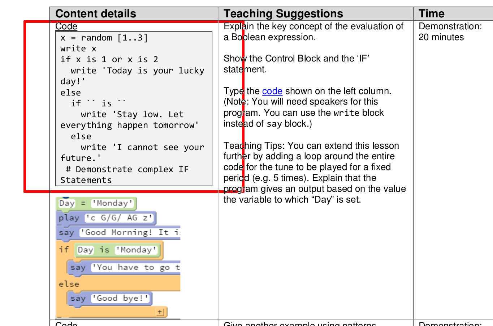
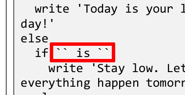
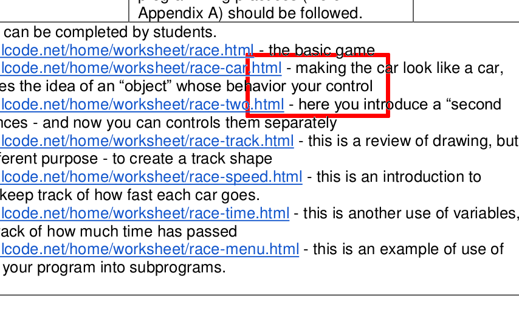

# ERROR

## 1

Location:The code in the first line of the table in 6.1.3.  
Deatail:It seems the code in the table is wrong.It is very different from the picture below.And I think it is a mistaek.  
Mark:  

## 2

Location:The "Teaching Suggestions" in the third line of the table in 6.1.3.  
Detail:I think you miss a 'c' in word "die".It should be "dice".
Mark:  

## 3

Location:The code in the second line of the table in 6.1.5.  
Detail:I find that "if `` is ``" is different from the code on the net - "if x is 3".So I think this is another mistake.
Mark:  

## 4

Location:The last line in the table 6.1.7.  
Deatail:I find I can not understand this sentence.And I think if an "in" was missed before "your control".  
Mark:  
