# 第七章 学习第二语言：JavaScript
## Block Mode(区块图形化编程)->CoffeeScript->JavaScript
### ==7.0.1 目标==
基本编程概念都是相同的，它适用于不同的编程语言。
接触第二语言能够让学生了解他们作为初学者所学的编程理念与专家们所用的是完全相同的。这一单元介绍了JavaScript，它与CoffeeScript非常接近，并且是专业开发人员最广泛使用的语言之一。在这一单元中，学生们将使用区块来学习JavaScript的语法，并且观察JavaScript和CoffeeScript的许多相似之处。他们会从区块的图形化编程方式直接转变到JavaScript 的文本代码编程中。
### ==7.0.2 主题及要点==
7.0    章节介绍
-  	7.0.1	对象
-  	7.0.2	主题及要点
-  	7.0.3	关键术语
-  	7.0.4	关键内容

7.1    学习计划
-	7.1.1	推荐时间规划
-	7.1.2	CSTA 标准
-	7.1.3	教学笔记
-	7.1.4	学习计划I 用区块的方式编写JavaScript
-	7.1.5	学习计划II 重建破碎的场景程序演示迭代开发模型

### ==7.0.3	关键术语==
| 术语单词 | 术语单词 |
|--------|--------|
|Websites|Block-mode|
|JavaScript|Text-mode|
|Scripting Language|Settings box in Pencil Code|
|Programming Language|      |
### ==7.0.4 关键内容==
####Pencil Code 中的语言
每一种编程语言都有它自己的语法，也就是说，在语言中，有一组特定的单词和标点的来标记或指代功能。如前几章所示，使用一个块编辑器视图能够为学生展现有一种语言的语法规则。
一个感觉如何不同于CoffeeScript的JavaScript，下面会看到两函数定义，其中一个用是CoffeeScript写的，另一个用的是JavaScript。文本方式和区块方式都会进行展示。
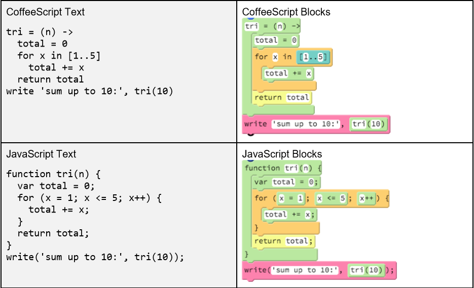
虽然看着文本使语言显得非常不同，但是区块写法显示出JavaScript和CoffeeScript是密切相关的语言。一般来说，JavaScript需要更多的标点符号，但大多数代码的结构在两种语言之间基本上是相同的。
####JavaScript和CoffeeScript之间选择
在Pencil Code的代码中，一个项目可以切换JavaScript或者CoffeeScript的编写方法通过点击蓝色栏中的“gear”按钮。当你选择JavaScript，它直接运行在你的浏览器。当你选择CoffeeScript，CoffeeScript编译器会在运行之前编译成JavaScript的程序。
CoffeeScript和JavaScript是密切相关的。它们在同一个对象上运行，并且在运行时具有相同的速度和消耗。CoffeeScript是在JavaScript之后被设计出来的，所以CoffeeScript语法有几个优点：
- CoffeeScript语法比JavaScript要求更少的标点符号，所以更容易进行没有语法错误的编写。
- CoffeeScript的直接支持更多的编程概念；例如，它有类和等待的语法
- CoffeeScript的使用有意义的缩进，这意味着它是不可能隐藏令人迷惑的嵌套错误。
- CoffeeScript避免了像JavaScript中近似为零的值判定相等和偶然的全局变量这类常见错误

在Pencil Code中的默认语言是CoffeeScript的，因为很容易的学会读和写CoffeeScript文本编码。为什么程序员会选择程序在JavaScript呢？因为JavaScript具有三个显著优势：
- JavaScript是一种由国际委员会设计的官方标准，它可以不用转换直接运行在Web浏览器中。
- JavaScript的程序员社区比CoffeeScript的社区大。
- 许多人都致力于提高JavaScript的未来版本，他们意识到了CoffeeScript中的改进。

JavaScript的不断发展，和JavaScript的未来版本将包括一些在CoffeeScript的创新。所以即使JavaScript狂爱人员，也值得了解CoffeeScript，因为它的许多思想代表JavaScript的未来。
然而对于CoffeeScript的爱好者，也值得知道JavaScript，因为其有更大的开发者社区。
####CoffeeScript和JavaScript之间的差异
JavaScript和CoffeeScript是密切相关的语言，并且了解一些额外的标记符号是必需的，有助于你直接从一个到另一个的理解。这里是一些CoffeeScript和JavaScript之间差异的一个总结，每一行代码都是等效的，我们将在下面进行详细讨论。
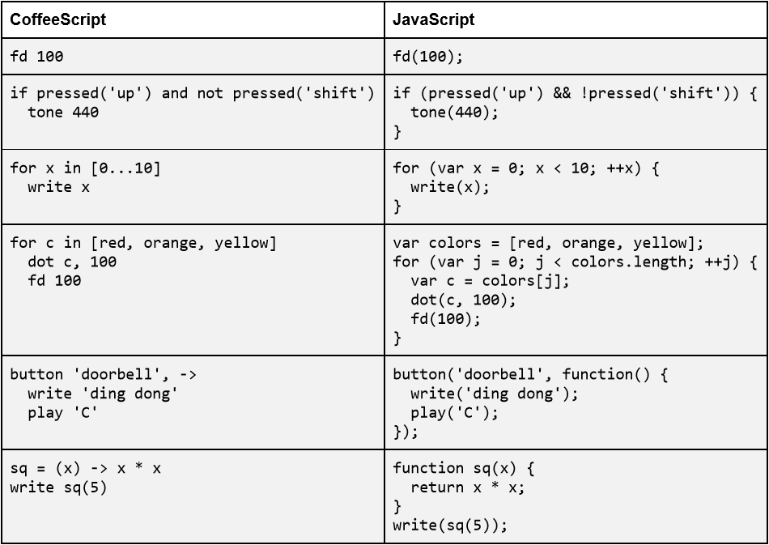
####小括号和分号
JavaScript需要在函数名之后加上括号来运行一个函数调用。这些括号在CoffeeScript中是可选的，但是在JavaScript中是必须要写的。
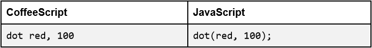
JavaScript也建议在每个完整的语句结束添加分号（包括函数调用，返回语句和break和continue语句）。然而，不是每一行代码都是一个完整的语句。例如，第一行的if是一个不完整的表述，则不应该函数体单独使用分号。
####布尔表达式的标点符号
JavaScript还需要在if, while和switch后加小括号来包裹条件表达，在CoffeeScript中，并不需要这些括号。
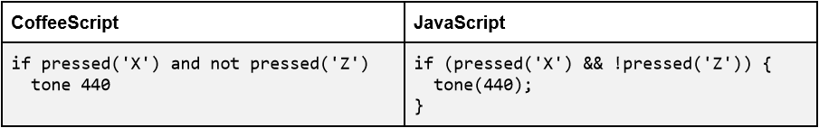
and, or, not , is 和 isnt这些在CoffeeScript中的关键字在JavaScript中是不支持的，取而代之的是JavaScript中使用符号来表示布尔表达式。相应的标点符号的意义和使用单词代替在CoffeeScript中是完全相同的。
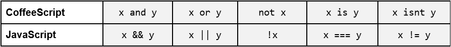
CoffeeScript允许所有这些JavaScript的标点符号，但在编写CoffeeScript的时候通常使用的英语单词来提高代码的可读性。
####缩进和括号
JavaScript使用大括号表示嵌套。而缩进是允许的，但是缩进对于JavaScript解释器没有任何意义。它主要使用大括号来确保代码符合缩进。
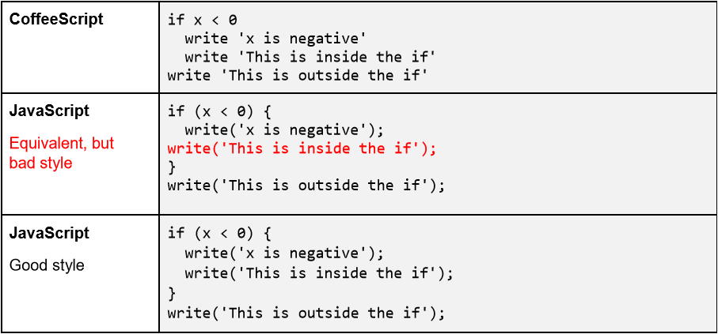
一些初学者，一旦发现JavaScript对缩进不敏感，就会写出完全没有缩进JavaScript代码。这是一个糟糕的想法，它会导致代码混乱，就像上面的例子。好的代码不仅是功能性的，而且是可读的。
如果大括号省略在JavaScript中，控制流语句像if, while, 或者只适用于条件语句后的一行代码的情况。在下面的JavaScript的红线将打印“这不是在if中！”不管x的值为多少。JavaScript中正确的书写等同于的方法是在最后一列写上大括号。
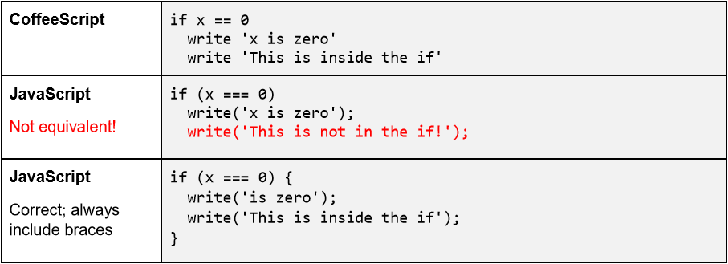
千万不要在JavaScript中省略大括号中！JavaScript解释器不会注意缩进，所以省略大括号是是会发生错误的，如上图。
帮助学生理解JavaScript中的良好编码风格是很重要的，需要考虑使用和大括号一致的缩进。程序应该用大括号后的条件和循环和缩进必须匹配括号使其他程序员可以阅读并理解。缩进的数量应匹配嵌套括号的数量。
####理解循环中的“Three-Clause”
JavaScript的当前版本没有像CoffeeScript那样基于列表的循环。不过JavaScript支持“三步循环”。这种类型的循环是一个三行的一个循环，是while循环的一种单行缩写的方式。以下三个是等价的：

“三步循环”在上表的最后一行中，for后面的小括号中包括三条语句。
1. 循环初始化，就像这的var x = 0。这条语句只会在循环开始之前运行一次。
2. 循环条件，这的x<10就是。这条语句在每一次循环重复之前都会执行，包括在第一次循环，如果条件一旦不成立，循环就会直接跳出停止运行。
3. 循环增量，比如这的++x。该语句在循环的每次迭代的执行之后运行，然后转到循环条件判断。

虽然可以有10个或更多的符号放到三步循环的一行中，他们通常遵循相同的模式，从零到某个值进行计数。
####用“function”声明函数
JavaScript的函数声明时都会带有一个特殊的单词“function”，函数返回一个值，必须包含一个显式的return语句（而在CoffeeScript，最后计算出的值是自动返回的值）。下面是CoffeeScript和JavaScript的函数声明：
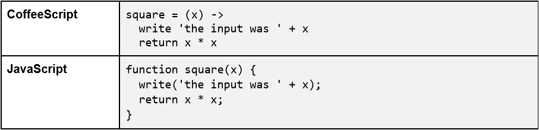
在CoffeeScript，函数必须在调用前进行定义，而在JavaScript函数的定义可以不遵守这个顺序。JavaScript中在任何其他代码运行之前，函数声明就已经隐式的绑定到函数名上了。
匿名函数比如按钮或输入的回调函数，还是用“function”定义，但是没有名字，就像：

当一个匿名函数定义为内联和事件绑定功能如“按钮”的最后一个参数传递，程序结束，包括最后的标点符号（封闭的大括号，封闭小括号，分号）。这一系列的标点在JavaScript代码中都很常见。
####等待输入“等待”
不像CoffeeScript，JavaScript的当前版本不支持“await”关键词或概念。这意味着，如果想写一个等待输入的程序，必须编写函数回调来达到预期的效果。
安排任何执行顺序是可能的，但它需要一个明确的计划
下面的表格包含一个简单的程序来统计总数。右边的程序是用JavaScript编写的，只使用函数定义，左边的程序使用了等效的CoffeeScript语句，且使用“await/defer”（等待/延时）。
得到一个循环的效果要求程序员定义一个函数，该函数设置一个回调，使它可以再次执行。这是一种循环递归。（在9章中，递归将更详细地讨论。）
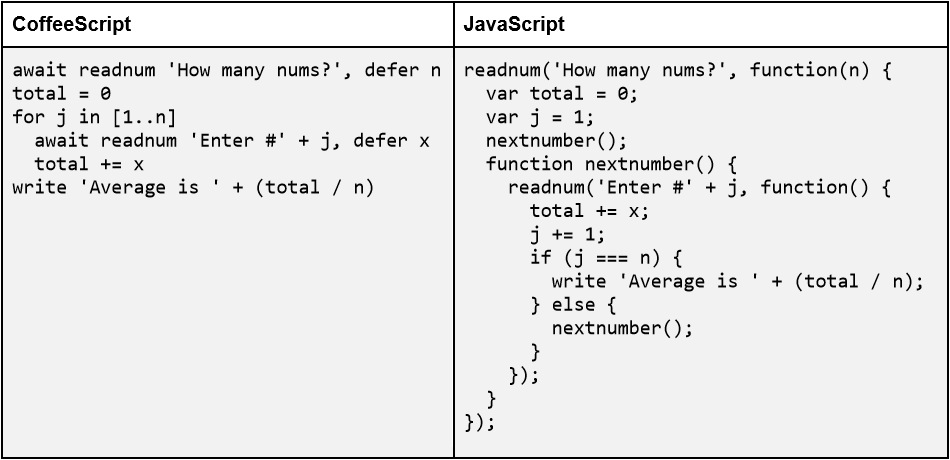
负责监督JavaScript开发标准的人们已经意识到右边的代码比左边的更难写，JavaScript标准委员会正在考虑在未来版本中加入“await”功能。在这之前，(要实现功能)JavaScript中的代码需要写成右边这样。
####在JavaScript中常见的语法错误
JavaScript有比CoffeeScript更多的标点符号，所以要注意在文本模式下进行JavaScript编码会有额外的语法错误。下面这张表中的内容需要注意：
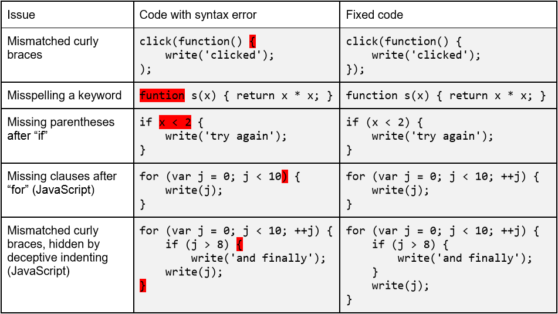
当使用JavaScript的语法，让学生做一些实践，阅读JavaScript（代码）的标点符号是很有帮助的，这样可以让他们快速识别错误，比如上表中的那些。
####7.1.1 推荐时间安排：55分钟的课时
<table><tr><td>教学时间</td><td>主题</td></tr><td>第1天</td><td>课程计划I：创建一个使用块的随机螺旋程序，JavaScript介绍</td></tr><tr><td>第2天</td><td>课程计划II：迭代开发周期</td></tr></table>
####7.1.2 标准
| CSTA 标准 | CSTA 链 | CSTA学习目标覆盖 |
|--------|--------|--------|
|等级3A（9-12年级）|计算思维（CT）|描述各种可供选择的编程语言来解决问题和开发系统|
|等级3A（9-12年级）|计算实践与编程（CPP）|应用分析，设计和实施技术来解决问题（例如，使用一个或多个软件生命周期模型）|
|等级3B（9-12年级）|计算实践与编程（CPP）|基于学生水平和应用领域的程序设计语言分类|
|等级3A（9-12年级）|计算实践与编程（CPP）|使用各种调试和测试的方法来保证程序的正确性（例如，测试用例、单元测试、白盒、黑盒、集成测试）|
####7.1.3 教学笔记
> 以下内容由weixh121001翻译

掌握这些概念和做法，要求学生进行几个转换。学生需要从使用块（编码）到使用文本。此外，他们现在就需要开始在JavaScript中是很难的编程语言程序相比，CoffeeScript的编程。下面是一系列的步骤，将有助于这一新的学习

Sept1：有一个学生选择一个计划，他们已经学习了分析编码块模式和文本模式。
Sept2：让学生们开始拉积木和安排他们（复制从现有的实验室），然后切换到文本模式有。
Sept3：请阅读添加新构建的程序，添加一个小特征的表现文本编辑器运行他们的程序。
Sept4：鼓励学生不断增加小结构，观看程序如何回应。鼓励学生切换到块模式，并添加一个块，如果这将使他们更冒险，并准备尝试修改程序；然后切换回文本模式，以熟悉文本语法。
####7.1.4教案 I
注：在这一课程中，确保你在使用区块(编写)模式（如果需要切换到块模式）,点击箭头表明运行结果。
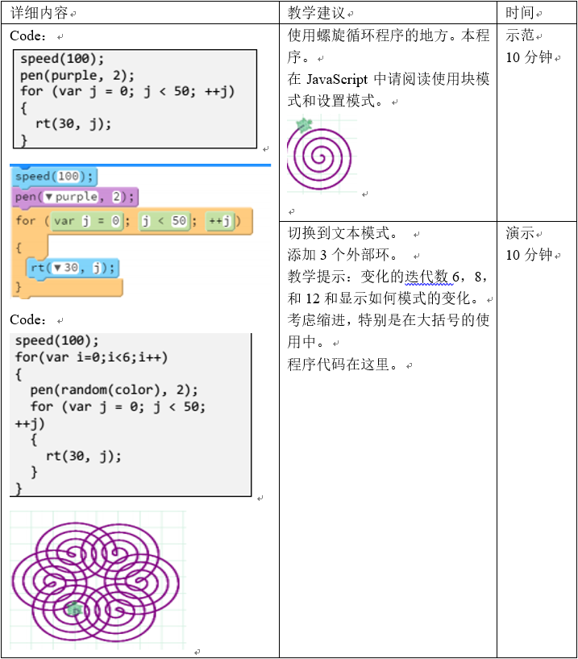
####教案II
本课使用的示例场景程序。整个程序工作已经接近函数，学生应该分离小片段代码可以看代码，这个课程有助于学生理解迭代开发周期，即在一个大的程序中添加少量的代码的过程。
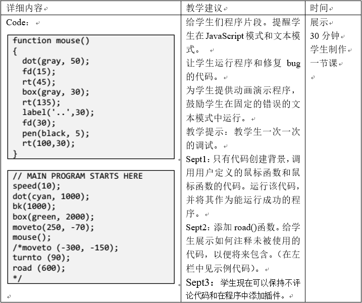

