第三章：输入/输出
## 3.0.1 教学目标
现代计算机使用多种多样的输入输出形式。在这个单元，学生将探索图片、文本、语音和音乐的输出，以及探讨鼠标点击、按钮、文本、声音和按键的输入。虽然仅仅几行代码就能创建一个结合输入输出的程序，但这些简单的程序可能是最使学生感兴趣的。任何形式的输入都可以附加到任何输出上，这为创建输入输出之间的连接提供了很多的创造性的可能。
## 3.0.2 大纲
### 3.0     本章介绍
        3.0.1 前言
        3.0.2 大纲
        3.0.3 关键术语
        3.0.4 关键概念
### 3.1     教案
        3.1.1 推荐日程
        3.1.2 CSTA 标准
        3.1.3 第一课 使用文本和声音块
        3.1.4 第二课 使用按钮块
        3.1.5 第三课 使用单击块和 /img
        3.1.6 第四课 课堂实验
### 3.2     资源
        3.2.1 重要链接
## 3.0.3 关键术语
<table>
<tr>
<td>Input</td>
<td>Output</td>
</tr>
<tr>
<td>Human Computer Interaction (HCI)</td>
<td>Event Object</td>
</tr>
<tr>
<td>Event Handler</td>
<td>Event Binding Function</td>
</tr>
<tr>
<td>Say, Play</td>
<td>Await</td>
</tr>
<tr>
<td>Spiral assignment</td>
<td>Assignment statements</td>
</tr>
<tr>
<td>Variables</td>
<td></td>
</tr>
</table>

## 3.0.4 关键概念
当计算机被用于和外界交互时才是最有趣的。

-   **输入**将数据带入计算机，比如你从键盘打字。
-   **输出**将数据发送到计算机外，比如你在屏幕上看到的东西。

输入输出有时候并称为 I/O。有许多种类的 I/O，包括人机界面、网络接口、存储设备接口和自动机器接口。计算机在处理各种输入输出上有许多共同点，无论是与一个人、一个文件或其他一些设备进行交互。用户可以通过只学习如何创建用户界面来学习重要的 I/O 技术。
### 常见的人机交互形式
这一节的重点在 **human-computer interaction (HCI)**。在 Web 应用中创建用户界面时，程序主要处理鼠标和键盘的输入，以及屏幕和音频输出。例如：

|   | 输入 | 输出 |
| -- | -- | -- |
| 图形化界面 | 鼠标，键盘 | 图形 |
| 面向文本 | 键盘输入 | HTML |
| 音频 | 麦克风 | 音乐，语音 |
### I/O 概念教学概述
输入和输出的介绍：

- 输出第二章的图形图像
- 简单的鼠标点击输入
- 把输入与输出结合起来

扩展到不同类型的输入和输出：

- 如何输出文本
- 如何输出语音和音乐
- 如何从键和按钮输入
- 如何输入文本和语音

特殊的输入策略：

- 使用 CoffeeScript "await" 等待输入
- 使用 "pressed" 轮询输入

### 鼠标点击事件
在图形化环境中，收集输入最简单的方法就是监听 **event**。event 是系统创建的代表单个输入单元的对象。比如，每次单击鼠标，一个代表单击的 event 对象就被创建。event 对象有代表输入详细信息的属性，比如位置、时间以及鼠标的哪个键被点击。

**Event e**

<table>
<tr>
<td>e.type = click</td>
<td>事件的类型</td>
</tr>
<tr>
<td>e.x = -195</td>
<td>单击的 X</td>
</tr>
<td>e.y = 40</td>
<td>单击的 Y 坐标</td>
</tr>
<tr>
<td>e.which = 1</td>
<td>哪一个鼠标按钮</td>
</tr>
<tr>
<td>e.timestamp = 1454775914487</td>
<td>代表单击时刻的数字</td>
</tr>
</table>

*event 对象有代表输入详细信息的属性，比如位置、时间以及鼠标的哪个键被点击。*

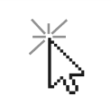

*点击鼠标创建一个看不见的 event 对象。*

无论用户何时输入，系统都会创建 event 对象。一个程序可以创建 event handler 来响应 event，这是接下来要讲解的。
### 创建 Event Handler
一个 event handler 是一段用来处理输入事件的代码。看上去就像这样：

```
click (e) ->
  moveto e.x, e.y
```


*一个处理单击事件的 event handler。每次点击鼠标时，handler 运行并且移动乌龟到鼠标点击的地方。*

创建 **event handler** 的代码有三个关键部分。(e) 是 event object 的参数。输入时，变量 e 的这个 event object （包含点击在屏幕上的位置）就被创建并可用。变量名可以使用任何方便的名字。使用 e 或者 evet 作为 event object 的名字是一个惯例。

总的来说，e (e) -> moveto e.x, e.y 是一个 event handler function, 当 event 发生时运行这段代码。箭头后面的任意行数的代码都可以缩进，它们将成为同一个 event handler 的部分。（event handler 正好是一个 **function**，这一点将在第五章讨论。）

click 命令是一个 event binding function，意味着“监听单击“，这是一个将 event handler 连接到系统的命令，因此单击时就会触发 handler。

### 把输入输出结合起来
输入输出的魔力在于结合它们来产生新的效果。比如，可以通过这段代码实现每次单击创建一个新的图片：

```
click (e) ->
  img 't-watermelon'
```


*使用一个 click event handler 创建新的图片以将输入输出结合起来。*

让学生们尝试以不同的方式结合输入输出，这对他们学习不同类型的输入输出非常有帮助。让学生们尝试下面这些：

<table>
<tr>
<td><pre>click (e) ->
  w = img 't-watermelon'
  w.moveto e.x, e.y</pre>
</td>
<td>将添加的图片移动到点击的位置。</td>
</tr>
<tr>
<td><pre>w = img 't-watermelon'
  click (e) ->
  w.moveto e.x, e.y</pre>
</td>
<td>只移动一个西瓜图片而不是每次点击就创建新的。</td>
</tr>

<tr>
<td><pre>pen purple
click (e) ->
  moveto e.x, e.y</pre>
</td>
<td>在两次点击的位置之间画一条线。</td>
</tr>
</table>

学生仅仅通过使用鼠标 event 就能创建一个简单的画图程序。如果结合不同类型的输入输出，他们还可以做到更多。
### 输出文本
使用 write 命令将文本输出到屏幕，像这样：

```
write 'Hello. My name is Compy.'
```
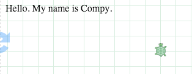

*写一行文本。write 命令从上到下书写，而不是写在乌龟的位置。*

当使用“write“向屏幕写文本时，文本会从上到下地出现并位于所有已写的文本下方（而不是在乌龟的位置）。img 命令也是将新图片放在所有已输出的文本和图片之后。

就像 img，也可以使用一个变量来记住 text 对象并在屏幕上移动它：

```
t = write 'Hello'
t.moveto 50, 100
t.rt 180
t.grow 2
```
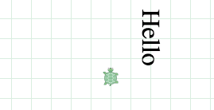

*对已写的文本使用一个变量，使文本可以移动、旋转和放大。*

可以使用“lable“命令在屏幕上乌龟的位置创建文本：

```
label 'Turtle was here'
```
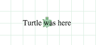

*通过使用变量，标签也可以像图片和使用 write 的文本一样移动。*
### 语音和音乐输出
屏幕并不是计算机唯一的输出设备！计算机也可以使用音频输出。有两种有趣的方法可以做到这一点：使用 speech 或 tone。

say 命令发出言语的声音。

```
say 'Hello. My name is compy.'
```
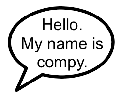

*say 命令大声说话*

要听到程序使用语音，浏览器需要支持语音合成。Chrome，Safari 和 Opera 都可以做到，并且浏览器支持的语音标准可能随时间增加。网页 [http://caniuse.com/#feat=speech-synthesis](http://caniuse.com/#feat=speech-synthesis) 列出了现在支持语音的浏览器版本。

play 命令使用 ABC 记谱法播放歌曲，这是用音乐家们用作记号的字母表示每份乐谱。

```
play 'EDCDEEEzDDDzEEE'
```
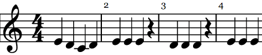

*play 命令使用 ABC 记谱法来播放乐谱*

在 ABC 记谱法中，字母 A-G 被用作记号。大写是高八度，字母 z 表示休止符。

ABC 记谱法还可以做很多事（你可以在 Google 上搜索“ABC notation”阅读相关资料）。比如，将“2”或分数“1/2”放在音符后面来改变这个音符的节奏，或者在音符前面使用“^”或“_”使它变得“sharp”或“flat”，或者在后面放一个逗号使音符变成低八度。

play 命令会排队音符，在音符全部转换完成并生成歌曲之前会一直等待，但有时候对一个交互式程序而言，立即播放一个音符更有用（没有排队）。使用 tone 命令可以立即输出一个音符而不必等待：

```
tone 'C'
```


*使用 tone 立即生成声音*

  总之，要在点击鼠标时让计算机说一些东西或播放一首歌或一个音节，或者写或说一个单词，那么以上就是所有必要的工具了。让学生们通过实验不同类型的输出来建立不同的交互。学生需要通过实验来理解响应多次鼠标点击时使用“play”和“tone”的时间差异。
### 从键盘和按钮输入
鼠标按键仅仅是一个计算机所有按键中的一个：一个典型的计算机的键盘有着 100 多个按键！

一个 event handler 通过另外两个 event binding function 收集来自这些按键的输入：keydown 和 keyup。

```
keydown 'A', ->
  tone 'C'
```
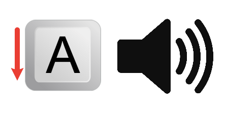

*按下键盘上的 A 时发出音 C*

任何时候用户按下“A”键，上面的程序会就会发出音 C。

按键名之后的逗号是必要的，因为 keydown 是使用两个参数而不是一个的 event binding function：第一个参数是按键名，第二个是 event handler。像任何其他有两个参数的命令一样，两个参数之间必须有逗号。

还有一个叫做 keyup 的 event binding function。例如，当用户放开按键时停止 C 音，用这招来当你放开 A 键的时候播放一个零持续时间的 C 音：

```
keyup 'A', ->
  tone 'C', 0
```
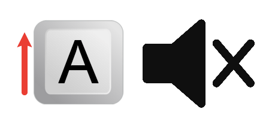

*放开 A 键时停止 C 音*

可以将许多 keydown 和 keyup 的 event handler 结合起来创建一个完整的钢琴或者其他效果。比如，可以创建 event handler 将海龟的运动附加到特定的键上，以及造一个使海龟转向的系统。要注意的是，不仅字母键有很明显的名字，方向键也有名字：你可以用 keydown 'up' 来监听“上”方向键，“下”，“左”，“右”也都相似。

```
keydown 'up', ->
  fd 100
```


*按上键使乌龟向前*

替代物理按键的一个方法三使用屏幕上的按钮。“button”命令就可以做到这个：

```
button 'forward', ->
  fd 100
```


*标签“forward“的屏幕按钮使乌龟向前移动*

屏幕按钮的好处就是用户可以确实地看到可以用哪些控件。加上好的标签，它们就是不言自明的。缺点就是占用屏幕空间。
### 输入文本和语音
收集用户输入的文本时，可以一次监听一个按键，但这太麻烦了！这就是为什么用户界面使用文本输入元素来输入文本。输入元素是一个显示文本的框，当它具有焦点的时候，所有按键都会自动转换成文本并显示在框中。

要在 Pencil Code 中使用文本输入框，就要使用 read 命令，像这样：

```
read 'Your name?', (n) ->
  write 'Hello, ' + n
```


*输入文本并提交后触发该 handler*

就像用 click、button 或 keydown 一样，read 命令在用户提供完输入后调用一个 event handler。read 和 click 有一些不同：

- 不是等待一个简单的小行为，read 命令等待一连串的按键，并且当用户按下“Enter“键（或点击 submit）完成输入。
- read 的 event handler 只被调用一次。当输入完成，输入框就会消失。
- 不是绑定一个变量到具有 x，y 这样的属性的 event object 上，read 设置变量为输入的文本值（上例中的 n）。

输入数字时要用一个特殊的变体 readnum，以限制只能输入数字。

```
readnum 'Your age?', (n) ->
  write 'Next year you will be ' + (n + 1)
```
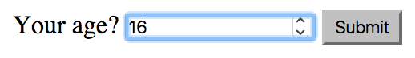

*readnum 限制输入数字*

键盘不是输入的唯一途径。另一个选择是使用语音输入，这可以用“listen”来实现。它的功能就和 read 一样：

```
listen 'Say something', (t) ->
  say 'You said: ' + t
```


*listen 接收语音输入*

关于使用语音的一点提示：现在语音识别和语音合成只能在 Chrome 上工作。当 Chrome 上的一个网页尝试打开麦克风时，它必须获得用户许可。如果使用 Pencil Code 的 https（secure）版本，那么第一次给予许可之后 Chrome 会记住，就不需要每次都询问了。

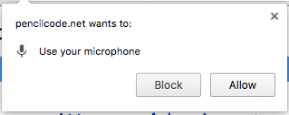

*当页面使用麦克风时，浏览器会向用户询问许可。如果通过 https 加载页面，许可会被记住*

### 使用 CoffeeScript await 等待输入
有时候程序需要读入一连串的输入。为了做到这一点，可以像这样把 event binding function 链接在另一个里面：

```
readnum 'Right triangle side a?', (a) ->
  readnum 'Right triangle side b?', (b) ->
    c = sqrt(a*a + b*b)
    write 'The hypotenuse is', c
```


*将两个 event handler 链接在一起以使用一连串的输入*

这种嵌套使程序看起来复杂许多，而且使它更难使用循环。

Pencil Code 使用的这个 CoffeeScript 版本有一对关键字“await“和“defer”应对这种情况，通过将程序搁置以等待一个事件的发生。在你想要暂停的命令前使用单词“word“，并且把“defer“放在带任意变量的 event handler 处，这个变量将是 event handler 的参数：

```
await readnum 'Right triangle side a?', defer a
await readnum 'Right triangle side b?', defer b
c = sqrt(a*a + b*b)
write 'The hypotenuse is', c
```

await 和 defer 跟函数调用有微妙的关系，因此在把 await 放到用户定义函数里之前，先理解“Iced CoffeeScript“的网页（如果在函数里使用 await，那么函数将使用回调返回结果）。

然而，在循环中 await 非常直接和有用。例如：

```
await readnum 'How many numbers to average?', defer count
total = 0
for j in [1..count]
await readnum 'Enter #' + j, defer val
  total += val
  write 'The total is ' + total
write 'The average is ' + (total / count)
```

这种代码风格称为“blocking i/o"，因为程序等待输入或输出时会阻塞（暂停）进程。blocking i/o 是教授 Python 或 C 的输入输出的传统方法，但处理 UI 事件的方法和这大有不同，典型的比如 JavaScript 和 Java GUIs，它们的输入是用 event handler 完成的。Iced CoffeeScript 的 await 允许在同一个系统中教授两种风格，甚至在同一个程序里也可以。

await 是如此有用，以至于它的一个版本被计划加入到 JavaScript 的未来版本中。然而它不能立即加入到语言中，所以现在还不能在 JavaScript 中使用 await，你必须定义函数来达到同样的效果。
### 使用 pressed 轮询键盘状态
不久前我们看到了两种输入风格：“event handler“和“blocking i/o“。第三种输入风格称为“polling”，它通常被用在视频游戏和机器人这样的实时系统中，并且你也可以在 Pencil Code 中尝试。一个使用 polling 的程序通过重复发起“现在键被按下了吗？“这样的提问来检查输入状态。

下面说明如何使用 Pencil Code 做到 polling（通常结合“forever“命令使用）。

```
forever ->
  if pressed 'W'
    fd 2
  if pressed 'D'
    rt 2
```


*通过嵌入到 forever 块中，pressed 函数可以被用来轮询键盘状态*

pressed 命令是 polling 命令。如果键被按下，它为真，如果没有按下就为假。if 被用在基于键的状态决定是否执行动作。有了“polling”，甚至可以支持“chording”，chording 是指制作一个同时响应两个按键的程序。学生可以使用上面的程序进行实验查看效果。

polling 是个很先进的技术，并且许多使它正确工作的微妙之处由“forever“命令处理。一个“forever”循环在很多方面都和传统的循环不同。

在一个“forever”循环中乌龟的速度被自动设置为无穷大以避免动画延迟。并且，一个“forever”循环自动在每一个循环之间放了一个短暂的延迟，因此你可以看到随时间重复的效果。你可以增加一个额外的数字参数来改变“forever”的帧速率。比如，“forever 10”速率将为每秒 10 帧。

```
forever 10, ->
  if pressed 'space'
    fd 1
  rt 1
```
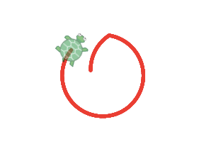

*设置 forever 块的频率为每秒重复 10 次*

### 将想法结合起来
输入输出这一单元覆盖了许多强大的概念，但真正的力量来自于寻求结合输入和输出的创造性的新方法。结合图形、文本、音频，学生们可以创造一些应用程序，像是计算器，游戏，对话助手，交互式绘图程序或者乐器。

每一个应用程序都需要一个特定的 i/o 模型。最通用的模型是：event-based i/o，blocking i/o 和 polling。有时候同样的程序可以以不同的方式使用不同的 i/o 模型，因此值得让学生们以不止一种模型来实验，以了解它们如何工作。
## 3.1.1 推荐日程：155 分钟课堂时间
| 教学日 | 主题 |
| -- | -- |
| 一天 | 课程计划一：文本和声音块 |
| 一天 | 课程计划二：使用 button 和 click (e) 控制|
| 一天 | 课程计划三：演示 /img bot 的使用 |
| 两天 | 课程计划四：实验室活动--在 shape bot 和 paint bot 中选择一个 |
## 3.1.2 标准
| CSTA 标准 | CSTA 链 | CSTA 学习目标 |
| -- | -- | -- |
| Level 3 A (Grades 9 – 12) | Computational Thinking (CT) | Describe how computation shares features with art and music by translating human intention into an artifact. |
| Level 3 A (Grades 9 – 12) | Computers and Communication Devices (CD) | 描述计算机的重要组成部分（例如，输入、输出、处理和存储 |
| Level 3 A (Grades 9 – 12) | CD | 比较各种形式的输入和输出 |
## 3.1.3 课程计划一
这一课的关注点在 Text，Sound 和 Control 块选项板。点击 Text，Sound 和 Operators 块，在这些块下面会显示给学生输入/输出语句命令。阅读并键入下面的代码，给学生演示输出。

提示：确保你在 block 模式。键入代码（如果需要就切换到 bock 模式）并点击播放箭头来演示结果。

<table>
<tr>
<th>详细内容</th>
<th>教学建议</th>
<th>时间</th>
</tr>
<tr>
<td>演示 write 和 say（Text 和 Sound 块）
<pre>Write_Say
write 'Hi'
write 'Hello.'
write 'Can you say hello world?'
say 'Hello World!'</pre></td>
<td>这些是输出语句。<br />
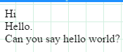<br />
键入代码并点击播放箭头演示结果。</td>
<td>演示 10 分钟。</td>
</tr>
<tr>
<td>展示表达式<br />
<pre>name = 'David Bau'
write 'Good to meet you ' + name
</pre>
输出<br />
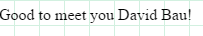
</td>
<td>演示 write 如何显示一个变量的值或一个表达式</td>
<td>演示 10 分钟</td>
</tr>
<tr>
<td>qustion bot 是一个简单的程序，提问问题并以智能的方式显示响应。<br />
代码：<br />
<pre># questionBot
# short interview with await..defer
await read 'What is your name?', defer name
await read ('What is your favorite food, ' + name) + '?',
defer food
await read ("Sounds tasty. What's so good about " + food)
+ ', ' + name + '?', defer response
write 'Fair. I might just go try me some ' + food + 'now.
Nice chat! '</pre>
输出<br />
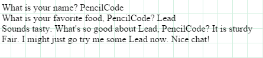</td>
<td>输入语句：<br />
使用 Qusetion Bot（Text 块）演示 Await-Read<br />
await 等待直到获得一个输入。然后将输入存储到声明在 defer 后面的变量中。</td>
<td>演示 15 分钟</td>
</tr>
<tr>
<td>代码：<br />
<pre># Question Bot using numbers
write 'Hello. Can you tell me your name
please?'
await read 'Your name?', defer name
write 'Hi '+ name
await readnum 'Can you tell me your age, ' +
name, defer age
write 'Hi ' + (name + ('. I have noted your
age '+ age))</pre></td>
<td>使用 Qusetion Bot（Text 块）演示 Await-Readnum。<br /></td>
输出<br />
</td>
<td>演示 15 分钟</td>
</tr>
<tr>
<td>现在学生们可以做出他们自己的 question bot 版本了。</td>
<td>鼓励学生表达他们自己的独立和创造性的实验，用“Say“代替“Write“。发生了什么？</td>
<td>学生练习 15 分钟</td>
</tr>
<tr>
<td>练习</td>
<td>使用 Art，Move，Text 和 Sound 块</td>
<td>学生练习 15 分钟</td>
</tr>
</table>

## 3.1.4 课程计划二
这一课讨论 Button 的使用：使用按钮点击输入。

提示：确保你在 block 模式。键入代码（如果需要就切换到 bock 模式）并点击播放箭头来演示结果。

<table>
<tr>
<th>详细内容</th>
<th>教学建议</th>
<th>时间</th>
</tr>
<tr>
<td>代码：
<pre>button 'Press to see a BullsEye', ->
  x = 18
  dot black, x * 5
  dot red, x * 4
  dot black, x * 3
  dot orange, x * 2</pre></td>
<td>演示 <a href = "http://teachersguide.pencilcode.net/edit/Chapter3/Button">Button</a>（'Click'）<br />
Button 选项允许用户给按钮贴上标签并且运行块中的代码。<br />
输出：<br />
</td>
<td rowspan = "3">演示 20 分钟</td>
</tr>
<tr>
<td>代码：
<pre>keydown 'a', ->
  x = 18
  dot black, x * 5
  dot red, x * 4
  dot black, x * 3
  dot orange, x * 2</pre></td>
<td>演示 <a href = "http://teachersguide.pencilcode.net/edit/chapter3/Keydown">Keydown</a><br />
Keydown 等待'a'键被按下然后执行块中的代码。<br />
输出：<br />
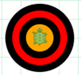</td>
</tr>
<tr>
<td>代码：
<pre>click (e) ->
  moveto e.x, e.y
  x = 18
  dot black, x * 5
  dot red, x * 4
  dot black, x * 3
  dot orange, x * 2</pre></td>
<td>演示 <a href = "http://teachersguide.pencilcode.net/edit/chapter3/MouseClick">Click</a><br />
click 会等待一个鼠标点击然后执行块中的代码。<br />
变量 e 代表 click event，因此<br />
<code>moveto e.x, e.y</code><br />
移动到点击的位置。<br />
输出：<br />
</td>
</tr>
<tr>
<td>完成上个课堂开始的实验室练习</td>
<td></td>
<td>学生练习：<br />
使用剩下的课堂时间，如果必要可以留家庭作业。</td>
</tr>
</table>
## 3.1.5 课程计划三
这一课介绍 Button 和 Click (e) 结合了 wear 和 img 块的能力，展示互联网上的图片。wear 和 img 块在 Art 面板下。

提示：确保你在 block 模式。键入代码（如果需要就切换到 bock 模式）并点击播放箭头来演示结果。

<table>
<tr>
<th>详细内容</th>
<th>教学建议</th>
<th>时间</th>
</tr>
<tr>
<td>代码：<br />
<pre>wear 't-pencil'
button 'Grow Smaller', ->
  jumpxy 30, 20
  grow 0.5
button 'Grow Larger', ->
  grow 2.0</pre>
输出：<br />
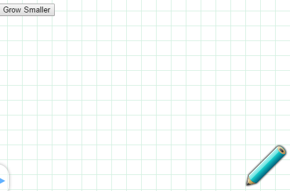</td>
<td>演示 wear 块如何工作。打开 <a href = "http://teachersguide.pencilcode.net/edit/chapter3/imgBot">ImgBot</a> 程序。<br /><br />
指出上一课的 Button 和 Click (e) 的使用。<br /><br />
解释 wear 和 img 如何工作（如果必要可以引用关键概念）。<br />
换作使用 pencil 的其他值，并且显示结果的图像。<br /><br />
鼓励学生使用 wear 和 grow 块。<br />
</td>
<td>演示：20 分钟<br /><br />
学生活动：25 分钟</td>
</tr>
</table>

## 3.1.6 课程计划四
这一课提供了设计 Shape Bot 的说明。学生将设计一个画几何图形的简单程序，比如正方形，三角形，圆形等等。程序首先向用户询问一个图形，需要用户提供一些细节，比如边的数量和长度，还有圆的周长等等。

<table>
<tr>
<th>详细内容</th>
<th>教学建议</th>
<th>时间</th>
</tr>
<tr>
<td>代码：<br />
<pre>speed 100
pen black, 10
button 'Triangle', ->
  await read 'How long are the
sides?', defer side
  cs()
  fd side
  rt 120
  fd side
  rt 120
  fd side
  rt 120
button 'Square', ->
  cs()
  await read 'How long are the
sides?', defer side
  fd side
  rt 90
  fd side
  rt 90
  fd side
  rt 90
  fd side
  rt 90
button 'Circle', ->
  cs()
  await read 'How long is the radius',
defer radius
  rt 360, radius
  fd 10</pre></td>
<td>给学生实验室程序。鼓励他们实验并改进程序的设计。在学生做完之后，拉下 <a href = "teachersguide.pencilcode.net./edit/Chapter3/shapeBot">Shapes Bot</a>，并开始给学生讲解这个程序。<br />
鼓励学生提出并展示他们的工作。<br />
输出：<br />
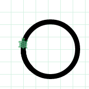</td>
<td>学生活动：55 分钟。<br /><br />
演示：20 分钟</td>
<tr>
<td colspan = 3>通过给出不同的作业完成同样的目的来鼓励学生探索和理解他们在编程上的爱好和优势。例如，考虑用一堆色彩点模拟一个油漆飞溅的画，这个可以称为 Paint Splatter Bot。</td>
</tr>
</table>

## 3.2 资源
<u>重要链接：</u>

[http://gym.pencilcode.net](http://gym.pencilcode.net/)

书：book.pencilcode.net
