<h1 align="center">第二章：点和线</h1>

## 2.0.1 教学目标

在此次课程中，我们将介绍使用小乌龟的图片来创建视频输出的直线程序。每次直线程序运行时都会按照相同的序列执行一系列的指令。学生们将学会如何设计、创建和调试序列。

## 2.0.2 主题大纲

2.0 章节介绍

- 2.0.1 目的
- 2.0.2 主题大纲
- 2.0.3 关键术语
- 2.0.4 关键概念

2.1 课程安排

- 2.1.1 课时建议
- 2.1.2 CSTA 标准
- 2.1.3 课程安排 I 使用移动块
- 2.1.4 课程安排 II 使用艺术块
- 2.1.5 课程安排 III 使用弧线
- 2.1.6 课程安排 IV 使用赋值运算符

2.2 资源

- 2.2.1 视频
- 2.2.2 相关链接
- 2.2.3 附加练习

## 2.0.3 关键术语

<table>
    <tr>
        <td>Sequencing</td>
        <td>Algorithms</td>
    </tr>
    <tr>
        <td>Bugs</td>
        <td>Pen</td>
    </tr>
    <tr>
        <td>Cartesian geometry</td>
        <td>Deterministic</td>
    </tr>
    <tr>
        <td>Turtle geometry</td>
        <td>Trace</td>
    </tr>
</table>

## 2.0.4 关键概念

**程序**为计算机定义了执行指令的一个**序列**。

- **直线程序**执行指令的顺序是自上而下的，中途不进行选择。这些简单的程序都**Deterministic**：它们每次运行都是按照相同的顺序执行相同的指令，而且指令执行的序列可以通过阅读程序来直接得出。
- 即使是Deterministic程序也会有一些**Bug**。Bug是用户和程序员都不想看到的，比如说一个程序绘制了与你设想的形状不同的图形。
- 为了**调试**程序，在程序运行时**Trace**（仔细地跟进）程序的每个步骤是十分有帮助的。这每一步都被称为程序的一个不同的**状态**。

目前，我们使用程序来在屏幕上创建图像。我们所用来创建图像的命令有两种类型：

- **Turtle geometry**，其通过控制一个画面对象的方向和运动情况来绘制线条、角度或其他形状。
- **Cartesian geometry**，其通过使用(x, y)坐标在屏幕上定位来绘制线条或其他形状。例如，`moveto`命令就是依照Cartesian geometry来移动小乌龟的。

## 在一点绘制

最容易的便是在小乌龟现在所在的位置绘制一个圆点或者方框。

    
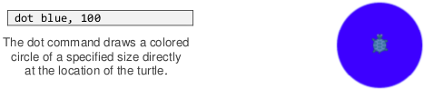

    
<em><code>dot</code>命令直接在小乌龟的位置处绘制一个指定大小的彩色圆圈。</em>

那个数字是用像素表示的直径（如果是方框的话，该数字就是边长）。一英寸大约有100像素（一厘米大约是40像素），这取决于正使用设备的精确比例。有很多颜色可以用来绘制：标准CSS中有140个颜色名，包括像“red”这种常见的名字和像“gainsboro”这种不常见的。一个包含所有颜色名的表格和一些实用的函数名列表，可以在Pencil Code的一张参照表中找到 http://reference.pencilcode.net/

单独绘制一个圆点或者方框不会移动小乌龟。如果绘制了第二个圆点，那么这个圆点的位置和第一个是相同的。顺序很重要：第二个圆点将会覆盖第一个，而如果这个圆点更大的话，它将会把第一个圆点完全遮住。

    
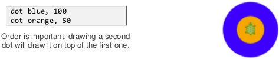

    
<em>顺序很重要：第二个圆点将会在第一个之上绘制。</em>

## 运动和线条

通过使用`fd`或`bk`命令可以让小乌龟向前或向后移动。可以通过移动圆点中的小乌龟来创建组成一排的三个圆点。

    
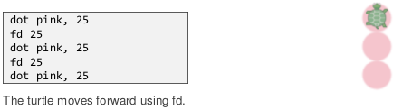

    
<em>使用<code>fd</code>让小乌龟向前移动。</em>

小乌龟也可以用Pen通过使用`pen`命令来移动绘制。Pen有颜色和粗细，同样颜色和粗细所画出的点具有相同的颜色和直径。一旦Pen被选择，它将能画出小乌龟爬行的路径。可以使用`pen off`来关闭Pen。

    
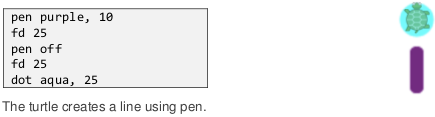

    
<em>使用Pen让小乌龟绘制了一个线条。</em>

## 转动和角度

使用`rt`向右转动小乌龟，向左用`lt`。这些命令是以度为单位的。

    

    
<em>使用<code>rt</code>或<code>lt</code>来转动一定角度。可以看出小角度的转动可以创建钝角。</em>

从图中可以看出，30°的转动创建了一个120°的角！当小乌龟的方向只改变了一个很小的数值时，创建的角度是很大的。在数学家看来，小乌龟方向改变的数值（30°）是外测度，而你所得到的角度（120°）是内测度。

要创建一个很小的锐角，小乌龟必须急转弯并将它的方向改变90°以上。180°是能转动的最大的角度，会将小乌龟转向后方。

## 用圆点和箭头调试

当使用一个复杂的绘图程序时，在待检查的一行代码之前或之后添加`dot`将会非常有帮助。绘制圆点本身是不会移动小乌龟的，所以当程序执行这行代码时它可以用来记录小乌龟此时的位置。另外，还有一个可以不移动小乌龟就能画出它当前方向的箭头绘制命令。

    

    
<em>使用一个蓝色的圆点和箭头来辅助调试代码的执行。</em>

通过在给定的一行代码处添加额外的输出来记录程序的运行状态是程序员最常用的调试技巧。

举个例子，如果一个角没有画对，那么解决的第一步就是找到负责绘制那个角的特定代码。可以通过添加圆点和箭头来标识当程序执行到特定步骤时小乌龟在做什么，这可以帮助缩小问题的范围。当有问题的那行代码被找到并修复后，多余的圆点和箭头就可以被移除了。

## 使用其他图像

可以将小乌龟的图像修改成任何互联网上的图片。若要显示小狗的图像，可以使用`wear`块：

    
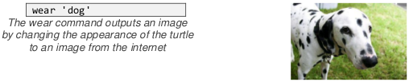

    
<em><code>wear</code>命令将显示用来代替小乌龟的互联网上的图片。</em>

`wear`命令将小乌龟替换成浏览器可加载的URL的图片。当你使用像“狗”这样的短名称时，Pencil Code从特定的URL集中加载图片，在 http://pencilcode.net/img 中使用知识共享图片搜索来查找图像。可以通过在/img后匹配名称来显示URL中的可自由重复使用的图片，例如在 http://pencilcode.net/img/mountain 中可以显示山。如果你使用像't-dog'这样t-开头的图像名，它将返回一个半透明的图像。

可以通过移动小乌龟来移动图像。例如，用以下命令将小乌龟向右移动200像素并向下移动100像素：

    
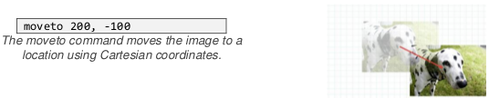

    
<em><code>moveto</code>命令通过直角坐标系来将图像移动到一个位置。</em>

## 使用变量移动第二个图像

使用`img`命令可以在屏幕上创建第二个图像。它可以通过使用变量加点号来移动（或者用任何对小乌龟可行的方式来操纵）：

    
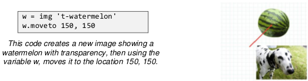

    
<em>这段代码创建了一个透明西瓜的图像，然后通过使用变量<code>w</code>，将它移动到了位置 150, 150 。</em>

上述代码介绍了两种最重要的编程概念：使用“=”操作符来为变量`w`赋值，和用“.”来向它指定命令。

变量是由程序定义的用来代表对象或数据的一个名字。可以用方便程序员记忆的任何单词来命名。例如，上述的变量`w`被用来代表西瓜（watermelon）。其他合理的名字可以也可以是“wm”或“melon”或者就是“watermelon”。

`w = img 't-watermelon'`中的“=”操作符与数学中的“=”略有不同。它不是用来表明`w`是和图像是具有相等关系的。它是一次赋值。“=”将变量`w`指向为西瓜的图像。如果在赋值前`w`已经有其他的值了，那么旧的值就会在赋值后被丢弃。

`w.moveto 150, 150`中的“.”操作符指定了`w`对象去执行`moveto`函数，而不是像告诉小乌龟去移动。图像也可以像小乌龟那样移动，所以“.”后也可以接小乌龟所使用的函数。在下面的例子中，`c`是代表小猫的图像的变量，而`c.rt 45`将它倾斜了45°。

    
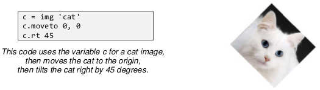

    
<em>这段代码用变量<code>c</code>代表小猫的图像，然后将小猫移动到初始位置然后将它倾斜45°。</em>

## 2.1.1 课时建议：155分钟课时

<table>
    <thead>
        <tr>
            <th>教学日</th>
            <th>主题</th>
        </tr>
    </thead>
    <tbody>
        <tr>
            <td>1日</td>
            <td>课程安排 I</td>
        </tr>
        <tr>
            <td>1日</td>
             <td>课程安排 II</td>
        </tr>
        <tr>
            <td>2日</td>
            <td>课程安排 III & IV</td>
        </tr>
    </tbody>
</table>

## 2.1.2 标准

<table>
    <thead>
        <tr>
            <th>CSTA 标准</th>
            <th>CSTA 部分</th>
            <th>CSTA 覆盖的学习目标</th>
        </tr>
    </thead>
    <tbody>
        <tr>
            <td>等级 3 A（9 - 12年级）</td>
            <td>计算机思维（CT）</td>
            <td>解释是如何用排序、选择、迭代和递归来构建算法块的。</td>
        </tr>
        <tr>
            <td>等级 3 A（9 - 12年级）</td>
            <td>计算机练习 & 编程（CPP）</td>
            <td>应用分析、设计和实现技术来解决问题。</td>
        </tr>
        <tr>
            <td>等级 3 A（9 - 12年级）</td>
            <td>CPP</td>
            <td>使用应用程序接口（API）和库来简化编程解决方案。</td>
        </tr>
    </tbody>
</table>

## 2.1.3 课程安排 I

本次课程将让学生对Pencil Code和移动块调色板有一个大概的了解。

提示：请确保你已经进入了块模式。输入代码（如有需要请切换至块模式）然后点击播放箭头来演示结果。

<table>
    <thead>
        <tr>
            <th>具体内容</th>
            <th>教学建议</th>
            <th>用时</th>
        </tr>
    </thead>
    <tbody>
        <tr>
            <td>使用第1章的资源和叙述作指导。</td>
            <td>对Pencil Code有一个概述。</td>
            <td>演示：10分钟</td>
        </tr>
        <tr>
            <td>
                
<u>代码：</u>

                
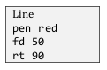

                

                
<u>代码：</u>

                

                

                
<u>代码：</u>

                

            </td>
            <td>
                
示例：

                
直线，

                
<u>输出：</u>

                

                
方形

                 
<u>输出：</u>

                

                
和三角形（移动块）。

                 
<u>输出：</u>

                

                
艺术块中的Pen实际上是在网格上绘制图案的。在Pen的选项中可以设置不同的颜色。

            </td>
            <td>演示：10分钟</td>
        </tr>
        <tr>
            <td>通过让学生尝试使用不同颜色和粗细的Pen来激发学生们的创造力。</td>
            <td>学生们将独自创建出他们自己的直线、方形和三角形。</td>
            <td>学生练习：15分钟</td>
        </tr>
        <tr>
            <td>在课堂上无法完成的同学可以将此作为课后作业。</td>
            <td>学生们将开始尝试使用House和Lighthouse</td>
            <td>学生练习：20分钟</td>
        </tr>
    </tbody>
</table>

##2.1.4 课程安排 II

本次课程将介绍**艺术**调色块。

<table>
    <thead>
        <tr>
            <th>具体内容</th>
            <th>教学建议</th>
            <th>用时</th>
        </tr>
    </thead>
    <tbody>
        <tr>
            <td>
                
<u>代码：</u>

                

                
<u>代码：</u>

                

            </td>
            <td>
                
对<u>Dot Row</u>和<u>Smiley</u>（艺术块）的演示展示了速度块的作用

                
<u>输出：</u>

                
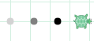

                 
<u>输出：</u>

                

                
提示：先别急着去演示绘制笑脸。让学生们来帮你定位黑色的眼睛的位置。

                
函数<code>function ht()</code>（<u>Smiley</u>代码中的最后一行）有什么用？

                
说明一下排序是一个关键的计算机思维的训练。

            </td>
            <td>演示：15分钟</td>
        </tr>
        <tr>
            <td>
            
设计你自己的……

            
鼓励学生们去尝试圆点的直径、Pen的颜色等等。

            </td>
            <td>学生们将会设计出他们自己的笑脸和圆点行。</td>
            <td>学生练习：10分钟</td>
        </tr>
        <tr>
            <td>
            
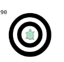

            </td>
            <td>
            
学生们要想办法创建一个眼睛部件。

            
以下是代码（答案）

            

            
提示：

            
1. 鼓励学生做出不同的尺寸和颜色。

            
2. 巡视课室，表达学生个人作品的满意。

            </td>
            <td>学生练习：15分钟</td>
        </tr>
    </tbody>
</table>

##2.1.5 课程安排 III

本次课程将介绍艺术调色块和移动块。

<table>
    <thead>
        <tr>
            <th>具体内容</th>
            <th>教学建议</th>
            <th>用时</th>
        </tr>
    </thead>
    <tbody>
        <tr>
            <td>
            
使用以下链接

            
http://gym.pencilcode.net/draw/#/draw/filled.html

            
完成以下任务：

            
改变颜色。

            
用<code>rt</code>和<code>lt</code>命令改变角度和半径。

            
观察图像是怎么改变形状的。

            </td>
            <td>
            
让学生们用crescent来实验。

            
鼓励他们去做一些考虑到艺术形式及数学运算的修改。

            </td>
            <td>学生练习：10分钟</td>
        </tr>
        <tr>
            <td>
                
<u>代码：</u>

                
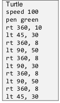

                
<u>输出：</u>

                

            </td>
            <td>
                
演示小乌龟程序。

                
解释用下面这个工具是怎么绘制角的：

                
http://guide.pencilcode.net/edit/explainer/turns

                
使用咖啡脚本：<code>rt</code>向右转动一定角度，来解释rt（角度）块。

                
解释怎么用rt (dg, rad)块来按照转动半径创建圆弧

                
http://guide.pencilcode.net/home/explainer/curves

                
lt块按照逆时针方向也一样。

                
提示：此处展示的代码是在文本模式下的。要鼓励学生在编程时在块模式和文本模式下来回切换，以加深了解。

            </td>
            <td>学生练习：20分钟</td>
        </tr>
        <tr>
            <td>http://activity.pencilcode.net/home/worksheet/flower.html</td>
            <td>
            
学生们现在已经可以实现在网格上绘制小乌龟了。

            
打印并分发两份学习资料（鲜花和汽车。让他们在下课前完成并向你展示成果）

            
用这项任务你还可以弥补下课之前时间的空白、做下热身或者留作家庭作业。

            
当学生们将完整的成果交给你后，你可以给他们完成成绩。

            </td>
            <td>学生练习：30分钟</td>
        </tr>
    </tbody>
</table>

## 2.1.6 课程安排 IV

本次课程的主旨在于使用图像BOT来创建有趣的场景并给学生们一个发挥自己创造力的机会。

教学提示：有两个概念需要讲解。第一，赋值运算符。Pencil Code允许你创建一个变量并可以用包括图片在内的任何东西为其赋值。第二，使用图像BOT来在互联网上找一张有趣的图片，学生可以用`moveTo`块将其移动到特定的地方。

<table>
    <thead>
        <tr>
            <th>具体内容</th>
            <th>教学建议</th>
            <th>用时</th>
        </tr>
    </thead>
    <tbody>
        <tr>
            <td>
                
<u>代码（文本模式）：</u>

                
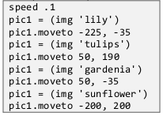

                
<u>块模式：</u>

                
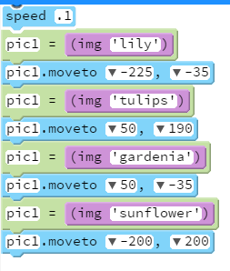

            </td>
            <td>
                
从左边的列表中将程序复制/粘贴到Pencil Code编辑器中。

                
解释img的功能——它从互联网中搜索能匹配引号中字符的第一张图片并将其显示出来。

                
解释'='赋值语句和'.'符号。（参考关键概念。）

                
解释一下图像已经被分配到了变量pic1。现在pic1可以按照moveTo块移动到一个地方。速度块可以添加动画效果。

                
向学生们演示通过试错来在屏幕上找到合适的位置，以达到拼贴效果。

                
现在让同学们来创建他们自己的贴图。

                
这段程序代码可以在<a href="http://teachersguide.pencilcode.net./edit/chapter2/collage">这里</a>找到。

                
一个好的活动结尾是反思类作业。让同学们写下创建贴图的过程和他们创建的贴图所表达的创意，在200字左右。

                
现在让同学们来创建他们自己的贴图。

                
<u>输出：</u>

                

            </td>
            <td>
            
演示时间：15分钟

            
练习时间：30分钟

            </td>
        </tr>
    </tbody>
</table>

## 2.2 资源

### 视频：

线条：https://www.youtube.com/watch?v=edN07wcbj2w

圆弧&角：https://www.youtube.com/watch?v=xUTPb0ozy8M

### 相关链接：

http://gym.pencilcode.net

角的教程：http://pencilcode.net/material/measuring.pdf

圆弧的教程：http://pencilcode.net/material/arcs.pdf

教材：book.pencilcode.net

### 附加练习：

练习——给小乌龟添加一条尾巴

通过完成这个简笔画来理解'Move'的用法：

http://activity.pencilcode.net/home/worksheet/stick_figure.html

*翻译者：[曹宇](https://github.com/ych0)*
