#
第十一章：使用 HTML-CSS 建立一个网站

##11.0.1目标介绍

   Pencil code 提供了一种非常简单的拖放的方式来创建HTML文件。本节介绍一个简单的HTML页面的结构。课程引导学生使用block-mode（块状态）创建基本页面，以及随着他们熟悉程度和知识的增加过渡到文本模式。

##11.0.2 主题大纲

### 11.0  章节介绍
- 11.0.1 目标介绍
- 11.0.2 主题大纲
- 11.0.3 关键术语
- 11.0.4 关键概念

### 11.1 课程计划
- 11.1.1 教学建议
- 11.1.2 建议时间表
- 11.1.3 CSTA 标准
- 11.1.4 课程计划I——建立一个基本的HTML页面
- 11.1.5 课程计划II——建立一个基本的CSS 页面
- 11.1.6 课程计划III——编写一个嵌入到HTML界面的JavaScript 程序
- 11.1.7 课程计划IV——编写一个JavaScript 程序来创建一个幻灯片

##11.0.3 关键术语
<table>
	<tr>
		<td>Cascading Style Sheet (CSS)</td> 
		<td>HTML</td>
	</tr>
	<tr>
		<td>url</td>
		<td>Hyper-text</td>
	<tr>
		<td>Server - client</td>
		<td>protocol</td>
	</tr>
	<tr>
		<td>https vs. http (encrypted vs. unencrypted) </td>
		<td>tags</td>
	</tr>
    <tr>
        <td>< script >-tag</td>
    </tr>
</table>

##11.0.4 关键概念
Pencil Code支持结合HTML,CSS和JavaScript或CoffeeScript的编码网页。要启用HTML和CSS编辑,单击“齿轮”图标并选择这些语言。
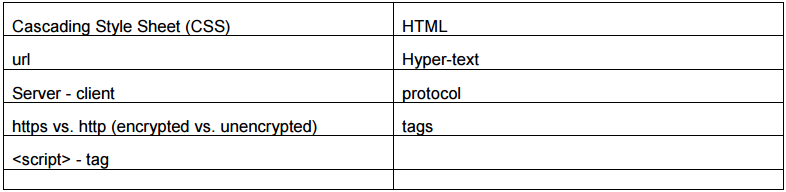

使用HTML和CSS会将编辑区域分割成多个窗格:
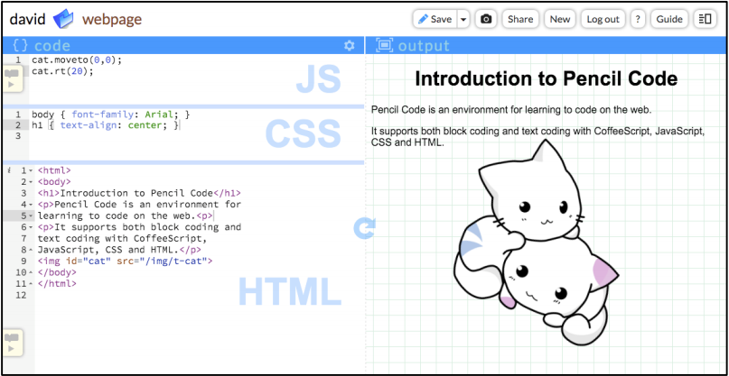

*在同一个项目编辑 HTML和 CSS和 JavaScript*

上面的截图的代码如下所示。它有一个含有若干元素的HTML页面,两个CSS规则,和两行JavaScript代码:
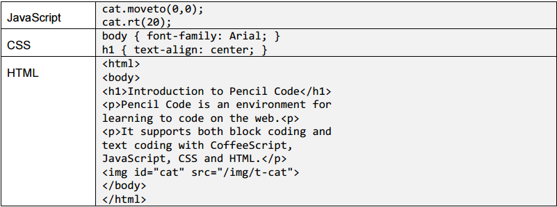

这个例子中所有的三种语言相互作用。

- HTML包括< body >,< h1 >和< img id='cat' >等元素。
- CSS包括body规则和一个h1规则，并且设置这些HTML元素的视觉风格。
- JavaScript引用cat image, 使用turtle函数移动翻转它。

这个编辑器可以用来教授网络和互联网的概念。因为Pencil Code同样提供了库,所以先前章节的所有的例子仍旧有效。编码可以直接在网页上进行,允许学生在学习HTML和CSS,URLs,和互联网的同时创建动画以及实现交互性。
###互联网
互联网，作为客户端,路由器和服务器，是一个连接了电脑的全球网络。网页由发送到互联网上的一些最有用的数据构成,当一些人谈论互联网,他们实际上指的是网络。

**服务器**运行在网络上等待的程序,准备好回答其他计算机发送的请求。例如,因“www.un.org“ 而广为熟知的计算机是一个在联合国等待网页请求的服务器,当它收到请求时,它将发送回被请求的网页无论哪个电脑发送的请求。

**客户端**通过创建和发送信息到服务器来运行发出请求的程序。例如,当你在你的手机上使用你的Web浏览器访问www.un.org,你的手机就是一个客户端。它将带有请求的小信息发送到位于联合国的计算机，过一会儿就会收到一个包含网页的返回消息。

**路由器**运行在其他计算机之间转发消息的程序。发送消息(或直接无线电信号)从你的客户端(和世界上每一个其他客户端)直接到联合国是不现实的。所以,相反,计算机通过向附近的电脑发送消息来传递指令，并且使它沿着正确的方向传递下去。信息从电脑传给电脑,直到它到达正确的服务器。路由器是互联网中默默无闻的送货工。你通常不需要知道十几个路由器可能在你的客户端和服务器之间,但如果你已经注意到在你的网络一个计算机被“192.168.1.1”或“10.0.0.1”表示,这些计算机可能是路由器。

###万维网
**HTML**是超文本标记语言,是在写web页面的主要语言。

**超文本文档**是一个文本文件,在互联网上嵌入到其他资源的链接。

**网址**是一个精确的名字(写作URL), 在互联网上定位一个特定的文档或文件。

**网页**是一个带有Web地址的超文本文档。
如果一个人要画一幅表示几个链接的网页的画，它们之间的每个网页一个点,每个链接一条线，这就像是一个网络的连接。万维网(网络)是我们给全世界数十亿链接的网页的名字。
组成Web的页面被世界各地数以万计的不同服务器服务着,每个服务器服务大量的网页。要想了解网页是如何被找到的,重要的是要理解URL。

###一个URL的三个主要部分

一个网页的网址用一个叫做
**URL**(统一资源定位器) 的方式精确书写。一个URL看起来像这样:

https://www.un.org/en/index.HTML

第一部分“https:”是
**protocol**（协议）,其决定与服务器通信时使用的消息格式。如今网络上有两个主要的协议。
**HTTP**(超文本传输协议)传输请求和响应没有任何加密,因此任何路由器可以读取消息。
**HTTPS**(HTTP安全)对消息加密,因此只有客户机和服务器可以阅读它们。

第二部分“/ / www.un.org” 双斜杠后的是服务器。这个URL请求将被发送到服务器www.un.org。

第三部分“/en/index.HTML”服务器名称后的是将在服务器被请求的网页的
**path**（路径）。Web服务器经常用“/”来划分目录名称的文件来组织路径，但Web服务器使用他们选择的任何路径来自由地组织他们的网页。举个例子,谷歌使用url(“https://www.google.com/search?q=un”)
来为几乎无限的各种各样的网页来服务。通过改变路径的最后一部分：把“UN”换做任何其他单词来向谷歌请求搜索结果的页面。

###Pencil Code URLs
Pencil Code为每个被学生保存的程序都设置了一URL:

http://newbie.pencilcode.net/home/myprogram

这里的协议是未加密的HTTP。(Pencil Code还支持HTTPS。)
“newbie.pencilcode.net”是一个被学生创建的服务器。所有在Pencil Code上保存工作的学生会拥有自己的虚拟服务器。(它被称为“虚拟”是因为实际上并没有为每个学生配备一个新电脑：Pencil Code服务器通过使用一个新名字和重新使用一个与其他同学共享的物理计算机来运行服务器软件。)
路径是“/ home / myprogram”,当保存文件时，在”/home”后加上所选择的名字。在Pencil Code 中,路径中顶级目录的名称是特殊的。如果你使用“/ home /”,它将提供原始网页,就像一个普通的Web服务器。如果你改变目录名为“/edit/”,它将提供一个特殊的编辑网页,让你看到源代码并可登陆进行页面编辑。

###HTML标签

**HTML**(超文本标记语言)是用于编写网页的语言。一个简单的HTML文档是这样的:

< !doctype HTML >

< HTML > 
   
< body style="background:wheat" >   
   < h1 >My Page< /h1 >
    
   < p >This is < em >my< /em > page.< /p >
    
< p >< img src="https://pencilcode.net/img/happyfox" title="little fox" >< /p >  
 
 < /body > 

< /HTML >

一个标准的HTML文档以< !doctype HTML >开始，之后为三种类型的信息。
在多角度中的
**标签**如< body >指定文档中的特殊位置。
**标签名称**是标签的第一个词。
标签的
**属性**,也写在标签的角度中,如title =“little fox”或style=“background:wheat”。
**文本内容**,如“My Page”，它们不出现在的角度中。
大部分的标签是成对出现的：例如
**开始标签**< body >匹配带有斜线的
**结束标签**< /body>,但是有一些特殊的
**自闭标签**不成对，如< img >。一个标签和其所配对的标签(如果有的话)被称为一个
**元素**,元素可以相互
**嵌套**。例如,在上面的文档中, < HTML >嵌套了< body >,< img >元素嵌套在一个< p >元素中,它们共同嵌套在< body >中。< em >元素也嵌套在一个不同的< p >元素中。
HTML有大约100种元素和100种左右的属性，可以让程序员在文档中做各种各样的事情。了解HTML的最好办法是做网页并同时从互联网上的诸多在线可用资源中尝试不同被描述的元素。这是一些特别有用元素的列表。
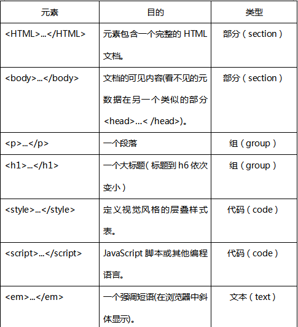
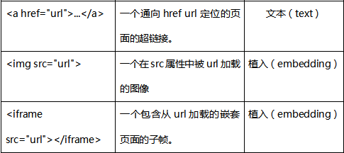

最后三个元素具有href属性和src属性，其价值标准为链接到其他文件或网页的URLs。在一个网页中,用短的方式写URL对理解是很重要的。

###相对URLs

网页的URL,可以写作缩写形式称为
**相对URLs**,相对URLs省略了URL的一部分，并且假设他们作为当前的Web地址起到了相同的作用。普通完整的url包含一个协议,服务器名称,路径，被称为
**绝对URLs**。例如,假设当前的URL是
http://newbie.pencilcode.net/home/myproject/welcome.html
 
这里是
**相对URLs**的示例。
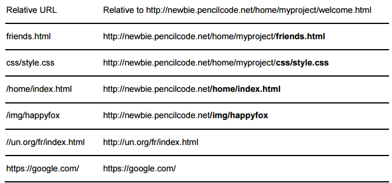

基本规则是这样的:一个的绝对URL总是开始于一个协议名称如http:或https:。如果一个相对URL开始于两个斜杠,它继承了当前协议但取代其后的一切。如果一个相对URL开始于一个斜杠,它取代当前的服务器名称后的一切。如果一个相对URL不开始于斜杠,它取代当前URL的最后一个斜杠之后的一切。
绝对URL作为一个被需求的URL可以在任何地方使用,但相对URL可以使输入更快捷。相对URL还有优势：如果一个网页的目录在服务器或目录之间被移动,目录中的相对URL将持续有效。

###样式属性和style元素

浏览器对于每个HTML元素都有默认的视觉样式。例如,< em >…< / em >元素表示一个应该被强调的短语,并且浏览器将使用斜体字体样式的默认文本。但是如果你想使用一个正常的字体样式并对文本下划线来替代呢?视觉风格可以通过使用任何可见元素的样式属性而被推翻,如下：

< em style="font-style:normal;text-decoration:underline">something< /em>

样式属性的值是一个
**样式声明模块**,可以列出任意数量的
**样式声明**并用分号隔开。每个样式声明都有一个样式属性，在其后有一个冒号和一个值。大约有100种标准样式属性并且有很多网络资源列出它们并给出它们如何工作的例子。
如果你想在文档中的每个< em >元素中应用相同的风格声明模块,您可以创建一个包含CSS(层叠样式表)规则的< style >元素，如:

< style >

em {
   
font-style:normal;
   
text-decoration:underline; 

}

< /style >  

CSS是一种强大的语言,它提供方法来结合并推广style（样式）规则。我们不会关于这方面谈论很多，但在互联网上有优秀的可用资源详细介绍了可以用CSS创建的美丽的效果。

###< script >元素
当把HTML和JavaScript代码结合时,JavaScript嵌入在< script >元素中。Pencil Code为网页提供了分隔开的编辑面板分别编辑HTML和JavaScript，但当你一起查看它们，Pencil Code通过添加一个< script >元素把JavaScript代码放到HTML页面中。

< script >元素也可以与其他语言一起使用。当CoffeeScript语言加载时,类型属性会被设置，那么< script type = " text / CoffeeScript " > < /script > 就包含了CoffeeScript。

##11.1.1 教学建议
前两个课程详细地计划了如何使用Pencil Code构建一个HTML页面。对整体结构有可用的模块,一个学生可以拖动并且帮助其他学生构建HTML页面。本章与别的不同之处在于,每个课程计划都是前面的课程计划的一个延续。

##11.1.2 合理的时间线：155分钟课时
|教学天数|主题|
|--------|----|
|2天	|课程计划I & II：HTML网页设计|
|1天|	课程计划III：JavaScript 嵌入式程序|
|1天	|课程计划IV：JavaScript数组使用(JavaScript嵌入到网页)|

##11.1.3 标准
|CSTA 标准|	CSTA串|	CSTA学习目标覆盖|
|---------|-------|-----------------|
|3B等级（9-12年级）|	CL	|当在一个协作软件项目工作时，使用项目协作工具、版本控制系统和集成开发环境(ide)。|
|3A等级（9-12年级）	|CPP	|使用先进的工具来创建数字计算创新和工件（例如网页设计、动画、视频等)。|
|3A等级（9-12年级）|	CPP	|通过使用各种web编程设计工具来创建和组织网页。|

##11.1.4 课程计划I
使用基本模块和HTML标签来构建一个单页的HTML页面；查看，检查HTML和CSS的选项被选中了。

|内容细节|	教学建议|	时长|
|--------|----------|-------|
|文本代码: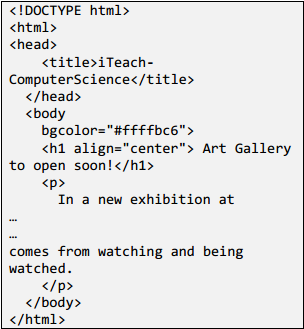|第一步：为学生示范如何用拖放框架的模块来创建一个基础页面。      第二步：要求学生添色和字体。       第三步：鼓励学生在HTML文本类型中使用文本模式。        第四步：如果学生在HTML代码的小细节中失误，指出基本结构和问题。注意,他们可以通过使用block-mode拖拽来避免这些问题。       第五步：点击“分享”,复制-粘贴URL到Web浏览器。指出布局和颜色并且评论网站的视觉吸引力。这是程序的代码。      输出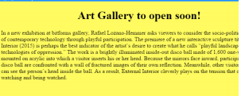|  示范：30分钟|

##11.1.5 课程计划II
这节课的重点是使用CSS创建页面。它演示了CSS的使用方法以及如何将其添加到之前教案的程序中。查看，检查HTML和CSS的选项被选中了。

|内容细节|	教学建议|	时长|
|--------|----------|-------|
|HTML代码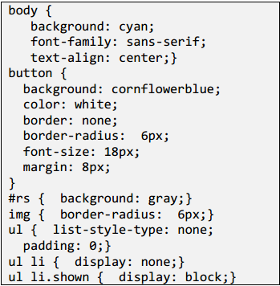     CSS代码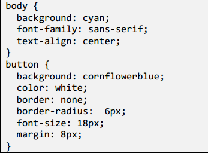|第一步：打开程序点击运行。      第二步：指出代码中HTML部分并且说明HTML文件中的结构如何嵌入到程序的模块模式中。     第三步：展示CSS代码并且通过修改值来演示外观的变化。       第四步：与第一个程序比较，向学生说明CSS是如何起作用的。这是一个样品程序。|示范：15分钟学生练习：30分钟|
##11.1.6 课程计划III
学生现在可以写一个JavaScript程序嵌入到他们已修改的网页中。艺术画廊页面。注意，这个程序是非常简单的，因为它使用了课程计划II中所学的知识以及在其中添加了JavaScript的信息。

|内容细节|	教学建议|	时长|
|--------|----------|-------|
|JavaScript代码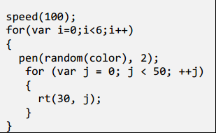  HTML代码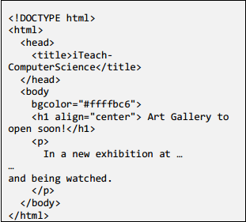   CSS代码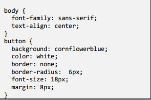|第一步：打开程序：第一页艺术画廊设计。确保Pencil Code的环境是在JavaScript和HTML / CSS选择模式。        第二步：运行这个程序。(看起来类似于学生在前面的教学计划修改的项目）。         第三步：指向JavaScript程序。这是他们以前设计的程序。       第四步： 说明这一活动与许多他们已经学到了技术相结合。      第五步:点击分享并复制/粘贴到一个新的URL选项卡在浏览器中查看网页。教学提示:右键单击鼠标查看源代码显示JavaScript代码如何嵌入到HTML页面中。       输出：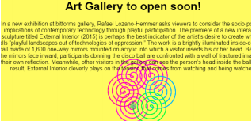|示范：20分钟|
||鼓励学生创建自己的JavaScript代码并查看嵌入到网页中的程序。学生练习：25分钟||
##11.1.7 课程计划IV
这节课的重点是使用JavaScript程序创建一个幻灯片。它演示了数组的使用(编程中最简单的数据结构)。这最后的一课使学生能够整合所有在本章课程计划的技术来创建一个有趣的网页。

|内容细节|	教学建议|	时长|
|--------|----------|-------|
|HTML代码 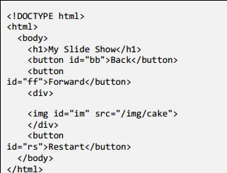   CSS代码 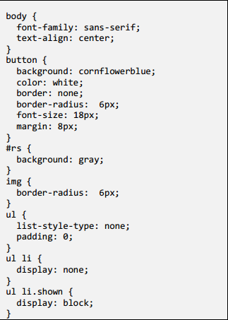   JavaScript代码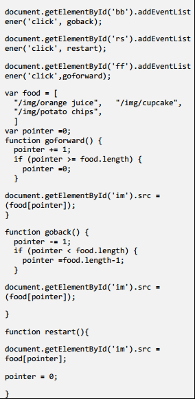|第一步：打开程序：js幻灯片。确保Pencil Code在 JavaScrip代码环境模式以及HTML和CSS被选择。          第二步：指出每个按钮都有一个小功能模块，点击时执行。(所提及概念在第5章-功能）。第三步：展示从互联网获取选择using/ img能力的图片(第三章-输入/输出)。           第四步：指出程序的HTML和CSS部分,使这个项目成为一个网页的一部分。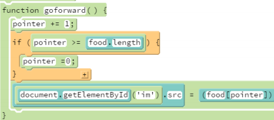    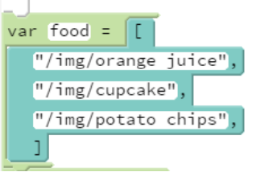      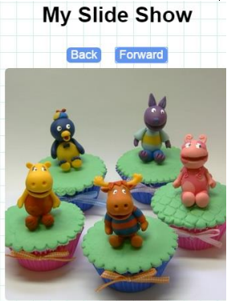|示范：30分钟|
||鼓励学生改变图像。增加数组的大小和添加更多的元素。鼓励学生修改CSS和HTML值来提高程序的视觉吸引力。学生练习：120分钟||