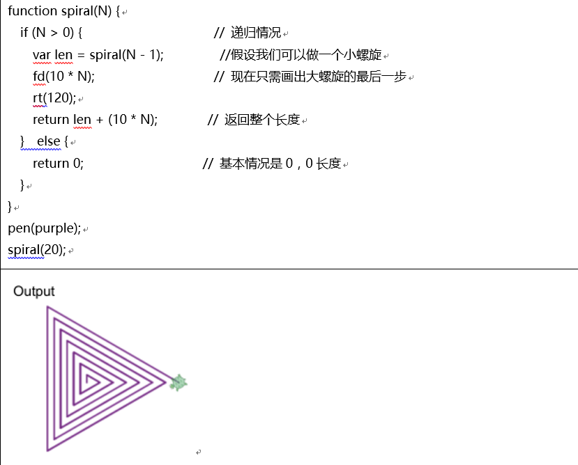
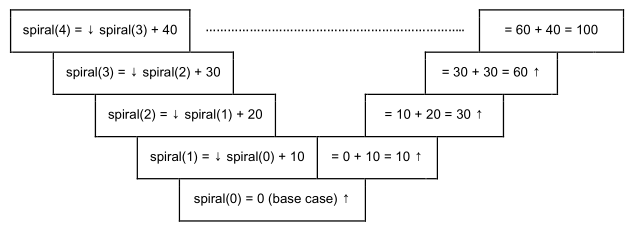
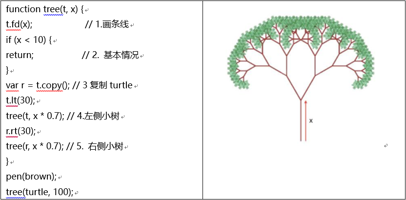
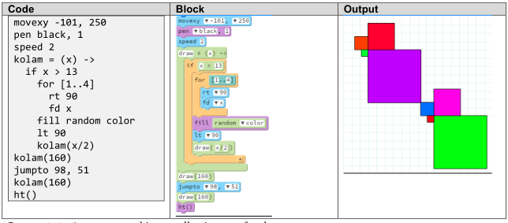
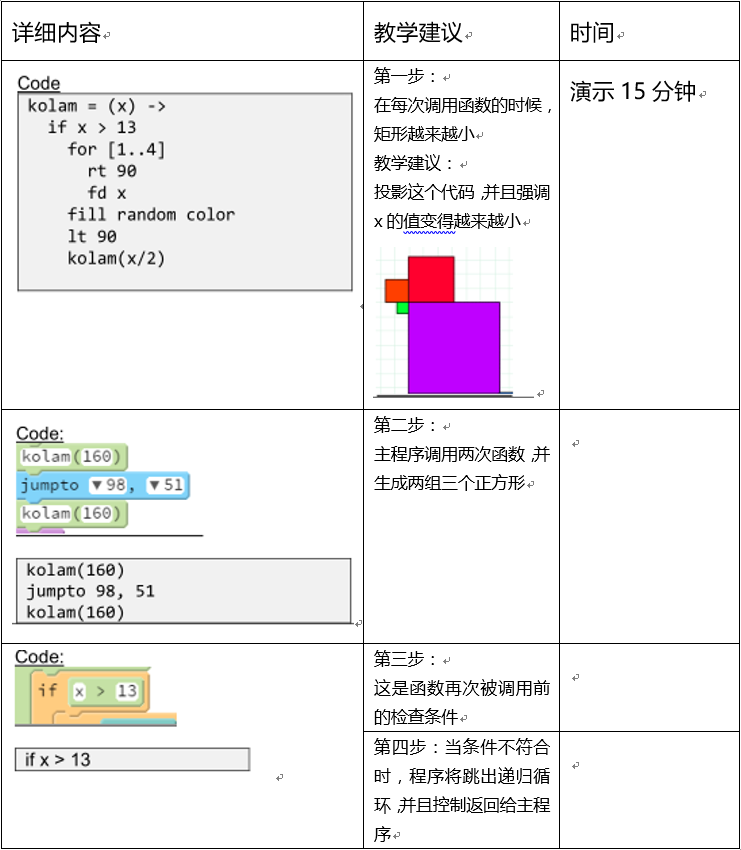
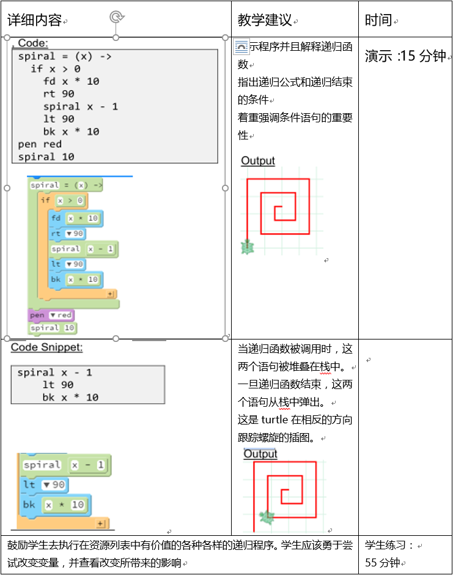

# 第十章 递归
### 10.0.1 教学目标
本章简要介绍递归，它是调用自身函数的实践。学生将学习到什么是递归和如何去阅读递归代码。学生将学习到递归程序的关键组成部分，并且重要的是，他们将学习到任何递归程序必须通过基本的情况有一个退出函数。
### 10.0.2 主题大纲
10.0    章节介绍
-  	10.0.1  目标
-  	10.0.2  主题大纲
-  	10.0.3  关键术语
-  	10.0.4  关键概念

10.1    学习计划
-	10.1.1  教学建议
-	10.1.2  建议时间表
-	10.1.3  CSTA标准
-	10.1.4  课程计划I关于演示递归函数如何工作
-	10.1.5  课程计划II关于演示递归栈如何工作

### ==7.0.3	关键术语==
| 术语单词 | 术语单词 |
|--------|--------|
|Recursive functions|Base case|
|Terminating condition|Infinite recursion|
### 10.0.4 关键概念
递归函数是个调用自身的函数。递归函数对处理相似问题是非常有用的。以下是两种思考递归的方法：
-	递归将问题变得更小,更类似,并且相比更大的问题更容易被解决。
-	递归扩展运算通过重复一个个小的,类似的过程来作为处理大过程的一部分。

递归函数有处理两种不同情况的条件:
-	递归情况，在这种情况下,函数自加去解决类似的问题,然后使用这种方案去解决完整的问题。
+	基本情况，在这种情况下,函数识别最简单的案例,并且不通过自加来完成计算。

以上两种情况都很重要。因为计算递归案例通常需要花费大量的思考,程序员经常忘掉简单的情况。当这种情况发生的时候,递归函数将在无穷的递归中反复自加,并且函数永远不会完成(除非调试器终止它)
结合例子是理解递归最好的方法。

####一个三角螺旋的例子
此前我们已经通过第一步思考创建了计算机算法,但是在递归中,方案首先从最后开始运算.假想大部分的问题已经被解决。在递归中,程序员会问:一旦几乎每件事都被完成,那么最后一步将是如何被解决?一个递归算法是通过开始和通过思索如何完成最后一步来建立的。
假设一个递归程序需要测量三角螺旋的边长，这个三角形的每条边都比之前的边长10个单位，第一条边10，然后第二条边20，接下来30，如此下去。那么第N条边的螺旋有多长呢？
使用递归解决这个问题需要两个情况：
-	递归情况。假设一个有N条边的螺旋，想象那个程序可以解决N-1条边的问题，那么答案就是spira(N-1).由于最后一条边长是 10*n ，因此我们可以得出 spiral(N) = spiral(N – 1) + (10 * N)
-	基本情况。一些N 是不需要参照自身，当N是0的时候，这样处理就很方便，因此 spiral (0) = 0.

在这个代码里面，spiral(20)调用 spiral(19),然后再调用spiral(18),依次进行下去。这是如何工作下去的？在运行spiral（20）之前，计算机实际上没有spiral(19)的答案！
跟踪在网格中的递归
每次函数被调用时，它的参数呈现不同的意思，因此即使spiral（4）还没有完成运算，计算机也可以调用spiral(3)。变量N在每次调用时，都有着不同的值，并且每层之间互不干扰。下面的关系图就是描述计算层面是如何工作的。

每一行都是递归的一个单独层次，表示在最底部的基本情况是如何调用下一个层次的递归。从头到底的移动表示着每一层递归是如何减少问题到一个更小的问题。
从左往右阅读揭示着随着时间的推移是如何实现递归计算：spiral(4)调用函数计算spiral（3），spiral(3)再调用函数计算spiral（2），以此类推，一直到基本情况返回到0,它允许完成spiral（1）的运算并返回到10，它允许完成spiral(2)的运算并返回到30，它允许完成spiral（3）的运算并返回到60，它允许完成spiral（4）的运算并返回到100.
一个分形树的例子
递归可以被用来创造自身相似的模型。如果一个递归函数调用自身两次，然后一个分支效果可以被创造出来，在这个分支里面，这个函数将被调用扩展到2,4,8等等。在下面这个例子中，这个树的递归函数需要两个输入，一个turtle对象 t 和一个分支长度 x。

下面是这个程序的部分解释：
1.	唯一直接做的图是根据移动t.fd(x)来画长度为x的线
2.	然后基础情况这样处理：如果线的长度短于10，它将返回，并且不会有进一步的行动。
3.	一个树枝将是一个复制的t来调用r。这将处理右侧
4.	原始的turtle t 将通过向左翻转30度并且画另外一棵树来处理左侧。在左边的树以小于x乘以0.7的树枝开始。
5.	新的turtle r 将通过向右翻转30度并且画另外一棵树来处理右侧。这个树在上面的例子中是自身相似的，因为一颗大树是由一群小树来构成的。在自然界中许多形状都有着同样的自身相似性，这样的递归程序可以被用来创造根本的，自然的形状。

###10.1.1 教学建议
学生总是认为递归很可怕，所以老师需要经常不断的重复递归的概念来让学生真正的理解递归。在入门编程的课程中，学生应该至少了解递归函数的概念，并且理解递归函数是如何工作的。如果他们看见运行中的递归算法，这将是帮助他们理解递归的有效方法。这对让学生去解决一些类似的递归问题，并且用纸和笔去预测它的输出是非常有用的。此时，我们不建议学生去创造属于自己的递归解决方案。在这节课中，你可以使用两个Pencil Code 的例子作为解释和演示递归的工具。最好用多个策略来教递归。

###10.1.2 合理的时间线：55分钟的课时

| 教学天数 | 主题 |
|--------|--------|
|一天|教学计划I|
|二天|教学计划II|

###10.1.3 CSTA标准

| CSTA标准 | CSTA部分 |CSTA覆盖的学习目标|
|--------|--------|--------|
|等级 3A（分数9-12）|计算思维（CT）|解释序列，选择，迭代和递归是如何构建算法块的。|

###10.1.4 教学计划I
本课介绍了递归过程。这个演示应该花大概30分钟。演示之后,复制一份程序给学生,让他们亲自体验并且理解递归函数是如何工作的。
教学提示:
这是初学编程者遇到的最难的课题。目前反馈来说,Pencil Code 提供了有助于理解的更好的概念。以下是两条建议方法。
第一步：演示程序
下一步：将其分割成一个个小的代码部分，来解释其概念。
在投影仪上演示程序（5分钟）

####演示小片段代码的概念

###10.1.5 教学计划II
本课程演示递归过程，并且展现编译器还没有从栈中执行的命令。这个地方应该花大约20分钟去演示和解释说明。

