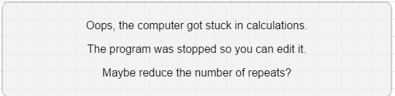
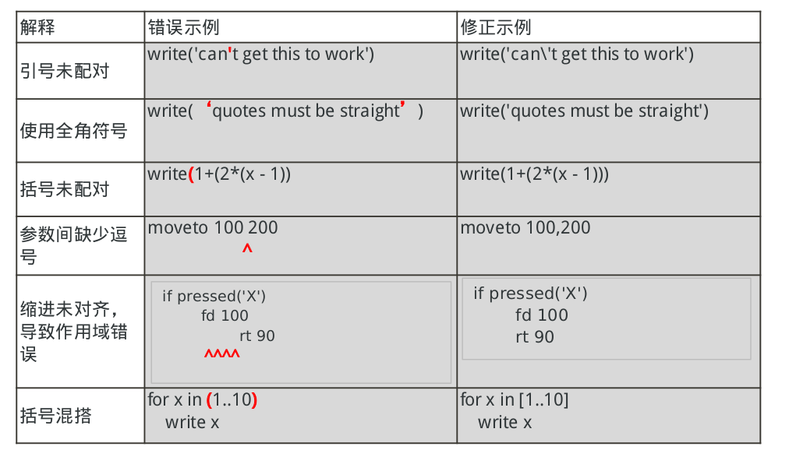
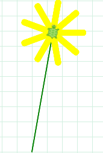
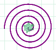
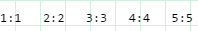

#
第四章：循环

##4.0.1目标介绍

**循环**是一种基本的程序结构，本章介绍了三种形式的循环，都是程序中基本的用于表示重复动作的结构。在本章学习结束后，学生应当具备的能力有：分析一个循环的重复执行次数和终止条件，并能在自己的程序中应用到for,while,forever循环

##4.0.2 主要内容
- 4.0.1 目标
- 4.0.2 内容纲要
- 4.0.3 关键术语
- 4.0.4 关键概念
		
##4.1 教学计划
- 4.1.1 时间安排建议
- 4.1.2 CSTA标准
- 4.1.3 教学计划 I : 在控制结构中使用for循环和while循环
- 4.1.4 教学计划 II : 在text-mode和block-mode之间切换
- 4.1.5 教学计划 III : 使用for-each循环
- 4.1.6 教学计划 IV : 智能问答机器人、循环赋值理念(Review?)
- 4.1.7 使用"forever"循环

##4.2 资源
- 4.2.1 实验扩展

##4.0.3 关键术语
<table>
	<tr>
		<td>Control Statements：repetition and iteration</td> 
		<td>Fixed adn variable repetitive statements</td>
	</tr>
	<tr>
		<td>Terminating condition</td>
		<td>Increments</td>
	<tr>
		<td>Infinite</td>
		<td>for loop</td>
	</tr>
	<tr>
		<td>while loop</td>
		<td>Start Value and beginning condition</td>
	</tr>
</table>
###4.0.4 关键概念
**迭代**:通过包括重复序列允许通过一个简短的程序来代替一系列的重复的步骤

程序中重复执行的一段指令叫做**循环**。

每一个循环由两部分组成:

- **条件**： 控制循环重复次数
- **循环体**： 循环执行时始终运行的代码段。

我们称一个无休止运行的程序为**死循环**。死循环将会阻止一个程序完成其执行，所以含有死循环的程序通常是不可取的。
在浏览器内，一个死循环甚至可以导致程序对鼠标点击失去响应，因此Pencil Code将尝试检测和中断带有死循环的程序。

为了避免死循环，控制循环执行次数的程序必须编写正确。在CoffeeScript中有两种主要的书写循环条件的方法：

- for循环对于**迭代表**中的每一个元素执行一次循环体
- 只要**循环条件**为真，while将一直执行循环体

###使用循环
循环结构位于block-mode中的面板上，有三种可用的循环结构：

**for循环**：在固定增量下有着固定循环次数的一段程序。下面的循环将输出三次单词“Hello”。

**while循环**：只要程序的执行条件为真，就会重复执行语句的一系列程序。在未运行前，实际的重复次数是未知的。

可能出现的情况是：由于一个逻辑错误，循环将相应代码段重复运行无数次，这对初学者来说是很常见的。Pecil Code通过收集错误和中断程序执行来避免上述情况。究其本质而言，Pencil Code在循环内部内置了一个计数器，如果一个程序在循环内部停留达几秒种而不处理输入的话，Pencil Code将认为程序卡死并中断执行。

请看如下示例:

由于count永远不能达到4, Pencil Code将绘制出方框并生成一个错误：

**注**：上述大意为：哦！计算机在运算过程中卡住了！程序已经结束运行以便你能编辑代码。请问你可以减少循环的次数么？

更正过的代码如下：

**forever循环**:一个普通的while循环在陷入死循环的情况下将会导致浏览器失去响应，这意味着页面将会卡死导致用户无法进行交互操作。为了可以执行上述死循环，可以在程序中使用forever循环，forever循环实现了在每次循环中短时间内暂停一下以使浏览器可以处理用户输入。这种暂停特性使得forever循环不同于上述的while和loop循环。forever循环可以用于执行一些需要无限循环的操作，同时不至于使整个浏览器失去响应。forever后面的数字指定了每秒重复执行的次数，即可以控制每次暂停的时长。

##在代码中使用for循环
如果学生到现在为止还没有还没有实验过text-mode编程，这一小节将是推荐这种编程方式的绝佳时机。下述代码将会以text-mode展示出来。比起block-mode,一些循环的概念在text-mode中可以更加方便地表现出来。例如，想对于block-mode,在text-mode中很容易做到将循环转变为while循环或者在for循环中增删一个循环变量。

for循环的形式多种多样，但是他们都以同一种方式运作，即，对于迭代表中的每一个元素都将执行一次循环体。在 text-mode下将上述形式的for循环相互转换是非常容易的。
<table border="1" cellspacing="0">
<tr>
<td><pre><code>
for [1..3]
	write 'hello'
</code></pre></td>
<td><pre><code>
for x in [0...3]
	write 'hello', x
</code></pre></td>
<td><pre><code>
for x in ['alice', 'bob', 'carol']
	write 'hello', x
</code></pre></td>
</tr>
<tr>
<td><pre><code>
hello
hello
hello
</code></pre></td>
<td><pre><code>
hello 0
hello 1
hello 2
</code></pre></td>
<td><pre><code>
hello alice
hello bob
hello carol
</code></pre></td>
</tr>
</table>
上述所有的三个循环都将他们的循环体重复执行3次，因为他们都便利了列表中的三个元素。上面的循环使用了一个语句"for x in"将每次循环遍历得到的值赋给x，循环体也可以使用这些变量来使得每次输出的内容略有差别。

这里只做了一些关于列表的介绍(具体的关于数组的内容将在第八章做详细讨论)。CoffeeScript中的数组以方括号封闭，[1..3]用整数间的两个点表明这是由1开始由3结束(包括3)的列表。

为了声明一个不含最后一位的列表，可以使用三个点[0...3]。这种三个点的形式非常有用，因为(和两个点不同)它可以表示一个不含元素的空数组比如[3...3]。数组也可以明确的用逗号或者换行将每个元素分开。

使用for语句的循环在达到数组的最后一个值后将自动结束，所以在Coffee Script中使用for循环是不太可能错误地写成死循环的，或许唯一可以的方式是为循环使用一个含有无限元素的数组！

##使用while循环
当检查一个循环条件时循环将会执行。如果循环条件为真，将执行循环体中的代码并重复执行这些步骤，在每次循环前将额外检查循环条件。由于循环终止时循环条件必须为假，故很容易错误地编写出一个循环条件永远不为假的循环，也就是死循环
<table border="1" cellspacing="0">
<tr>
<td><pre><code>
j = 0
while j < 3
	j += 1
	write 'checking', j
write 'finished
</code></pre></td>
<td><pre><code>
roll = -1
while roll isnt 1
	roll = random(6)
	wrote 'got', j
write 'finished'
</code></pre></td>
<td><pre><code>
countdown = 3.5
while countdown isnt 0
	countdown -= 1
	write countdown
write 'finished'
</code></pre></td>
</tr>
<tr>
<td><pre><code>
checking 1
checking 2
checking 3
finished
</code></pre></td>
<td><pre><code>
got 4
got 0
got 5
got 5
got 1
finished
</code></pre></td>
<td><pre><code>
2.5
1.5
0.5
-0.5
-1.5
.... (永无止境的数字)
真糟糕！
</code></pre></td>
</tr>
</table>
前两个示例正常结束运行，第三个是一个陷入死循环的含bug的程序。在上述所有情况下，循环程序都包涵了三个内容

- 一个清晰的**起始条件**(例如：j=0,flip=-1,或者countdown=3.5)
- 一个**循环条件**，指示程序是否应该继续执行循环部分。在上面的程序中，循环部分在j  < 3,flip不等于1,或者j不等于0时一直执行着循环体。
- 一个**条件改变**最终导致循环条件变为假，在上述程序运行过程中，改变了j,flip,countdown。

这些程序均使用使用'='运算符来进行**赋值**。
- 赋值语句 j += 1将j的值增加了一
- 赋值语句roll = -1或者roll = random(6)用后面的值替代了roll的值
- 赋值语句countdown -=1将变量countdown的值减1,注意'-='在等号前面加上减号表示"从这个变量减去并设变量为这个值"。

在这些程序中，成功的赋值改变了循环条件中的变量值。在前两个程序中，赋值使得循环条件最终为假。然而，在第三个程序中，赋值语句将非整型变量countdown减1但是他们永远不能刚好等于0，所以循环条件永远不为假。你可以修改循环条件中的开始条件或者减少量来改正这个循环

##在text-mode和block-mode之间切换
在Pencil Code中，block代码和text代码是完全等价的(一切可以一其中一种形式表示的代码也完全可以用另一种形式表示)，你可以随时在两种模式之间切换。至于如何选择则是个人生产力的问题了。  Block-mode对那些对刚接触编程语言的人来说非常有帮助，他使得纠正语法、帮助程序员分辨合法代码中不同的模式更加便利。然而，使用block-mode使得当需要加入面板中不存在的成分时变得困难起来。

在text模式下编程使得程序员能够尽其所能的快速输入程序代码，而不被面板上的成分所限制。然而，在text-mode下编程要求程序员记住并遵循相应的语法规则，并很容易写出因为语法错误而不能运行的程序。

尽管block-mode已经得到了很大的改进，专业的程序员仍然使用text-mode来编程，因为一旦熟悉了编程语言，他们在text-mode下就可以以比block-mode更快的速度工作。

##查找和修复语法错误
用text-mode编程是一项需要时间来掌握的技能。这里有两条学习编程语法的建议：

- 阅读并复制正确的代码。在Pencil Code中，block-mode对于这个相当有用，如果学生不记得某一个语法的工作机制，他们可以跳转到block-mode下进行尝试，当信心足够时再切换回text-mode。
- 在写出太多错误语句之前请注意计算机屏幕上的报错，并以正确的方式更正过来。在Pencil Code中，语法错误将被'x'标记在代码左边并高亮显示，比如：

当一行代码没有写完时红色的'x'有时也可能出现。然而，当一行代码完成后，学生就应该注意红色的'x'并立即修复了，因为修复只含有一处语法错误的程序比修复含很多语法错误的程序要容易很多。

这段代码是"引号不匹配的"的一个示例。Block-mode自动将单引号更正为在单引号前面加上一个'\'，以告诉Pencil Code包含一个单引号进去而不是作为字符的结束。在text-mode下，程序员需要自己在引号前面输入一个反斜杠。因为，根据定义，语法错误是指程序中出现了计算机不能理解的部分。有时计算机屏幕会在一个不正确的位置显示了一个'x'。程序中的有些错误在可能在输入更多代码前都不会被察觉到，故这个错误可能在'x'的上一行，也可能是被一个故障所导致的，而非像计算机所显示的那样。

##常见语法错误
下面列出了一些在CoffeScript中常见的语法错误，练习改正这样的错误也是学习编程语言语法的一种很好的方式。

编程语言的语法对标点符号非常敏感，甚至在某些情况下连空格也包括在内。人类通常善于找出缺少的单词或者拼写错误，然而要注意到程序中的标点和空格却需要一定努力。

##常见运行错误
下面给出了最常见的运行错误。即使是语法正确的程序在运行时也可能出现错误，如：运行时引用了一个没有定义的名称、变量或者函数

##4.1.1 建议进度表：1  55分钟课程周期
<table border="1" cellspacing="0">
<tr><th>教学时长</th><th>课题</th></tr>
<tr><td>两天</td><td>课程计划 I:for循环和降序for循环，练习for循环</td></tr>
<tr><td>一天</td><td>课程计划 II:智能问答机器人</td></tr>
<tr><td>一天</td><td>课程计划 III & IV:while循环和forever循环，练习while循环</td></tr>
<tr><td>一天</td><td>课程计划 V:  跟踪循环变量</td></tr>
</table>

## 4.1.2 标准
<table border="1" cellspacing="0">
<tr><th>CSTA标准</th><th>CSTA部分</th><th>涉及学习对象</th></tr>
<tr><td>3 A等级(9-12分)</td><td>计算机思维(CT)</td><td>解释循环、选择结构、迭代和递归是怎样构成算法的</td></tr>
<tr><td>3 A等级(9-12分)</td><td>计算机实践与编程(CPP)</td><td>使用API(应用编程接口)和库文件以便于解决编程问题<td></tr>
</table>

## 4.1.3 课程计划 I
这一节课程将介绍如何在CoffeeScript中使用For循环，涵盖升序和降序变量。 
**注意**: 确认你处于block-mode，输入代码(如果需要的话切换到block-mode)并按下play图标以显示结果。

<table style="margin:20px;" border="1" cellspacing="0">
<tr style="background:lightgray">
	<th>内容细节</th>
	<th>教学建议</th>
	<th>时间</th>
</tr>
<tr>
<td style="padding:20px">蒲公英：代码
<pre style="background-color:lightgray;"><code >
speed 20
pen green
rt 10
fd 200
pen yellow, 10
for x in [1..9]
fd 50
bk 50
rt 360 / 9
</code></pre>
五角星  
  
360度循环  
  
</td>
<td>
声明for和while循环(面板中)。输入显示的代码并点击play按钮来生成蒲公英。指点学生x是如何从1到9被赋值并画出9片花瓣的。向学生解释:每次循环,变量rt根据角度转动小海龟，并让学生手动尝试  输出： 
 
你也可以让学生对五角星和360度循环进行实验，因为这对他们加强这一概念而言是很好的例子。
点击下面的链接来获取这两个示例的源代码。 
<a href="http://guide.pencilcode.net/edit/loops/">http://guide.pencilcode.net/edit/loops/</a>
</td>
<td>
    
示范：20分钟
    
学生练习：30分钟
</td>
</tr>

<tr>
<td style="padding:20px">螺旋线：代码
<pre style="background:lightgray"><code>
pen purple, 10
for x in [50...1]by -1
rt 30, x
</code></pre>
输出：  

</td>
<td>
一旦学生理解了递增的for循环，开始着手向其介绍递减for循环，即循环以一个固定的负数常量从最大值向最小值递减。例如：  
for x in [50..1] by -1  
向学生解释清楚变量是如何经由每次循环从50减少到1的。点击下面的链接来获取源代码。 
<a href="http://teachersguide.pencilcode.net/edit/chapter
4/spiral/">http://teachersguide.pencilcode.net/edit/chapter
4/spiral</a>
</td>
<td>
    
示范：10分钟
</td>
</tr>
</table>
##4.1.4教学计划 II
Pencil Code允许程序员方便地在text-mode和block-mode中转换，在这一章我们将介绍如何使用text-mode编程。
<table border="1" cellspacing="0">
<tr style="background:lightgray" >
	<th>内容细节</th>
	<th>教学建议</th>
	<th>时间</th>
</tr>
<tr>
<td style="padding:20px">
代码：<pre style="background:lightgray"><code>
for x in [0..3]
	write 'hello', x
</code></pre>
输出： hello 0 hello 1 hello 2
</td>
<td>
当处于Pencil Code环境中时，从block-mode切换到text-mode，输入最左边单元格中的代码。 
让学生注意到循环语句中的三个点点，并向学生解释变量x依次将0,1,2,3设置为自己的值，并每次都输出"hello"和x的值
</td>
<td>
    示范：20分钟
    学生练习:80分钟
</td>
</tr>
<tr>
	<td style="padding:20px">
		<table border="1" cellspacing="0">
			<tr><th>重复次数</th><th>x的值</th><th>write x</th></tr>
			<tr><td>1</td><td>0</td><td>0</td></tr>
			<tr><td>2</td><td>1</td><td>1</td></tr>
			<tr><td>3</td><td>2</td><td>2</td></tr>
		</table>
	</td>
	<td>向学生介绍变量跟踪的概念。 
	让学生自己画出一张表，依照左边表格的方式跟踪变量x的值
	</td>
</tr>
<tr>
	<td style="padding:20px" >代码：<pre style="background:lightgray;"><code>
count =1
for x in [1..5]
	type count + ': '  x
	count += 1
	</code></pre>
	输出： 
	 
	<table border="1" cellspacing="0">
	<tr>
		<th>循环次数</th>
		<th>x的值</th>
		<th>type count</th>
		<th>count + 1</th>
	</tr>
	<tr>
		<td>1</td>
		<td>1</td>
		<td>1</td>
		<td>2</td>
	</tr>
	<tr>
		<td>2</td>
		<td>2</td>
		<td>2</td>
		<td>3</td>
	</tr>
	<tr>
		<td>3</td>
		<td>3</td>
		<td>3</td>
		<td>4</td>
	</tr>
	<tr>
		<td>4</td>
		<td>4</td>
		<td>4</td>
		<td>5</td>
	</tr>
	<tr>
		<td>5</td>
		<td>5</td>
		<td>5</td>
		<td>6</td>
	</tr>
	</table>
	</td>
	<td>向学生介绍基本的数学操作，例如：  
	count = count + 1
	  
	然后输入所给的代码。  
	要求学生跟踪分析代码，所跟踪的变量也列在最左边的表格里  
学生正确完成之后，将会得到这里给出的答案	
	</td>
</tr>
<tr>
<td style="padding:20px" colspan="3">
我们提供了如下的for循环题目作为学生的额外训练，要求学生跟踪分析出这些变量的变化情况。
<pre style="background:lightgray;"><code>
for x in [0..5]
	type count + ': ' x
	count += 1
for x in [5..1]
	type count + ': ' x
	count += 1
for x in [0..0]
	type count + ': ' x
	count += 1
	</code></pre>
</td>
</tr>
</table>
##4.1.4 教学计划 III
这一节介绍了一个不同的for循环：他使用一组数据来作为循环
<table border="1" cellspacing="0">
<tr style="background:lightgray"><th>详细内容</th><th>教学建议</th><th>时间</th></tr>
<tr>
	<td style="padding:20px">
	代码:<pre style="background:lightgray"><code>
for color in [red,orange,yellow]
	dot color, 100
	fd 30 
</code></pre>
输出： 

	</td>
	<td>
	向学生演示<a href="http://teachersguide.pencilcode.net./edit/chapter4/rainbowCircles">这个程序</a>的同时解释这种不同的循环结构。  变量'color'随着这些颜色集合变化，同时以color作为参数执行dot指令。  代码的执行显示了'dot'指令是如何使用不同的变量的。  鼓励学生使用这样的循环来产生有趣的输出。
	</td>
	<td>
	    演示：15分钟
	    学生练习：20分钟
	</td>
</tr>
</table>
##4.1.5教学计划 IV
这一章引入了第一个大型的程序项目：智能问答机器人，介绍了使一个程序不断循环的想法。
<table  border="1" cellspacing="0">
<tr style="background:lightgray"><th>教学建议</th><th>时间</th></tr>
<tr><td>循环赋值：要求学生使用他们在上一章制作的智能问答机器人。  给学生提供自由发挥的时间。激励他们分成小组学习，去尽可能创造最有想法的智能问答机器人。如果他们选择增加新的未还没有教授的内容，让他们自己探索就好，但注意按需调整时间，当课程准备好时快速转入下一项课题</td><td>学生练习： 55分钟</td></tr>
</table>
##4.1.6 教学计划 IV
<table border="1" cellspacing="0">
<tr style="background:lightgray"><th>内容细节</th><th>教学建议</th><th>时间</th></tr>
<tr>
	<td style="padding:20px">
	使用while循环绘制螺旋线
	代码：
	<pre style="background:lightgray"><code>
pen purple, 10
x = 50
while x > 0
	rt 30, x
	x = x-1
	</code></pre>
	输出: 
	
	</td>
	<td>
	**while循环：** 
	输入左边的代码创建一个while循环。 
	向学生解释：while循环的for循环的写法不同但死产生了相同的输出。这也教育了学生解决问题的方法不止一种。  
	这里有while循环的<a href="http://teachersguide.pencilcode.net/edit/chapter4/interactionWhile">另外一个例子</a>：他在代码中使用了输入语句，解决了一个for循环无法解决的问题。这个程序在执行后等待用户输入以确定循环内的代码是否应该再次执行。
	</td>
	<td>
	演示：25分钟  
	学生练习:允许学生利用剩下时间开始练习直到下节课结束  
	注意：将学生对内容的理解程度进行评测，能力足够的，也可以让他们完成课程计划IV
	</td>
</tr>
</table>
##4.1.7 学习计划 VI
这一章介绍了'forever'循环
<table border="1" cellspacing="0">
<tr style="background:lightgray"><th>内容细节</th><th>教学建议</th><th>时间</th></tr>
<tr>
	<td style="padding:20px">
	代码：
	<pre style="background:lightgray"><code>
forever 1, ->
	dot (random color),random 
100
	moveto (random position),
random position
	</code></pre>
	</td>
<td>
foever(x)循环： 
用<a href="http://teachersguide.pencilcode.net./edit/chapter4/forever">这里的代码</a>演示(五彩纸屑) 输出： 
 
引导学生思考什么地方适合使用forever循环。
</td>
<td>
演示：20分钟  
允许学生利用剩下时间开始练习直到下节课结束
</td>
</tr>
</table>

#4.2 资源
书籍：book.pencilcode.net

####(本章翻译参与者：卢俊志&周栩)